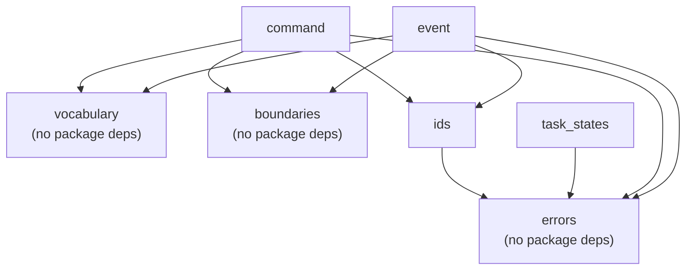

# MOGO-010 STEP 1 — SOURCE REVIEW PACKAGE (REGENERATED AFTER CORRECTION)

**Supersedes** the pre-correction source-review package. Regenerated after the MOGO-010 Step 1 pre-commit correction (I-1 through I-6).
**Generated mechanically.** Every file below was read in binary and emitted byte-for-byte. No formatter was run, no line ending rewritten, no whitespace normalized, no implementation file regenerated. Public-surface and import inventories are derived by AST from the same bytes.

> **Dependency-classifier correction (I-6).** The previous generation classified root modules against a hand-maintained set literal that omitted `platform`, and therefore reported the standard-library module as an unexpected third-party dependency (`Third-party dependencies: 1`). That was wrong. This generation classifies against **`sys.stdlib_module_names`**, the authoritative source, so an author's omission can no longer masquerade as a dependency violation.

**Nothing was staged, committed, tagged or pushed.**

---

## 1. Repository HEAD and Git Status

``````
$ git rev-parse HEAD
bd6ff7c8ccebe31431c4d58c345894d7effdb738
$ git log -1 --oneline --decorate
bd6ff7c (HEAD -> main, origin/mogo-main) MOGO-009: approve automation platform architecture
$ git status --porcelain --untracked-files=all
?? MOGO-010-STEP-1-CORRECTION-PLAN.md
?? MOGO-010-STEP-1-IMPLEMENTATION-REPORT.md
?? MOGO-010-STEP-1-PLAN.md
?? MOGO-010-STEP-1-SOURCE-REVIEW.md
?? docs/architecture/MOGO_AGENTIC_SYSTEM_BLUEPRINT.md
?? docs/reports/MOGO-004-STEP-1-COMPLETION-REPORT.md
?? docs/reports/MOGO-004-STEP-1-PILOT-EXECUTION-BLOCKED.md
?? docs/reports/MOGO-RESEARCH-ACQUISITION-ARCHITECTURE.md
?? platform/README.md
?? platform/src/mogo_platform/__init__.py
?? platform/src/mogo_platform/contracts/__init__.py
?? platform/src/mogo_platform/contracts/boundaries.py
?? platform/src/mogo_platform/contracts/command.py
?? platform/src/mogo_platform/contracts/errors.py
?? platform/src/mogo_platform/contracts/event.py
?? platform/src/mogo_platform/contracts/ids.py
?? platform/src/mogo_platform/contracts/task_states.py
?? platform/src/mogo_platform/contracts/vocabulary.py
?? tests/platform/test_platform_boundaries.py
?? tests/platform/test_platform_envelopes.py
?? tests/platform/test_platform_identifiers.py
?? tests/platform/test_platform_task_states.py
?? tests/run_platform_tests.sh
$ git diff --name-status HEAD        # tracked modifications
(empty)
$ git diff --cached --name-only      # staged files
(empty)
``````

**Zero tracked files modified. Zero files staged. HEAD unchanged.**

---

## 2. Manifest of the 15 Proposed Commit Files

| # | Path | Bytes | Lines | SHA-256 (lowercase) |
|---:|---|---:|---:|---|
| 1 | `platform/README.md` | 9146 | 149 | `5ab16568e01682c7d62ea7129ee4ea2fdfb0d714ffcd4e23945002927b50f3cc` |
| 2 | `platform/src/mogo_platform/__init__.py` | 1428 | 28 | `e8c4e2dddbdf902c22c80e4777bc5d449dc4a5e30fba9b9717268922e0031f84` |
| 3 | `platform/src/mogo_platform/contracts/__init__.py` | 1321 | 28 | `c7217cd12ecd5efac5ff9ad917c2f7d8bef0f24c24534ee69aa2cf98655f2b2f` |
| 4 | `platform/src/mogo_platform/contracts/ids.py` | 24367 | 596 | `4e9c84672de24ded674d1e9ffaa9e5ecf5d5c9011cc5f2d61c1d73c3fc910465` |
| 5 | `platform/src/mogo_platform/contracts/errors.py` | 8885 | 218 | `68a3506ee027273881fd5ccc5b9b6cd3d558c987eb3b2d6672a185e5d138fa2f` |
| 6 | `platform/src/mogo_platform/contracts/vocabulary.py` | 7512 | 183 | `cd6e058f9e4f0513cba12ce7c6153ca1da097cc2138460db081e72ec0e575959` |
| 7 | `platform/src/mogo_platform/contracts/command.py` | 11616 | 283 | `ab3265cde439b53ef130559676765a8e708b40ecc7fad966d0f7b6bd3099aaba` |
| 8 | `platform/src/mogo_platform/contracts/event.py` | 9492 | 243 | `f95088b4f1976bc1575bb1180ff2a87a90b5e3648b754f00ff355e592dfa0b83` |
| 9 | `platform/src/mogo_platform/contracts/task_states.py` | 9836 | 251 | `aaa78f98b68473bfae5e32f1227fa7ffda50a3037cecece651a94792264392e6` |
| 10 | `platform/src/mogo_platform/contracts/boundaries.py` | 8978 | 223 | `a90171937511cd13a288c045204a074d6babeeb489472cced6b133d00ee566a3` |
| 11 | `tests/platform/test_platform_identifiers.py` | 26927 | 646 | `9fbfc8c0e22623ca8c69287f12526849dada60b09a50998d259584c871dbc35d` |
| 12 | `tests/platform/test_platform_envelopes.py` | 43856 | 932 | `6d850aeef0a028e51f549c3cddc4760a373872d03cda3c6176376f26d613a604` |
| 13 | `tests/platform/test_platform_task_states.py` | 16564 | 375 | `d4ffd07c02f8af976350e970334afa2041fd858f94d4d69ca92bea01b6fd68cf` |
| 14 | `tests/platform/test_platform_boundaries.py` | 28261 | 629 | `943c7ef61c24cec3094aeb24789bbcbf768b32dea47a0b41b9891dc3305c7c2c` |
| 15 | `tests/run_platform_tests.sh` | 3391 | 99 | `eb9973583e3401e6972d2cff0f3c4bc929b08a4f0ad806cd6002dd57e9072a07` |
| | **Total** | **211580** | **4883** | |

All 15 are **untracked** (`??`) and constitute the entire proposed Step 1 commit. `platform/__init__.py` does not exist and must never be created.

---

## 3. Complete File Contents

Each file in full. Fences use six backticks so the triple-backtick blocks inside `platform/README.md` render intact.

### 3.1 `platform/README.md`

| | |
|---|---|
| **Exact path** | `platform/README.md` |
| **Byte count** | 9146 |
| **Line count** | 149 |
| **SHA-256** | `5ab16568e01682c7d62ea7129ee4ea2fdfb0d714ffcd4e23945002927b50f3cc` |

``````markdown
# MOGO Automation Platform

**Milestone:** MOGO-010 Step 1 (corrected) · **Status:** contracts only — nothing executable
**Governing document:** [`AUTOMATION_PLATFORM_CONSTITUTION.md`](../docs/governance/AUTOMATION_PLATFORM_CONSTITUTION.md) v1.0 — senior to everything here
**Architecture:** [MOGO-009 specification](../docs/architecture/MOGO-009-AUTOMATION-PLATFORM-ARCHITECTURE.md) · [Contract Catalog](../docs/architecture/MOGO-009-CONTRACT-CATALOG.md) · [ADR-012](../docs/adr/ADR-012-automation-platform-architecture.md)

---

## ⛔ READ FIRST — the `platform` name collision, and the *narrow* rule

**Never create `platform/__init__.py`. That one file, and only that file, is the problem.**

`platform` is a Python standard-library module (`platform.system()`, `platform.python_version()`). This directory sits at the repository root, which is on `sys.path` whenever Python runs from here. A package marker **at this directory's root** would make the repository the `platform` package and break the stdlib module process-wide.

Nested package markers deeper in the tree are a different matter entirely, and the distinction is load-bearing. All four configurations were tested empirically on Python 3.14.6:

| Configuration | `import platform` resolves to | Package importable? |
|---|---|---|
| **`platform/__init__.py` present** | **this directory** — `platform.system()` raises `AttributeError`; **stdlib broken repository-wide** | yes, at the cost of breaking stdlib |
| No `__init__.py` (PEP 420 namespace) | stdlib `platform.py` ✅ | no — `'platform' is not a package` |
| No `__init__.py` + `sys.path` insert on a leaf directory | stdlib ✅ | only as flat, generic top-level modules |
| **`platform/src/mogo_platform/` + `sys.path` insert on `platform/src`** ✅ **current** | stdlib `platform.py` ✅ intact | yes — as a uniquely named package |

**Why the nested markers cannot shadow anything — three independent reasons:**

1. `platform/__init__.py` is never created, so this directory stays a namespace directory and the stdlib *regular module* wins over it.
2. The `sys.path` entry is `platform/src`, which contains only `mogo_platform/`. Nothing named `platform` is reachable through it.
3. `mogo_platform` is not a standard-library name — verified against `sys.stdlib_module_names`, not a hand-maintained list.

> **Historical note, recorded so the mistake is not repeated.** The first version of this file stated *"never create an `__init__.py` anywhere under `platform/`"*. That was an over-generalisation of a real constraint, and it was enforced by a test, which turned a wrong rule into policy. It blocked normal packaging, forced generic top-level module names (`platform_ids`), and required every caller to manipulate `sys.path`. MOGO-010 Step 1 correction I-1 narrowed the rule to the one file that actually causes the collision. **Do not re-broaden it.**

## Import convention

```python
import os
import sys

REPO_ROOT = os.path.abspath(os.path.join(os.path.dirname(__file__), "..", ".."))
SRC_DIR = os.path.join(REPO_ROOT, "platform", "src")   # the ONE path entry
if SRC_DIR not in sys.path:
    sys.path.insert(0, SRC_DIR)

from mogo_platform.contracts import ids, event         # noqa: E402
```

Inside the package, modules import each other **relatively**:

```python
from . import errors
from . import ids
```

The single `sys.path` insert is a bridge until a package manifest exists (ADR-012 D-01, deferred by operator ruling). Once a manifest lands, `mogo_platform` becomes installable and the insert disappears — the src layout is chosen precisely so that step requires no restructuring.

**Guards.** Four tests protect this permanently: `test_no_init_py_at_platform_root`, `test_stdlib_platform_module_is_importable_and_functional`, `test_package_markers_are_docstring_only`, and `test_no_retired_flat_module_is_importable`. If someone adds `platform/__init__.py`, the suite fails immediately with an explanatory message instead of the repository breaking in a confusing way.

---

## Layout

```
platform/
  README.md
  src/
    mogo_platform/
      __init__.py                 docstring only — no imports, no side effects
      contracts/
        __init__.py               docstring only
        ids.py                    identifier model, canonicalization,
                                  idempotency keys, JSON-shape validation
        errors.py                 error taxonomy + inert Catalog §K table
        vocabulary.py             closed vocabularies (Catalog §J, §M, §O)
        command.py                command envelope contract (Catalog §A)
        event.py                  operational event envelope (Catalog §B)
        task_states.py            task states and transitions (Catalog §L)
        boundaries.py             protected-boundary declarations (Spec §7)
```

**This is contracts only.** There is no runtime, orchestrator, worker, connector, event store, queue, registry, adapter, or acquisition path. Step 1 performs **no I/O of any kind** — no file is opened even for reading, no socket is created, no subprocess is spawned. Those code paths do not exist rather than being disabled.

## Contract guarantees

Every envelope returned by `validate_command()` or `validate_event()` is:

| Guarantee | Enforced by |
|---|---|
| **Strictly JSON-shaped** — no `object()`, `set`, `bytes`, `complex`, or any other non-JSON type, at any depth | `ids.require_json_shaped()` on the whole envelope |
| **Free of non-finite floats** — `NaN` and `±Infinity` rejected anywhere, because JSON cannot express them | same |
| **Free of non-string keys** — never coerced, never stringified; `bool` and `int` keys rejected | same |
| **Additive-field preserving** — a valid unknown field is retained verbatim and participates in the payload hash | validators never drop a field |
| **Deeply immutable** — mappings are `MappingProxyType`, arrays are tuples | `ids.freeze()` |
| **Idempotent** — `validate(validate(x))` succeeds and preserves values, unknown fields, payload hash and immutability | `canonical_json_bytes()` routes through `as_plain()` |
| **Free of prohibited references** — see below | `boundaries.find_prohibited_references()` |

## What is deliberately deferred

Each is declared in the relevant module docstring, and none is simulated:

| Deferred | Why it cannot be done in Step 1 |
|---|---|
| Opaque-identifier uniqueness check | requires the operational event log |
| Command rejection **events** | requires an event store |
| Event persistence, ordering, `sequence` monotonicity, chain replay | requires the event log |
| Capability **registration** verification | requires the Capability Registry (ADR-012 D-16) |
| Licensing **evaluation** | requires the policy gate |
| Task-state **application** | requires the orchestrator |
| Late-transition **logging** | requires the event log |
| Review routing, retry, backoff, dead-letter execution | later, separately approved steps |

## Prohibited boundaries

`platform/**` must never contain a write path to any of these (MOGO-009 Architecture §7):

```
evidence/
docs/campaigns/
docs/trader-intelligence/governance/PREREG-*.md
docs/MOGO-003-VERIFIED-REPLAY-RECORD.md
index.html
hypothesis-registry.json      (read-only; updates stay operator-driven)
```

It must also never reuse `mogo.evidence-canon.v1`, `mogo.evidence-package.v1`, `alexGStableHash`, or `sourceTradeId` (Contract Catalog §H reuse verdict), and must never import from `scripts/trader_intelligence/` — that tree is reachable only through adapters, and no adapter exists.

**`contracts/boundaries.py` is the single module permitted to contain those literals**, because it is the machine-readable declaration of the boundary. Enforcement distinguishes the two cases: the declaration module must contain the *complete* approved set with nothing omitted and nothing invented; every other `.py` module under `platform/` must contain none of them. The literal scan covers `.py` files only — this README documents the boundary and is intentionally outside that scan.

## Running the tests

```bash
bash tests/run_platform_tests.sh
```

or directly:

```bash
python3 -m unittest \
  tests.platform.test_platform_identifiers \
  tests.platform.test_platform_envelopes \
  tests.platform.test_platform_task_states \
  tests.platform.test_platform_boundaries
```

All suites are standard-library `unittest`, fully offline, deterministic, and repeatable. They require no network, no credentials, and no fixture copied from the repository tree.

`tests/run_all.sh` is **deliberately unmodified**: repository-wide runner integration is separately governed (ADR-012 D-12, Specification §33). Until that authorization lands, the platform suites run through their own runner.

## Dependencies

**None.** Python 3.14 standard library only. There is no `pyproject.toml`, `requirements.txt`, `setup.py`, or lock file, and Step 1 introduces none — deferred until a genuine runtime dependency or installable execution surface exists. The Python floor is enforced by a test rather than declared in a manifest nothing reads.
``````

### 3.2 `platform/src/mogo_platform/__init__.py`

| | |
|---|---|
| **Exact path** | `platform/src/mogo_platform/__init__.py` |
| **Byte count** | 1428 |
| **Line count** | 28 |
| **SHA-256** | `e8c4e2dddbdf902c22c80e4777bc5d449dc4a5e30fba9b9717268922e0031f84` |

``````python
"""MOGO Automation Platform -- uniquely named package root.

AUTHORITY
    Automation Platform Constitution v1.0 (senior)
    ADR-012 (accepted 2026-08-07) -- approval 2, new top-level platform/
                                     bounded context
    MOGO-009 Architecture, sections 7 and 25 -- the platform/** boundary

WHY THIS NAME
    The bounded context directory is `platform/`, which collides with the
    Python standard-library module of the same name. A package marker at the
    repository-root `platform/` would shadow and BREAK stdlib `platform`
    process-wide. This package therefore lives at `platform/src/mogo_platform/`
    and carries a name that is not a standard-library name, verified against
    `sys.stdlib_module_names` rather than a hand-maintained list.

    `platform/__init__.py` MUST NEVER BE CREATED. That single file -- and only
    that file -- causes the collision. Nested markers such as this one cannot,
    because they are reached through a different sys.path entry and carry a
    different top-level name.

DELIBERATELY EMPTY OF CODE
    This module contains a docstring and nothing else: no import, no
    re-export, no registration, no side effect. Importing it does nothing
    observable. A re-export would create an import-time side effect and a
    second name for every symbol, both of which work against the MOGO-010
    Step 1 property that the platform is not executable.
"""
``````

### 3.3 `platform/src/mogo_platform/contracts/__init__.py`

| | |
|---|---|
| **Exact path** | `platform/src/mogo_platform/contracts/__init__.py` |
| **Byte count** | 1321 |
| **Line count** | 28 |
| **SHA-256** | `c7217cd12ecd5efac5ff9ad917c2f7d8bef0f24c24534ee69aa2cf98655f2b2f` |

``````python
"""MOGO Automation Platform -- Step 1 contract definitions.

AUTHORITY
    Automation Platform Constitution v1.0 (senior)
    ADR-012 (accepted 2026-08-07)
    MOGO-009 Contract Catalog, sections A, B, H, I, J, K, L, M, O
    MOGO-009 Architecture, sections 7, 10, 11, 17, 18.1, 25

CONTENTS -- contract definitions only, nothing executable
    ids           identifier model, canonicalization, idempotency keys, and
                  the JSON-shape validator every envelope passes through
    errors        exception hierarchy, canonical raisers, inert error classes
    vocabulary    closed command / event / licensing / lifecycle vocabularies
    command       command envelope contract (Catalog section A)
    event         operational event envelope contract (Catalog section B)
    task_states   task states and transition legality (Catalog section L)
    boundaries    protected-boundary declarations (Architecture section 7)

DELIBERATELY EMPTY OF CODE
    Docstring only: no import, no re-export, no registration, no side effect.
    Importing this package does nothing observable. Callers import the modules
    they need explicitly, for example:

        from mogo_platform.contracts import ids, event

    so that no symbol acquires a second name and no module is loaded merely
    because a sibling was.
"""
``````

### 3.4 `platform/src/mogo_platform/contracts/ids.py`

| | |
|---|---|
| **Exact path** | `platform/src/mogo_platform/contracts/ids.py` |
| **Byte count** | 24367 |
| **Line count** | 596 |
| **SHA-256** | `4e9c84672de24ded674d1e9ffaa9e5ecf5d5c9011cc5f2d61c1d73c3fc910465` |

``````python
#!/usr/bin/env python3
"""MOGO Automation Platform -- Step 1 identifier model and Catalog conventions.

AUTHORITY
    Automation Platform Constitution v1.0 (senior)  -- sections 10, 11
    ADR-012 (accepted 2026-08-07)                   -- D-07, D-11
    MOGO-009 Architecture, section 17               -- identifier model
    MOGO-009 Contract Catalog, conventions header   -- sha256 / uuid / iso8601
    MOGO-009 Contract Catalog, section H            -- identifier classes
    MOGO-009 Contract Catalog, section I            -- idempotency matrix

This module owns the Catalog's *conventions* block (the three shared value
formats: 64-char lowercase hex sha256, UUIDv4, and ISO-8601 UTC at millisecond
precision) together with sections H and I. They are co-located because the
Catalog defines them together and because every other Step 1 contract module
depends on all three; splitting them would duplicate validation logic across
modules, which the Step 1 authorization forbids.

CANONICALIZATION -- ADAPTED, NOT SHARED
    MOGO-009 Architecture section 17 records the verdict: the repository's
    SHA-256 canonicalization *discipline* is "adapted (same algorithm, new
    namespace)". Architecture section 6.7 permits access to the Phase I
    pipeline only through adapters, and no adapter exists in Step 1. The rule
    is therefore re-implemented here rather than imported. A contract test
    proves this module's output is byte-identical to the documented rule while
    asserting the pipeline module was never imported.

IMPLEMENTED NOW
    * Canonical JSON serialization for hashing, and SHA-256 over it.
    * Format predicates and raisers for sha256 / UUIDv4 / ISO-8601 UTC ms.
    * Composite identifier construction, parsing and validation (section H).
    * Idempotency key composition (section I).
    * Content-identity collision handling (Architecture section 17).

STRUCTURALLY PREPARED
    * new_uuid4() accepts an optional `seen` uniqueness source. When one is
      supplied a duplicate is a hard failure, which is how a later step will
      wire in the event log.

EXPLICITLY DEFERRED -- not implemented in Step 1
    * Uniqueness of opaque identifiers against the operational event log.
      Catalog section H requires that check; no event log exists in Step 1, so
      with no `seen` argument NO uniqueness check occurs. This is a real,
      declared gap, not a silent one.
    * Routing a composite identity conflict to human review. The conflict is
      surfaced through inert metadata (IdentifierError.routes_to_review); no
      review system exists to receive it.

GOVERNANCE-OWNED IDENTIFIERS
    hypothesisId, evidencePackageId and replayPackageId are owned by project
    governance. Catalog section H: "the platform never mints these." This
    module therefore exposes NO function that creates one, and no alias that
    indirectly creates one. They may be carried as references.
"""

import hashlib
import json
import math
import re
import uuid as _uuid
from datetime import datetime
from types import MappingProxyType

from . import errors  # noqa: E402  (package-relative; see platform/README.md)

# ---------------------------------------------------------------------------
# Catalog conventions block -- canonicalization and hashing
# ---------------------------------------------------------------------------


def canonical_json_bytes(obj):
    """Canonical serialization used ONLY for hashing.

    Object keys sorted recursively; arrays never reordered (order may carry
    meaning); compact separators; UTF-8; NaN and Infinity rejected.

    The value is routed through as_plain() first so that an ALREADY-VALIDATED
    envelope -- whose mappings are MappingProxyType and whose arrays are
    tuples -- can be hashed and therefore revalidated. as_plain() changes no
    JSON output, so no digest moves: this makes validation idempotent without
    altering payload-hash semantics (MOGO-010 Step 1 correction I-5).

    Raises ContractValidationError if the value is not JSON-serializable or
    contains a non-finite float, so a non-hashable payload fails closed rather
    than producing an unstable digest.
    """
    try:
        text = json.dumps(
            as_plain(obj),
            sort_keys=True,
            separators=(",", ":"),
            ensure_ascii=False,
            allow_nan=False,
        )
    except ValueError as exc:
        # json raises ValueError for NaN/Infinity when allow_nan=False.
        errors.fail("value is not canonically serializable: %s" % (exc,))
    except TypeError as exc:
        errors.fail("value is not JSON-serializable: %s" % (exc,))
    return text.encode("utf-8")


def sha256_hex(data_bytes):
    """SHA-256 of raw bytes, as 64 lowercase hex characters."""
    if not isinstance(data_bytes, (bytes, bytearray)):
        errors.fail("sha256_hex requires bytes, got %s" % (type(data_bytes).__name__,))
    return hashlib.sha256(bytes(data_bytes)).hexdigest()


def content_hash_of(obj):
    """SHA-256 over the canonical serialization of a JSON-shaped value."""
    return sha256_hex(canonical_json_bytes(obj))


# ---------------------------------------------------------------------------
# Canonical value representation -- the in-memory counterpart of the rules above
# ---------------------------------------------------------------------------
# freeze()/as_plain() live beside canonical_json_bytes() because they are the
# same concern: how a platform value is represented. Keeping them here gives
# the command and event contracts one shared implementation instead of two.


def freeze(value):
    """Return a deeply read-only view of a JSON-shaped value.

    Mappings become MappingProxyType and arrays become tuples, so a validated
    envelope cannot be mutated by its caller. Constitution section 6.1:
    operational events are "never updated, never deleted".
    """
    if isinstance(value, (list, tuple)):
        return tuple(freeze(item) for item in value)
    if hasattr(value, "keys"):
        return MappingProxyType({key: freeze(value[key]) for key in value.keys()})
    return value


def as_plain(value):
    """Inverse of freeze(): a mutable, JSON-serializable deep copy.

    Needed because json.dumps cannot serialize MappingProxyType, so hashing
    and round-trip serialization operate on the plain form.
    """
    if isinstance(value, (list, tuple)):
        return [as_plain(item) for item in value]
    if hasattr(value, "keys"):
        return {key: as_plain(value[key]) for key in value.keys()}
    return value


# ---------------------------------------------------------------------------
# JSON-shape validation -- the admissibility rule for every envelope value
# ---------------------------------------------------------------------------
# MOGO-010 Step 1 correction I-2 / I-3 / I-4. Contract Catalog section B
# requires consumers to ignore unknown fields and Architecture section 11
# requires additive evolution -- but neither says an unknown field must be
# REPRESENTABLE. Without that check an envelope could carry a value with no
# JSON form (an arbitrary object, a set, bytes), a value JSON cannot express
# (NaN, Infinity), or a key json.dumps would silently coerce (an int key
# becoming a string). Each breaks a property the platform claims: round-trip
# fidelity, durable-record compatibility, deterministic auditability.
#
# Accepted, exactly the JSON data model:
#     None | bool | int | finite float | str | mapping with string keys |
#     list | tuple
# Read-only mappings (MappingProxyType) and tuples are accepted so that an
# already-validated envelope can be revalidated -- see canonical_json_bytes().


def require_json_shaped(value, field="$"):
    """Prove that `value` is JSON-shaped and canonically serializable.

    Depth-first. Returns the value unchanged and mutates nothing. Raises
    ContractValidationError naming the precise JSON-style path of the first
    offending value, so a failure is actionable without a debugger.

    Recursion follows mappings, lists and tuples ONLY. Arbitrary object
    attributes are never traversed: an unrecognized type is rejected outright
    rather than inspected. Performs no I/O and no serialization.
    """
    _require_json_shaped(value, field)
    return value


def _require_json_shaped(value, path):
    if value is None or isinstance(value, (bool, int, str)):
        return
    if isinstance(value, float):
        if not math.isfinite(value):
            errors.fail(
                "%s is the non-finite float %r; JSON has no representation for "
                "NaN or Infinity" % (path, value)
            )
        return
    if isinstance(value, (list, tuple)):
        for index, item in enumerate(value):
            _require_json_shaped(item, "%s[%d]" % (path, index))
        return
    if hasattr(value, "keys") and hasattr(value, "__getitem__"):
        for key in value.keys():
            # bool is a subclass of int and neither is a str, so both are
            # rejected here. Keys are never coerced or stringified.
            if not isinstance(key, str):
                errors.fail(
                    "%s has the non-string key %r of type %s; JSON object keys "
                    "must be strings and are never coerced"
                    % (path, key, type(key).__name__)
                )
            _require_json_shaped(value[key], "%s.%s" % (path, key))
        return
    errors.fail(
        "%s is of type %s, which has no JSON representation"
        % (path, type(value).__name__)
    )


# ---------------------------------------------------------------------------
# Catalog conventions block -- value formats
# ---------------------------------------------------------------------------

SHA256_HEX_RE = re.compile(r"^[0-9a-f]{64}$")

# RFC 4122 version 4, canonical lowercase hyphenated form.
UUID4_RE = re.compile(
    r"^[0-9a-f]{8}-[0-9a-f]{4}-4[0-9a-f]{3}-[89ab][0-9a-f]{3}-[0-9a-f]{12}$"
)

# Catalog conventions: iso8601 = UTC, millisecond precision.
ISO8601_UTC_MS_RE = re.compile(
    r"^\d{4}-\d{2}-\d{2}T\d{2}:\d{2}:\d{2}\.\d{3}Z$"
)


def is_sha256_hex(value):
    """True if `value` is exactly 64 lowercase hex characters."""
    return isinstance(value, str) and bool(SHA256_HEX_RE.match(value))


def require_sha256_hex(value, field):
    """Require a canonical sha256 hex digest. Returns the value."""
    if not is_sha256_hex(value):
        errors.fail(
            "%s must be 64 lowercase hex characters (sha256), got %r" % (field, value),
            errors.IdentifierError,
        )
    return value


def is_uuid4(value):
    """True if `value` is a canonical lowercase hyphenated UUIDv4 string."""
    return isinstance(value, str) and bool(UUID4_RE.match(value))


def require_uuid4(value, field):
    """Require a canonical UUIDv4 string. Returns the value."""
    if not is_uuid4(value):
        errors.fail(
            "%s must be a canonical lowercase UUIDv4, got %r" % (field, value),
            errors.IdentifierError,
        )
    return value


def is_iso8601_utc_ms(value):
    """True if `value` is ISO-8601 UTC at millisecond precision, e.g.
    '2026-08-07T12:00:00.000Z'. The calendar date must also be real."""
    if not isinstance(value, str) or not ISO8601_UTC_MS_RE.match(value):
        return False
    try:
        # The pattern already fixes the zone as UTC; strptime is used only to
        # reject an impossible calendar date or time such as 2026-02-30.
        datetime.strptime(value, "%Y-%m-%dT%H:%M:%S.%fZ")
    except ValueError:
        return False
    return True


def require_iso8601_utc_ms(value, field):
    """Require an ISO-8601 UTC millisecond timestamp. Returns the value."""
    if not is_iso8601_utc_ms(value):
        errors.fail(
            "%s must be ISO-8601 UTC at millisecond precision "
            "(YYYY-MM-DDThh:mm:ss.sssZ), got %r" % (field, value)
        )
    return value


# ---------------------------------------------------------------------------
# Catalog section H -- opaque execution identifiers
# ---------------------------------------------------------------------------


def new_uuid4(uuid_factory=None, seen=None):
    """Mint an opaque execution identifier.

    `uuid_factory` is a test seam: a zero-argument callable returning a
    uuid.UUID. Whatever it returns is validated, so an injected factory can
    never produce a value that is not a real UUIDv4.

    `seen` is an optional uniqueness source: a callable taking the candidate
    string and returning True if it has been observed before. Supplying one
    makes a duplicate a hard IdentifierError.

    DEFERRED: with `seen` omitted -- which is every caller in Step 1 -- NO
    uniqueness check is performed. Catalog section H requires the check to run
    against the operational event log, and no event log exists yet.
    """
    factory = uuid_factory if uuid_factory is not None else _uuid.uuid4
    candidate = str(factory())
    if not is_uuid4(candidate):
        errors.fail(
            "uuid_factory produced %r, which is not a canonical UUIDv4" % (candidate,),
            errors.IdentifierError,
        )
    if seen is not None and seen(candidate):
        errors.fail(
            "opaque identifier %s is a duplicate" % (candidate,),
            errors.IdentifierError,
        )
    return candidate


# ---------------------------------------------------------------------------
# Catalog section H -- composite human-readable identifiers
# ---------------------------------------------------------------------------

COMPOSITE_SEPARATOR = "|"

# A component: lowercase alphanumeric, with '.', '_' and '-' permitted inside.
# NOTE ON AUTHORITY: Catalog section H specifies composite *structure*
# (the prefix and the ordered components); it does not specify a character
# set. This restriction is a MOGO-010 Step 1 structural decision, adopted from
# the repository's existing lowercase-identifier convention, and is recorded
# here as such rather than presented as a Catalog quotation. It admits the
# capability form used in the architecture (for example "research.acquire.v1")
# and rejects whitespace, emptiness, uppercase and an embedded separator.
COMPONENT_RE = re.compile(r"^[a-z0-9](?:[a-z0-9._-]*[a-z0-9])?$")
HASH12_RE = re.compile(r"^[0-9a-f]{12}$")

_COMPONENT = "component"
_HASH12 = "hash12"

# prefix -> (identifier name, ordered component names, ordered component kinds)
COMPOSITE_ID_SPECS = MappingProxyType({
    "SRC":  ("sourceId",         ("platform", "normalizedUrlHash12"),
             (_COMPONENT, _HASH12)),
    "EDU":  ("educatorId",       ("slug",),               (_COMPONENT,)),
    "CONN": ("connectorId",      ("sourceType", "name"),  (_COMPONENT, _COMPONENT)),
    "WRK":  ("workerId",         ("capability",),         (_COMPONENT,)),
    "XF":   ("transformationId", ("name",),               (_COMPONENT,)),
    "CAP":  ("capabilityId",     ("domain", "name"),      (_COMPONENT, _COMPONENT)),
    "RULE": ("canonicalRuleId",  ("educator", "slug"),    (_COMPONENT, _COMPONENT)),
})

COMPOSITE_PREFIXES = tuple(COMPOSITE_ID_SPECS.keys())


def _require_component(value, kind, prefix, name):
    if not isinstance(value, str):
        errors.fail(
            "%s component %s must be a string, got %s"
            % (prefix, name, type(value).__name__),
            errors.IdentifierError,
        )
    if COMPOSITE_SEPARATOR in value:
        errors.fail(
            "%s component %s must not contain the separator %r"
            % (prefix, name, COMPOSITE_SEPARATOR),
            errors.IdentifierError,
        )
    pattern = HASH12_RE if kind == _HASH12 else COMPONENT_RE
    if not pattern.match(value):
        errors.fail(
            "%s component %s is invalid: %r" % (prefix, name, value),
            errors.IdentifierError,
        )
    return value


def make_composite_id(prefix, components):
    """Build a composite identifier from its prefix and ordered components."""
    if prefix not in COMPOSITE_ID_SPECS:
        errors.fail("unknown composite prefix %r" % (prefix,), errors.IdentifierError)
    _name, names, kinds = COMPOSITE_ID_SPECS[prefix]
    components = tuple(components)
    if len(components) != len(names):
        errors.fail(
            "%s requires %d component(s) %s, got %d"
            % (prefix, len(names), list(names), len(components)),
            errors.IdentifierError,
        )
    for value, kind, name in zip(components, kinds, names):
        _require_component(value, kind, prefix, name)
    return COMPOSITE_SEPARATOR.join((prefix,) + components)


def parse_composite_id(value):
    """Split a composite identifier into (prefix, components tuple).

    Validates the prefix, the component count and every component, so
    make_composite_id(*parse_composite_id(x)) round-trips exactly.
    """
    if not isinstance(value, str):
        errors.fail(
            "composite identifier must be a string, got %s" % (type(value).__name__,),
            errors.IdentifierError,
        )
    parts = value.split(COMPOSITE_SEPARATOR)
    prefix, components = parts[0], tuple(parts[1:])
    if prefix not in COMPOSITE_ID_SPECS:
        errors.fail("unknown composite prefix %r" % (prefix,), errors.IdentifierError)
    _name, names, kinds = COMPOSITE_ID_SPECS[prefix]
    if len(components) != len(names):
        errors.fail(
            "%s requires %d component(s) %s, got %d"
            % (prefix, len(names), list(names), len(components)),
            errors.IdentifierError,
        )
    for component, kind, name in zip(components, kinds, names):
        _require_component(component, kind, prefix, name)
    return prefix, components


def require_composite_id(value, prefix, field):
    """Require a composite identifier carrying exactly `prefix`."""
    actual, _components = parse_composite_id(value)
    if actual != prefix:
        errors.fail(
            "%s must be a %s identifier, got prefix %r" % (field, prefix, actual),
            errors.IdentifierError,
        )
    return value


def make_source_id(platform_name, normalized_url):
    """SRC|<platform>|<normalizedUrlHash12> (Catalog section H).

    The hash component is the first 12 hex characters of the SHA-256 of the
    normalized URL, so the identifier is deterministic for a given input.
    """
    errors.require_str(normalized_url, "normalizedUrl")
    digest12 = sha256_hex(normalized_url.encode("utf-8"))[:12]
    return make_composite_id("SRC", (platform_name, digest12))


def make_educator_id(slug):
    """EDU|<slug>"""
    return make_composite_id("EDU", (slug,))


def make_connector_id(source_type, name):
    """CONN|<sourceType>|<name>"""
    return make_composite_id("CONN", (source_type, name))


def make_worker_id(capability):
    """WRK|<capability>"""
    return make_composite_id("WRK", (capability,))


def make_transformation_id(name):
    """XF|<name>"""
    return make_composite_id("XF", (name,))


def make_capability_id(domain, name):
    """CAP|<domain>|<name> (Catalog section O).

    Constructs the identifier form only. Registration, lifecycle and dispatch
    eligibility are DEFERRED to the Capability Registry step.
    """
    return make_composite_id("CAP", (domain, name))


def make_canonical_rule_id(educator, slug):
    """RULE|<educator>|<slug>"""
    return make_composite_id("RULE", (educator, slug))


# ---------------------------------------------------------------------------
# Governance-owned identifiers -- referenced, never minted
# ---------------------------------------------------------------------------

GOVERNANCE_OWNED_IDENTIFIER_FIELDS = (
    "hypothesisId",
    "evidencePackageId",
    "replayPackageId",
)


def is_governance_owned_identifier_field(field_name):
    """True if `field_name` names an identifier the platform must never mint.

    Catalog section H: these are "owned by governance; the platform never mints
    these". They may be carried as references, which is why this module offers
    a predicate and no constructor.
    """
    return field_name in GOVERNANCE_OWNED_IDENTIFIER_FIELDS


# ---------------------------------------------------------------------------
# Catalog section I -- idempotency key composition
# ---------------------------------------------------------------------------

# Operation -> exact ordered semantic parts. Constitution section 11: keys are
# "deterministic and derived from semantic inputs, never from timestamps or
# attempt numbers". No composition below contains a timestamp or an attempt
# number, and an undeclared part is rejected rather than ignored.
IDEMPOTENCY_KEY_COMPOSITION = MappingProxyType({
    "source_discovery":           ("connectorId", "query", "window"),
    "source_registration":        ("normalizedUrl", "educatorId"),
    "metadata_acquisition":       ("sourceId", "connectorVersion"),
    "artifact_acquisition":       ("sourceId", "locator", "connectorVersion"),
    # Catalog section I records transcript acquisition as "as artifact".
    "transcript_acquisition":     ("sourceId", "locator", "connectorVersion"),
    "raw_storage":                ("sha256",),
    # Catalog section I groups normalize / clean / segment / extract into one
    # row with one composition.
    "transformation":             ("inputHash", "transformationId",
                                   "transformationVersion"),
    "duplicate_analysis":         ("candidateSetHash", "algorithmVersion"),
    "evidence_candidate_creation": ("segmentId", "extractorVersion"),
    "review_request":             ("subjectId", "reviewType"),
})

IDEMPOTENCY_OPERATIONS = tuple(IDEMPOTENCY_KEY_COMPOSITION.keys())


def idempotency_key(operation, parts):
    """Compose a deterministic idempotency key.

    `parts` must be a mapping whose keys are exactly the declared parts for
    `operation` -- no more, no fewer. A missing part and an undeclared extra
    part are both errors, so a caller cannot quietly widen or narrow a key.

    The key is the SHA-256 of the canonical serialization of the operation
    together with its parts, making it stable across retries by construction.
    """
    if operation not in IDEMPOTENCY_KEY_COMPOSITION:
        errors.fail(
            "unknown idempotency operation %r" % (operation,), errors.IdentifierError
        )
    declared = IDEMPOTENCY_KEY_COMPOSITION[operation]
    errors.require_mapping(parts, "parts", errors.IdentifierError)
    supplied = set(parts.keys())
    missing = [name for name in declared if name not in supplied]
    if missing:
        errors.fail(
            "idempotency operation %s is missing part(s) %s" % (operation, missing),
            errors.IdentifierError,
        )
    extra = sorted(supplied - set(declared))
    if extra:
        errors.fail(
            "idempotency operation %s received undeclared part(s) %s"
            % (operation, extra),
            errors.IdentifierError,
        )
    for name in declared:
        value = parts[name]
        if value is None:
            errors.fail(
                "idempotency part %s.%s must not be null" % (operation, name),
                errors.IdentifierError,
            )
    ordered = {name: parts[name] for name in declared}
    return content_hash_of({"operation": operation, "parts": ordered})


# ---------------------------------------------------------------------------
# Architecture section 17 -- collision handling
# ---------------------------------------------------------------------------


def assert_content_identity(bytes_a, bytes_b):
    """Apply the content-derived collision rule to two byte strings.

    Identical bytes are the same object -- identity, not an error. An identical
    digest over differing bytes is a corruption alarm and raises
    InvariantViolationError; it is never resolved by renaming.

    Returns the shared digest when the two are identical.
    """
    digest_a = sha256_hex(bytes_a)
    digest_b = sha256_hex(bytes_b)
    if digest_a != digest_b:
        errors.fail(
            "content hashes differ: %s != %s" % (digest_a, digest_b),
            errors.IdentifierError,
        )
    if bytes(bytes_a) != bytes(bytes_b):
        errors.fail(
            "content hash %s produced by differing bytes -- corruption alarm"
            % (digest_a,),
            errors.InvariantViolationError,
        )
    return digest_a
``````

### 3.5 `platform/src/mogo_platform/contracts/errors.py`

| | |
|---|---|
| **Exact path** | `platform/src/mogo_platform/contracts/errors.py` |
| **Byte count** | 8885 |
| **Line count** | 218 |
| **SHA-256** | `68a3506ee027273881fd5ccc5b9b6cd3d558c987eb3b2d6672a185e5d138fa2f` |

``````python
#!/usr/bin/env python3
"""MOGO Automation Platform -- Step 1 error taxonomy and inert error-class table.

AUTHORITY
    Automation Platform Constitution v1.0 (senior)  -- sections 11, 16
    ADR-012 (accepted 2026-08-07)
    MOGO-009 Contract Catalog, section K            -- error classification

SCOPE -- MOGO-010 Step 1.

IMPLEMENTED NOW
    * The Step 1 exception hierarchy.
    * The canonical raisers used by every Step 1 validator. Routing every
      failure through these keeps the message format uniform and guarantees
      that a failure always names the field or invariant that failed.
    * ERROR_CLASSES: Contract Catalog section K transcribed as inert,
      read-only data.

STRUCTURALLY PREPARED
    * ERROR_CLASSES is shaped for the retry/dead-letter/review machinery of a
      later step. Nothing in Step 1 consumes it.

EXPLICITLY DEFERRED -- absent from Step 1 entirely
    * Retry scheduling, backoff, jitter, attempt counting.
    * Dead-letter handling.
    * Review routing.
    * Any consumer of ERROR_CLASSES. The Constitution (section 11) forbids
      retrying `policy_blocked`; that fact is recorded here as DATA ONLY. No
      code in Step 1 reads this table to make a decision, because no component
      exists that could act on one.

Validation-shaped failures derive additionally from ValueError and structural
failures from RuntimeError, matching the exception convention already used
throughout the Phase I pipeline (for example EvidenceValidationError(ValueError)
and IllegalTransitionError(ValueError)). The convention is adopted; the
pipeline itself is neither imported nor referenced by path -- see
boundaries.PROHIBITED_SOURCE_TREES.
"""

from types import MappingProxyType

# ---------------------------------------------------------------------------
# Exception hierarchy
# ---------------------------------------------------------------------------


class PlatformError(Exception):
    """Root of every error raised by automation platform code."""


class ContractValidationError(PlatformError, ValueError):
    """A contract payload is structurally invalid.

    Raised for: a missing required field, a wrong type, a value outside a
    closed vocabulary, or a payload hash that does not match its payload.
    """


class UnsupportedContractVersionError(PlatformError, ValueError):
    """A contract declares a major version this build does not implement.

    Deliberately distinct from ContractValidationError so a caller can
    distinguish "I do not speak this version" from "this is malformed".
    """


class IdentifierError(PlatformError, ValueError):
    """An identifier is malformed, or an identifier invariant was broken.

    Covers: bad format, an illegal composite component, an unknown
    idempotency operation, a missing or undeclared idempotency part, and a
    duplicate opaque identifier reported by a supplied uniqueness source.
    """

    def __init__(self, message, routes_to_review=False):
        PlatformError.__init__(self, message)
        # Inert metadata only. Constitution section 9 makes identity conflict a
        # blocking human review; no review system exists in Step 1, so this
        # flag is recorded and never acted upon.
        self.routes_to_review = bool(routes_to_review)


class InvariantViolationError(PlatformError, RuntimeError):
    """A rule that must hold structurally does not.

    The canonical case is a content-derived identifier collision over
    differing bytes -- a corruption alarm, never a rename
    (MOGO-009 Architecture section 17).
    """


class ProtectedBoundaryViolationError(PlatformError, RuntimeError):
    """A prohibited cross-context reference or write target was detected.

    See MOGO-009 Architecture section 7 and platform_boundaries.
    """


class ConfigurationError(PlatformError, RuntimeError):
    """Platform configuration is absent, contradictory, or names an
    undeclared resource."""


class InternalPlatformError(PlatformError, RuntimeError):
    """A defect in the platform itself. Never raised for caller input."""


class IllegalTaskTransitionError(PlatformError, ValueError):
    """A task-state transition that is absent from the approved table.

    Mirrors the existing acquisition_common.IllegalTransitionError convention:
    raised without mutating anything.
    """


class LateTransitionAnomaly(PlatformError, RuntimeError):
    """A transition arriving at an already-terminal task.

    Contract Catalog section C: such transitions are "logged as anomalies and
    NOT applied". Step 1 classifies them. Logging is DEFERRED -- no log exists.
    """


# ---------------------------------------------------------------------------
# Canonical raisers
# ---------------------------------------------------------------------------


def fail(message, error_cls=ContractValidationError):
    """Raise `error_cls` with `message`. The single raise site for Step 1."""
    raise error_cls(message)


def require_mapping(value, field, error_cls=ContractValidationError):
    """Require a mapping. Returns the value unchanged."""
    # Accept only real mappings; a list or string must never be treated as an
    # envelope. `isinstance(value, dict)` is too narrow for MappingProxyType,
    # which is what this platform hands back from its validators.
    if not hasattr(value, "keys") or not hasattr(value, "__getitem__"):
        fail("%s must be a mapping, got %s" % (field, type(value).__name__), error_cls)
    return value


def require_present(mapping, field, error_cls=ContractValidationError):
    """Require `field` to be present and not None. Returns the value."""
    if field not in mapping:
        fail("required field %s is missing" % (field,), error_cls)
    value = mapping[field]
    if value is None:
        fail("required field %s must not be null" % (field,), error_cls)
    return value


def require_str(value, field, allow_empty=False, error_cls=ContractValidationError):
    """Require a string. Returns the value."""
    if not isinstance(value, str):
        fail("%s must be a string, got %s" % (field, type(value).__name__), error_cls)
    if not allow_empty and not value.strip():
        fail("%s must be a non-empty string" % (field,), error_cls)
    return value


def require_int(value, field, minimum=None, maximum=None,
                error_cls=ContractValidationError):
    """Require an int (bool is rejected -- it is an int subclass in Python)."""
    if isinstance(value, bool) or not isinstance(value, int):
        fail("%s must be an integer, got %s" % (field, type(value).__name__), error_cls)
    if minimum is not None and value < minimum:
        fail("%s must be >= %d, got %d" % (field, minimum, value), error_cls)
    if maximum is not None and value > maximum:
        fail("%s must be <= %d, got %d" % (field, maximum, value), error_cls)
    return value


def require_list(value, field, error_cls=ContractValidationError):
    """Require a list or tuple. Returns the value."""
    if not isinstance(value, (list, tuple)):
        fail("%s must be an array, got %s" % (field, type(value).__name__), error_cls)
    return value


def require_member(value, field, allowed, error_cls=ContractValidationError):
    """Require membership in a closed vocabulary. Returns the value."""
    if value not in allowed:
        fail("%s value %r is not in the approved vocabulary" % (field, value), error_cls)
    return value


# ---------------------------------------------------------------------------
# Contract Catalog section K -- inert operational error classification
# ---------------------------------------------------------------------------

def _class_record(retryable, terminal, routes_to_review):
    return MappingProxyType({
        "retryable": retryable,
        "terminal": terminal,
        "routesToReview": routes_to_review,
    })


ERROR_CLASSES = MappingProxyType({
    "transient":                _class_record(True,  False, False),
    "rate_limited":             _class_record(True,  False, False),
    "dependency_unavailable":   _class_record(True,  False, False),
    "authentication":           _class_record(False, True,  True),
    # Constitution section 11: retrying a policy denial is an attempt to
    # launder it. Never retryable, under any condition.
    "policy_blocked":           _class_record(False, True,  True),
    "not_found":                _class_record(False, True,  False),
    "source_mutated":           _class_record(False, False, True),
    "validation":               _class_record(False, True,  False),
    "deterministic_processing": _class_record(False, True,  True),
    "corrupted_input":          _class_record(False, True,  True),
    "human_review_required":    _class_record(False, False, True),
    "permanent":                _class_record(False, True,  False),
})

ERROR_CLASS_NAMES = tuple(ERROR_CLASSES.keys())
``````

### 3.6 `platform/src/mogo_platform/contracts/vocabulary.py`

| | |
|---|---|
| **Exact path** | `platform/src/mogo_platform/contracts/vocabulary.py` |
| **Byte count** | 7512 |
| **Line count** | 183 |
| **SHA-256** | `cd6e058f9e4f0513cba12ce7c6153ca1da097cc2138460db081e72ec0e575959` |

``````python
#!/usr/bin/env python3
"""MOGO Automation Platform -- Step 1 closed vocabularies (inert data only).

AUTHORITY
    Automation Platform Constitution v1.0 (senior)  -- sections 5.2, 6.8
    ADR-012 (accepted 2026-08-07)                   -- approvals 3, 11, 12, 18
    MOGO-009 Contract Catalog, section J            -- command and event names
    MOGO-009 Contract Catalog, section M            -- licensing classification
    MOGO-009 Contract Catalog, section O            -- capability lifecycle

CATALOG SECTION J CAVEAT, PRESERVED VERBATIM IN SPIRIT
    Contract Catalog section J states: "Not finalized. Names and payloads are
    Step 3 work." The names below are transcribed EXACTLY from the current
    approved Catalog and are treated as the current Catalog v1 vocabulary:
    closed for Step 1 structural validation, additive-only within the current
    approved major, and NOT permanently finalized. Future governed additions
    may occur. No name here was invented or renamed.

    PAYLOAD SEMANTICS ARE NOT DEFINED. The Catalog specifies no payload shape
    for any command or event. Step 1 therefore validates that a payload is
    structurally present and canonically hashable; it does NOT interpret,
    validate or claim to understand payload content for any name below.

IMPLEMENTED NOW
    * The four closed vocabularies, as read-only mappings and tuples.

EXPLICITLY DEFERRED -- absent from Step 1 entirely
    * Dispatch, routing, execution and orchestration of any command.
    * Emission, persistence and ordering of any event.
    * Any evaluation of a licensing status. LICENSING_STATUSES is inert
      reference data: no policy engine, no authorization decision, no
      connector behaviour, no task routing, no retry behaviour. Nothing in
      Step 1 reads it to decide anything.
    * Capability registration, lifecycle transition and dispatch eligibility.
      CAPABILITY_LIFECYCLE_STATES is a name list only; no registry exists.
"""

from types import MappingProxyType

# ---------------------------------------------------------------------------
# Operational namespace -- Constitution section 6.8, ADR-012 approval 3
# ---------------------------------------------------------------------------
# Operational events never share a store, schema registry or identifier space
# with trading or scientific records. That separation begins with a distinct
# namespace, used by every platform schema version string.

OPERATIONAL_NAMESPACE = "mogo.platform.operational"

# ---------------------------------------------------------------------------
# Contract Catalog section J -- commands (17)
# ---------------------------------------------------------------------------

COMMAND_TYPES = (
    "RequestSourceDiscovery",
    "RegisterSource",
    "EvaluateSourcePolicy",
    "AcquireSourceMetadata",
    "AcquireArtifact",
    "AcquireTranscript",
    "NormalizeArtifact",
    "SegmentArtifact",
    "ExtractMetadata",
    "AnalyzeDuplicates",
    "CreateEvidenceCandidate",
    "RequestHumanReview",
    "RecordReviewDecision",
    "RetryTask",
    "CancelTask",
    "SuppressWorkflow",
    "ReclaimTask",
)

# ---------------------------------------------------------------------------
# Contract Catalog section J -- events (34)
# ---------------------------------------------------------------------------

EVENT_TYPES = (
    "SourceDiscoveryRequested",
    "SourceDiscovered",
    "SourceRegistered",
    "PolicyEvaluated",
    "AcquisitionAuthorized",
    "AcquisitionDenied",
    "ArtifactAcquisitionRequested",
    "ArtifactAcquired",
    "ArtifactAcquisitionFailed",
    "TranscriptAcquired",
    "RawArtifactRegistered",
    "ArtifactNormalized",
    "ArtifactSegmented",
    "MetadataExtracted",
    "DuplicateCandidateDetected",
    "EvidenceCandidateCreated",
    "HumanReviewRequired",
    "HumanReviewCompleted",
    "SourceMutationDetected",
    "TaskClaimed",
    "TaskReclaimed",
    "TaskRetryScheduled",
    "TaskSucceeded",
    "TaskFailed",
    "TaskDeadLettered",
    "WorkflowStarted",
    "WorkflowCompleted",
    "WorkflowFailed",
    "WorkflowSuppressed",
    "CheckpointVerified",
    "CheckpointInvalidated",
    "PartialArtifactQuarantined",
    "RecoveryOverrideIssued",
    "SecretAccessed",
)

# ---------------------------------------------------------------------------
# Contract Catalog section B -- executionResult vocabulary
# ---------------------------------------------------------------------------

EXECUTION_RESULTS = ("success", "failure", "partial")

# ---------------------------------------------------------------------------
# Contract Catalog section M -- licensing / access classification (12)
# ---------------------------------------------------------------------------
# Per-operation permission values. A closed set, so a status can never carry a
# free-text permission.

ALLOWED = "ALLOWED"
DENIED = "DENIED"
AS_RECORDED = "AS_RECORDED"                       # "per licence" / "per policy"
LOCATOR_ONLY = "LOCATOR_ONLY"                     # store the locator, retrieve nothing
ALREADY_GATHERED_ONLY = "ALREADY_GATHERED_ONLY"   # no new acquisition of any kind

PERMISSION_VALUES = (
    ALLOWED, DENIED, AS_RECORDED, LOCATOR_ONLY, ALREADY_GATHERED_ONLY,
)


def _status(metadata, transcript, artifact, permits_acquisition):
    return MappingProxyType({
        "metadata": metadata,
        "transcript": transcript,
        "artifact": artifact,
        "permitsAcquisition": permits_acquisition,
    })


LICENSING_STATUSES = MappingProxyType({
    "PERMITTED_PUBLIC_METADATA":   _status(ALLOWED, DENIED, DENIED, True),
    "PERMITTED_PUBLIC_TRANSCRIPT": _status(ALLOWED, ALLOWED, DENIED, True),
    "PERMITTED_PUBLIC_ARTIFACT":   _status(ALLOWED, ALLOWED, ALLOWED, True),
    "PERMITTED_EXPLICIT_LICENSE":  _status(AS_RECORDED, AS_RECORDED, AS_RECORDED, True),
    "PERMITTED_DOCUMENTED_POLICY": _status(AS_RECORDED, AS_RECORDED, AS_RECORDED, True),
    "METADATA_ONLY":               _status(ALLOWED, DENIED, DENIED, True),
    "LINK_ONLY":                   _status(LOCATOR_ONLY, DENIED, DENIED, True),
    # Catalog section M footnote 1: the "minimum to evaluate" allowance covers
    # metadata ALREADY gathered before a classification existed. No new
    # acquisition of any kind occurs under this status.
    "HUMAN_REVIEW_REQUIRED":       _status(ALREADY_GATHERED_ONLY, DENIED, DENIED, False),
    "AUTHENTICATION_REQUIRED":     _status(DENIED, DENIED, DENIED, False),
    "RESTRICTED":                  _status(DENIED, DENIED, DENIED, False),
    "PROHIBITED":                  _status(DENIED, DENIED, DENIED, False),
    # Constitution section 5.2 and ADR-012 approval 12: UNKNOWN behaves
    # EXACTLY as PROHIBITED. Absence of a known permission is not permission.
    # The two records below are required to be identical, and a test asserts it.
    "UNKNOWN":                     _status(DENIED, DENIED, DENIED, False),
})

LICENSING_STATUS_NAMES = tuple(LICENSING_STATUSES.keys())

# ---------------------------------------------------------------------------
# Contract Catalog section O -- capability lifecycle states (7)
# ---------------------------------------------------------------------------
# Names only. No registry, no transition rules, no dispatch eligibility.
# See ADR-012 D-16: implementation is a later, separately approved step.

CAPABILITY_LIFECYCLE_STATES = (
    "proposed",
    "experimental",
    "approved",
    "production",
    "deprecated",
    "disabled",
    "retired",
)
``````

### 3.7 `platform/src/mogo_platform/contracts/command.py`

| | |
|---|---|
| **Exact path** | `platform/src/mogo_platform/contracts/command.py` |
| **Byte count** | 11616 |
| **Line count** | 283 |
| **SHA-256** | `ab3265cde439b53ef130559676765a8e708b40ecc7fad966d0f7b6bd3099aaba` |

``````python
#!/usr/bin/env python3
"""MOGO Automation Platform -- Step 1 command envelope contract.

AUTHORITY
    Automation Platform Constitution v1.0 (senior)
    ADR-012 (accepted 2026-08-07)
    MOGO-009 Architecture, section 10    -- command model
    MOGO-009 Contract Catalog, section A -- command contract (18 fields)

IMPLEMENTED NOW
    * Structural construction and validation of a command envelope: field
      presence, types, identifier formats, timestamp format, closed-vocabulary
      membership, approved defaults, unknown-field preservation, and rejection
      of a prohibited reference.
    * Distinct rejection of an unsupported major version.
    * Payload-hash verification when the caller supplies the payload.

STRUCTURALLY PREPARED
    * targetCapability is required and syntactically validated, so the
      Capability Registry step has a validated value to resolve.

EXPLICITLY DEFERRED -- NOT implemented, and NOT claimed
    * CAPABILITY REGISTRATION IS NOT CHECKED. Contract Catalog section A notes
      that targetCapability "must exist in the worker registry". No registry
      exists in Step 1, and none is simulated, stubbed or hard-coded here.
      Validation confirms SYNTAX ONLY. Registration verification is deferred
      to the separately approved Capability Registry implementation step
      (ADR-012 D-16).
    * COMMAND REJECTION EVENTS ARE NOT EMITTED. Catalog section A states that
      a hash mismatch "is a rejection, and the rejection is an event". Step 1
      raises the typed error; emitting the event requires an event store,
      which does not exist.
    * PAYLOAD SEMANTICS ARE NOT INTERPRETED. The Catalog defines no payload
      shape for any command type. A supplied payload is canonically hashed and
      compared; its content is never interpreted or validated.
    * POLICY IS NOT EVALUATED. policyContext is validated structurally. No
      authorization decision is made, and no policy gate exists.
    * NO COMMAND IS DISPATCHED, ROUTED, QUEUED OR EXECUTED.

KNOWN CONTRACT AMBIGUITY, SURFACED RATHER THAN HIDDEN
    Catalog section A types targetCapability as "string" and does not fix its
    form. Two forms are attested in the approved documents: the dotted
    capability name in Architecture section 26 (for example the v1 acquisition
    capability) and the CAP|<domain>|<name> composite in Catalog section O.
    Step 1 accepts EITHER, validating each strictly, and invents no third
    form. Governance should fix a single canonical form before the Capability
    Registry step; until then this validator is deliberately permissive across
    exactly the two attested forms and strict within each.
"""

from types import MappingProxyType

from . import boundaries  # noqa: E402
from . import errors  # noqa: E402
from . import ids  # noqa: E402
from . import vocabulary  # noqa: E402

COMMAND_SCHEMA_VERSION = vocabulary.OPERATIONAL_NAMESPACE + ".command.v1"

# Contract Catalog section A. 13 required, 5 optional, 18 total.
COMMAND_REQUIRED_FIELDS = (
    "commandId",
    "commandType",
    "commandVersion",
    "workflowId",
    "correlationId",
    "causationId",
    "idempotencyKey",
    "issuedAt",
    "issuedBy",
    "targetCapability",
    "inputRefs",
    "policyContext",
    "payloadHash",
)

COMMAND_OPTIONAL_FIELDS = (
    "taskId",
    "priority",
    "attemptLimit",
    "timeoutMs",
    "approvalRequirements",
)

COMMAND_FIELDS = COMMAND_REQUIRED_FIELDS + COMMAND_OPTIONAL_FIELDS

# Catalog section A: priority default 5, attemptLimit default 3.
COMMAND_DEFAULTS = MappingProxyType({
    "priority": 5,
    "attemptLimit": 3,
})

# Additive-only within a major. A breaking change is a new type, never a new
# version of an old one (Architecture section 11).
SUPPORTED_COMMAND_MAJORS = (1,)

# Catalog section A: `operator:<id>` | `orchestrator` | `workflow:<type>`
ISSUED_BY_LITERAL = "orchestrator"
ISSUED_BY_PREFIXES = ("operator:", "workflow:")

POLICY_CONTEXT_FIELDS = ("authorizationId", "policyVersion", "permittedOperations")


def _validate_issued_by(value):
    errors.require_str(value, "issuedBy")
    if value == ISSUED_BY_LITERAL:
        return value
    for prefix in ISSUED_BY_PREFIXES:
        if value.startswith(prefix) and value[len(prefix):].strip():
            return value
    errors.fail(
        "issuedBy must be %r, or %s<id>, or %s<type>; got %r"
        % (ISSUED_BY_LITERAL, ISSUED_BY_PREFIXES[0], ISSUED_BY_PREFIXES[1], value)
    )


def _validate_target_capability(value):
    """Validate SYNTAX ONLY. Registration is not checked -- see module docstring."""
    errors.require_str(value, "targetCapability")
    if value.startswith("CAP" + ids.COMPOSITE_SEPARATOR):
        ids.require_composite_id(value, "CAP", "targetCapability")
        return value
    if not ids.COMPONENT_RE.match(value):
        errors.fail(
            "targetCapability must be a CAP composite identifier or a lowercase "
            "dotted capability name, got %r" % (value,)
        )
    return value


def _validate_policy_context(value):
    """Structural validation only. No authorization decision is made."""
    errors.require_mapping(value, "policyContext")
    for name in POLICY_CONTEXT_FIELDS:
        if name not in value:
            errors.fail("policyContext.%s is missing" % (name,))
    authorization_id = value["authorizationId"]
    if authorization_id is not None:
        errors.require_str(authorization_id, "policyContext.authorizationId")
    errors.require_str(value["policyVersion"], "policyContext.policyVersion")
    operations = errors.require_list(
        value["permittedOperations"], "policyContext.permittedOperations"
    )
    for index, operation in enumerate(operations):
        errors.require_str(
            operation, "policyContext.permittedOperations[%d]" % (index,)
        )
    return value


def _validate_refs(value, field):
    refs = errors.require_list(value, field)
    for index, ref in enumerate(refs):
        errors.require_str(ref, "%s[%d]" % (field, index))
    return refs


def command_payload_hash(payload):
    """Canonical SHA-256 over a command payload.

    Unknown payload fields are hashed exactly as supplied. They are never
    stripped, because dropping them would change this digest and break hash
    verification for a consumer running an older minor.
    """
    return ids.content_hash_of(payload)


def build_command(**fields):
    """Assemble and validate a command envelope from keyword fields.

    Applies the approved defaults, then validates. Returns the same read-only
    envelope validate_command() returns.
    """
    envelope = dict(fields)
    for name, default in COMMAND_DEFAULTS.items():
        if name not in envelope:
            envelope[name] = default
    return validate_command(envelope)


def validate_command(envelope, payload=None, verify_payload_hash=False):
    """Validate a command envelope. Never mutates the caller's input.

    Returns a deeply read-only normalized copy. Unknown fields are preserved
    verbatim; they are ignored for semantic purposes only.

    `payload` and `verify_payload_hash`: Catalog section A defines payloadHash
    as being "over the canonical payload" but declares NO payload field on the
    command envelope, so the envelope alone cannot verify its own hash. When a
    caller supplies the payload, the digest is recomputed and a mismatch is
    rejected. With no payload supplied, only the FORM of payloadHash is
    checked -- and this function does not claim otherwise.
    """
    errors.require_mapping(envelope, "command envelope")
    normalized = dict(envelope)

    for name in COMMAND_REQUIRED_FIELDS:
        errors.require_present(normalized, name)

    # Version first: an unsupported major must fail distinctly, before any
    # field is interpreted under rules that may not apply to it.
    version = errors.require_int(normalized["commandVersion"], "commandVersion",
                                 minimum=1)
    if version not in SUPPORTED_COMMAND_MAJORS:
        errors.fail(
            "commandVersion %d is not supported by this build (supported: %s)"
            % (version, list(SUPPORTED_COMMAND_MAJORS)),
            errors.UnsupportedContractVersionError,
        )

    # Admissibility before semantics: prove the WHOLE envelope is JSON-shaped
    # before any field is interpreted, before prohibited-reference scanning,
    # before hashing and before freezing. An unknown additive field carrying a
    # value with no JSON form is rejected here rather than surviving into a
    # record that cannot be serialized (MOGO-010 Step 1 correction I-2/3/4).
    ids.require_json_shaped(normalized, "$command")
    if payload is not None:
        ids.require_json_shaped(payload, "$payload")

    ids.require_uuid4(normalized["commandId"], "commandId")
    ids.require_uuid4(normalized["workflowId"], "workflowId")
    ids.require_uuid4(normalized["correlationId"], "correlationId")
    ids.require_uuid4(normalized["causationId"], "causationId")
    if normalized.get("taskId") is not None:
        ids.require_uuid4(normalized["taskId"], "taskId")

    errors.require_member(normalized["commandType"], "commandType",
                          vocabulary.COMMAND_TYPES)
    ids.require_sha256_hex(normalized["idempotencyKey"], "idempotencyKey")
    ids.require_sha256_hex(normalized["payloadHash"], "payloadHash")
    ids.require_iso8601_utc_ms(normalized["issuedAt"], "issuedAt")
    _validate_issued_by(normalized["issuedBy"])
    _validate_target_capability(normalized["targetCapability"])
    _validate_refs(normalized["inputRefs"], "inputRefs")
    _validate_policy_context(normalized["policyContext"])

    if "priority" in normalized:
        errors.require_int(normalized["priority"], "priority", minimum=0, maximum=9)
    if "attemptLimit" in normalized:
        errors.require_int(normalized["attemptLimit"], "attemptLimit", minimum=1)
    if "timeoutMs" in normalized:
        errors.require_int(normalized["timeoutMs"], "timeoutMs", minimum=1)
    if "approvalRequirements" in normalized:
        requirements = errors.require_list(
            normalized["approvalRequirements"], "approvalRequirements"
        )
        for index, requirement in enumerate(requirements):
            errors.require_str(requirement, "approvalRequirements[%d]" % (index,))

    _reject_prohibited_references(normalized, payload)

    if verify_payload_hash or payload is not None:
        if payload is None:
            errors.fail(
                "verify_payload_hash requires the payload, which was not supplied"
            )
        actual = command_payload_hash(payload)
        if actual != normalized["payloadHash"]:
            errors.fail(
                "payloadHash mismatch: envelope declares %s, payload hashes to %s"
                % (normalized["payloadHash"], actual)
            )

    return ids.freeze(normalized)


def _reject_prohibited_references(normalized, payload):
    """Reject any prohibited target or reference anywhere in the command.

    Uses the single detector in platform_boundaries so the rule has exactly
    one implementation.
    """
    subjects = [("envelope", normalized)]
    if payload is not None:
        subjects.append(("payload", payload))
    for label, subject in subjects:
        found = boundaries.find_prohibited_references(subject, "$" + label)
        if found:
            location, value, reason = found[0]
            errors.fail(
                "prohibited reference at %s (%r): %s" % (location, value, reason),
                errors.ProtectedBoundaryViolationError,
            )
``````

### 3.8 `platform/src/mogo_platform/contracts/event.py`

| | |
|---|---|
| **Exact path** | `platform/src/mogo_platform/contracts/event.py` |
| **Byte count** | 9492 |
| **Line count** | 243 |
| **SHA-256** | `f95088b4f1976bc1575bb1180ff2a87a90b5e3648b754f00ff355e592dfa0b83` |

``````python
#!/usr/bin/env python3
"""MOGO Automation Platform -- Step 1 operational event envelope contract.

AUTHORITY
    Automation Platform Constitution v1.0 (senior)  -- section 6, section 6.8
    ADR-012 (accepted 2026-08-07)                   -- D-04, approval 3
    MOGO-009 Architecture, section 11    -- event model
    MOGO-009 Contract Catalog, section B -- event contract (19 fields)

OPERATIONAL, NEVER SCIENTIFIC
    Constitution section 6.8 requires operational events to be stored
    separately from trading decision events and from every scientific ledger,
    "with their own namespace, store and identifier space". Step 1 establishes
    the namespace and the identifier space. There is no store yet, and this
    module can neither reach nor describe a scientific record: a prohibited
    reference anywhere in an envelope or its payload is rejected outright.

IMMUTABILITY
    A validated event is returned deeply read-only. Constitution section 6.1:
    events are "never updated, never deleted". This module therefore exposes
    NO mutator, updater, deleter, setter or patcher -- and a test asserts that
    no such function appears on its public surface.

IMPLEMENTED NOW
    * Structural construction and validation of an event envelope.
    * Full payload-hash verification. Unlike a command, an event carries its
      payload, so the digest is always recomputed and a mismatch is rejected.
    * Deep read-only return value.

STRUCTURALLY PREPARED
    * `sequence` is validated as a non-negative integer, ready for the ordering
      guarantee a later step will enforce.

EXPLICITLY DEFERRED -- NOT implemented, and NOT claimed
    * NOTHING IS PERSISTED, APPENDED OR EMITTED. No event store, no log, no
      index, no file. Building an envelope records nothing anywhere.
    * SEQUENCE MONOTONICITY IS NOT ENFORCED. Catalog section B requires
      `sequence` to be monotonic within a workflow. That is a property of a
      log, and no log exists; only the value's type and range are checked.
    * PER-SUBJECT CHAINING IS NOT VERIFIED. `priorEventId` is validated as a
      UUIDv4 when present; that it names the real previous event for the
      subject cannot be checked without a log.
    * DUPLICATE DETECTION AND CORRUPTION-CHAIN REPLAY are deferred with the
      log that would make them possible.
    * PAYLOAD SEMANTICS ARE NOT INTERPRETED. The Catalog defines no payload
      shape for any event type. The payload is canonically hashed and carried;
      its meaning is never inferred.
    * POLICY IS NOT EVALUATED. policyContext is structural only.
"""

import re
from types import MappingProxyType

from . import boundaries  # noqa: E402
from . import errors  # noqa: E402
from . import ids  # noqa: E402
from . import vocabulary  # noqa: E402

# Catalog section B declares no schemaVersion field on the envelope itself, so
# the operational namespace is carried by the contract's identity rather than
# by a field. Recorded here, and asserted by test, as the structural separator
# from every trading and scientific schema identifier.
EVENT_SCHEMA_VERSION = vocabulary.OPERATIONAL_NAMESPACE + ".event.v1"

# Contract Catalog section B. 14 required, 5 optional, 19 total.
EVENT_REQUIRED_FIELDS = (
    "eventId",
    "eventType",
    "eventVersion",
    "workflowId",
    "correlationId",
    "causationId",
    "producer",
    "producerVersion",
    "occurredAt",
    "recordedAt",
    "subjectRefs",
    "payload",
    "payloadHash",
    "sequence",
)

EVENT_OPTIONAL_FIELDS = (
    "taskId",
    "priorEventId",
    "policyContext",
    "executionResult",
    "errorClass",
)

EVENT_FIELDS = EVENT_REQUIRED_FIELDS + EVENT_OPTIONAL_FIELDS

SUPPORTED_EVENT_MAJORS = (1,)

# Catalog section B: `worker:<id>` | `orchestrator` | `policyGate` | `reviewGate`
PRODUCER_LITERALS = ("orchestrator", "policyGate", "reviewGate")
PRODUCER_PREFIXES = ("worker:",)

SEMVER_RE = re.compile(r"^\d+\.\d+\.\d+$")


def _validate_producer(value):
    errors.require_str(value, "producer")
    if value in PRODUCER_LITERALS:
        return value
    for prefix in PRODUCER_PREFIXES:
        if value.startswith(prefix) and value[len(prefix):].strip():
            return value
    errors.fail(
        "producer must be one of %s, or %s<id>; got %r"
        % (list(PRODUCER_LITERALS), PRODUCER_PREFIXES[0], value)
    )


def _validate_producer_version(value):
    errors.require_str(value, "producerVersion")
    if not SEMVER_RE.match(value):
        errors.fail("producerVersion must be semver major.minor.patch, got %r" % (value,))
    return value


def _validate_subject_refs(value):
    refs = errors.require_list(value, "subjectRefs")
    for index, ref in enumerate(refs):
        errors.require_str(ref, "subjectRefs[%d]" % (index,))
    return refs


def _validate_policy_context(value):
    """Structural only -- no authorization decision is made here."""
    errors.require_mapping(value, "policyContext")
    return value


def event_payload_hash(payload):
    """Canonical SHA-256 over an event payload.

    Unknown payload fields are hashed exactly as supplied, never stripped:
    dropping them would change this digest and break verification for a
    consumer running an older minor.
    """
    return ids.content_hash_of(payload)


def build_event(**fields):
    """Assemble and validate an operational event envelope.

    Records nothing anywhere. There is no store to record into.
    """
    return validate_event(dict(fields))


def validate_event(envelope):
    """Validate an operational event envelope. Never mutates caller input.

    Returns a deeply read-only normalized copy. Unknown fields are preserved
    verbatim and ignored for semantic purposes only.
    """
    errors.require_mapping(envelope, "event envelope")
    normalized = dict(envelope)

    for name in EVENT_REQUIRED_FIELDS:
        errors.require_present(normalized, name)

    version = errors.require_int(normalized["eventVersion"], "eventVersion", minimum=1)
    if version not in SUPPORTED_EVENT_MAJORS:
        errors.fail(
            "eventVersion %d is not supported by this build (supported: %s)"
            % (version, list(SUPPORTED_EVENT_MAJORS)),
            errors.UnsupportedContractVersionError,
        )

    # Admissibility before semantics -- see the equivalent note in command.py.
    # The event payload is a required field, so this single call covers the
    # envelope and its payload together.
    ids.require_json_shaped(normalized, "$event")

    ids.require_uuid4(normalized["eventId"], "eventId")
    ids.require_uuid4(normalized["workflowId"], "workflowId")
    ids.require_uuid4(normalized["correlationId"], "correlationId")
    ids.require_uuid4(normalized["causationId"], "causationId")
    if normalized.get("taskId") is not None:
        ids.require_uuid4(normalized["taskId"], "taskId")
    if normalized.get("priorEventId") is not None:
        ids.require_uuid4(normalized["priorEventId"], "priorEventId")

    errors.require_member(normalized["eventType"], "eventType", vocabulary.EVENT_TYPES)
    _validate_producer(normalized["producer"])
    _validate_producer_version(normalized["producerVersion"])
    ids.require_iso8601_utc_ms(normalized["occurredAt"], "occurredAt")
    ids.require_iso8601_utc_ms(normalized["recordedAt"], "recordedAt")
    _validate_subject_refs(normalized["subjectRefs"])
    errors.require_mapping(normalized["payload"], "payload")
    ids.require_sha256_hex(normalized["payloadHash"], "payloadHash")
    # DEFERRED: monotonicity within the workflow requires a log. Only the
    # value's type and range are checked here.
    errors.require_int(normalized["sequence"], "sequence", minimum=0)

    if normalized.get("policyContext") is not None:
        _validate_policy_context(normalized["policyContext"])

    execution_result = normalized.get("executionResult")
    if execution_result is not None:
        errors.require_member(execution_result, "executionResult",
                              vocabulary.EXECUTION_RESULTS)
    error_class = normalized.get("errorClass")
    if error_class is not None:
        errors.require_member(error_class, "errorClass", errors.ERROR_CLASS_NAMES)
    if execution_result == "failure" and error_class is None:
        errors.fail("errorClass is required when executionResult is 'failure'")

    found = boundaries.find_prohibited_references(normalized, "$event")
    if found:
        location, value, reason = found[0]
        errors.fail(
            "prohibited reference at %s (%r): %s" % (location, value, reason),
            errors.ProtectedBoundaryViolationError,
        )

    actual = event_payload_hash(normalized["payload"])
    if actual != normalized["payloadHash"]:
        errors.fail(
            "payloadHash mismatch: envelope declares %s, payload hashes to %s"
            % (normalized["payloadHash"], actual)
        )

    return ids.freeze(normalized)


# Re-exported for callers that need the plain form for serialization. This is
# the read direction only; there is deliberately no function anywhere in this
# module that changes a validated event.
as_plain = ids.as_plain

TRADING_AND_SCIENTIFIC_SEPARATION = MappingProxyType({
    "namespace": vocabulary.OPERATIONAL_NAMESPACE,
    "schemaVersion": EVENT_SCHEMA_VERSION,
    "note": (
        "Operational events share no store, schema registry or identifier "
        "space with trading decision events or scientific records "
        "(Constitution section 6.8)."
    ),
})
``````

### 3.9 `platform/src/mogo_platform/contracts/task_states.py`

| | |
|---|---|
| **Exact path** | `platform/src/mogo_platform/contracts/task_states.py` |
| **Byte count** | 9836 |
| **Line count** | 251 |
| **SHA-256** | `aaa78f98b68473bfae5e32f1227fa7ffda50a3037cecece651a94792264392e6` |

``````python
#!/usr/bin/env python3
"""MOGO Automation Platform -- Step 1 task-state contract (definitions only).

AUTHORITY
    Automation Platform Constitution v1.0 (senior)  -- section 7
    ADR-012 (accepted 2026-08-07)                   -- D-05, approval 7
    MOGO-009 Contract Catalog, section L -- task state transitions (AUTHORITATIVE)
    MOGO-009 Contract Catalog, section C -- terminal states, late transitions
    MOGO-009 Architecture, section 18.1  -- state machine diagram

WHICH SOURCE GOVERNS
    Architecture section 18.1 draws `cancelled` reachable from three states
    "for legibility" and says so; Catalog section L states the normative rule
    -- ANY non-terminal state may be cancelled by an explicit, audited
    operator action -- and declares itself authoritative where the two differ.
    This module implements Catalog section L: 16 explicit edges plus 9
    cancellation edges, 25 in total.

IMPLEMENTED NOW
    * The 13 approved states, the 4 terminal states, the 9 non-terminal states.
    * The 25 legal transitions and the authority for every one of them.
    * Legality predicates and a raising assertion.
    * Late-transition classification.
    * Fail-closed classification of an indeterminate operation class.

EXPLICITLY DEFERRED -- absent from Step 1 entirely, and NOT claimed
    * NO TASK STATE IS APPLIED OR STORED. This module answers "is this
      transition legal, and who may make it?". It cannot perform one. There is
      no task object, no state table, no persistence and no read model.
    * NO ORCHESTRATOR. Constitution section 7: "Only the orchestrator writes
      task state." No orchestrator exists, so nothing writes task state.
    * NO QUEUE, NO LEASE, NO CLAIM, NO RETRY ENGINE, NO BACKOFF, NO
      DEAD-LETTER EXECUTION.
    * NO LOGGER. Catalog section C requires a late transition to be "logged as
      an anomaly and NOT applied". Step 1 CLASSIFIES it; logging is deferred
      with the event log that would receive it.
    * NO POLICY GATE. classify_policy_check() can resolve the non-acquisition
      and indeterminate cases from the contract alone. It cannot resolve the
      acquisition case, because that requires the policy gate -- so it says so
      rather than guessing.
"""

from types import MappingProxyType

from . import errors  # noqa: E402

# ---------------------------------------------------------------------------
# Catalog section L -- states
# ---------------------------------------------------------------------------

TASK_STATES = (
    "requested",
    "policy_check",
    "blocked",
    "awaiting_review",
    "queued",
    "claimed",
    "running",
    "failed",
    "retry_scheduled",
    "succeeded",
    "dead_lettered",
    "suppressed",
    "cancelled",
)

# Catalog section C: terminal states accept no further transitions.
TERMINAL_STATES = (
    "succeeded",
    "dead_lettered",
    "suppressed",
    "cancelled",
)

NON_TERMINAL_STATES = tuple(
    state for state in TASK_STATES if state not in TERMINAL_STATES
)

# ---------------------------------------------------------------------------
# Transition authority -- Catalog section L
# ---------------------------------------------------------------------------

AUTHORITY_ORCHESTRATOR = "orchestrator"
AUTHORITY_POLICY_GATE = "policy_gate"
AUTHORITY_WORKER_RUNTIME = "worker_runtime"
AUTHORITY_REVIEW_GATE = "review_gate"
AUTHORITY_OPERATOR = "operator"

TRANSITION_AUTHORITIES = (
    AUTHORITY_ORCHESTRATOR,
    AUTHORITY_POLICY_GATE,
    AUTHORITY_WORKER_RUNTIME,
    AUTHORITY_REVIEW_GATE,
    AUTHORITY_OPERATOR,
)

# The 16 explicit edges of Catalog section L, in table order.
_EXPLICIT_TRANSITIONS = (
    ("requested",       "policy_check",    AUTHORITY_ORCHESTRATOR),
    ("policy_check",    "queued",          AUTHORITY_POLICY_GATE),
    ("policy_check",    "blocked",         AUTHORITY_POLICY_GATE),
    ("blocked",         "awaiting_review", AUTHORITY_ORCHESTRATOR),
    ("queued",          "claimed",         AUTHORITY_WORKER_RUNTIME),
    ("claimed",         "running",         AUTHORITY_WORKER_RUNTIME),
    ("claimed",         "queued",          AUTHORITY_ORCHESTRATOR),
    ("running",         "queued",          AUTHORITY_ORCHESTRATOR),
    ("running",         "succeeded",       AUTHORITY_ORCHESTRATOR),
    ("running",         "awaiting_review", AUTHORITY_ORCHESTRATOR),
    ("running",         "failed",          AUTHORITY_ORCHESTRATOR),
    ("failed",          "retry_scheduled", AUTHORITY_ORCHESTRATOR),
    ("failed",          "dead_lettered",   AUTHORITY_ORCHESTRATOR),
    ("retry_scheduled", "queued",          AUTHORITY_ORCHESTRATOR),
    ("awaiting_review", "queued",          AUTHORITY_REVIEW_GATE),
    ("awaiting_review", "suppressed",      AUTHORITY_REVIEW_GATE),
)

# Catalog section L: any non-terminal state may be cancelled by an explicit,
# audited operator action. 9 further edges.
_CANCELLATION_TRANSITIONS = tuple(
    (state, "cancelled", AUTHORITY_OPERATOR) for state in NON_TERMINAL_STATES
)

TRANSITION_AUTHORITY = MappingProxyType({
    (frm, to): authority
    for frm, to, authority in _EXPLICIT_TRANSITIONS + _CANCELLATION_TRANSITIONS
})

LEGAL_TRANSITIONS = tuple(sorted(TRANSITION_AUTHORITY.keys()))


# ---------------------------------------------------------------------------
# Predicates -- pure, over the constant table above
# ---------------------------------------------------------------------------


def _require_state(state, field):
    if state not in TASK_STATES:
        errors.fail(
            "%s %r is not an approved task state" % (field, state),
            errors.ContractValidationError,
        )
    return state


def is_terminal(state):
    """True if `state` is one of the four terminal states."""
    _require_state(state, "state")
    return state in TERMINAL_STATES


def is_legal_transition(from_state, to_state):
    """True if the transition appears in the approved table.

    Both states must be approved states; an unknown state name is an error,
    not a quiet False.
    """
    _require_state(from_state, "from_state")
    _require_state(to_state, "to_state")
    return (from_state, to_state) in TRANSITION_AUTHORITY


def assert_legal_transition(from_state, to_state):
    """Raise IllegalTaskTransitionError unless the transition is approved.

    Mutates nothing under any outcome -- there is nothing to mutate.
    Returns the transition's authority when legal.
    """
    if not is_legal_transition(from_state, to_state):
        errors.fail(
            "illegal task transition %s -> %s" % (from_state, to_state),
            errors.IllegalTaskTransitionError,
        )
    return TRANSITION_AUTHORITY[(from_state, to_state)]


def transition_authority(from_state, to_state):
    """The authority permitted to make a legal transition.

    Raises IllegalTaskTransitionError if the transition is not approved.
    """
    return assert_legal_transition(from_state, to_state)


def legal_successors(state):
    """Every state legally reachable in one step from `state`.

    Empty for all four terminal states.
    """
    _require_state(state, "state")
    return tuple(sorted(to for (frm, to) in TRANSITION_AUTHORITY if frm == state))


def classify_late_transition(current_state, attempted_state):
    """Classify a transition arriving at an already-terminal task.

    Returns a LateTransitionAnomaly INSTANCE when `current_state` is terminal
    -- classified, deliberately not raised and deliberately not logged, because
    Catalog section C requires such a transition to be recorded as an anomaly
    and NOT applied, and no log exists in Step 1 to record it in.

    Returns None when `current_state` is not terminal; use
    assert_legal_transition() for that case.
    """
    _require_state(current_state, "current_state")
    _require_state(attempted_state, "attempted_state")
    if current_state in TERMINAL_STATES:
        return errors.LateTransitionAnomaly(
            "late transition %s -> %s arrived at terminal state %s; not applied"
            % (current_state, attempted_state, current_state)
        )
    return None


# ---------------------------------------------------------------------------
# policy_check routing -- fail closed
# ---------------------------------------------------------------------------

OPERATION_CLASS_ACQUISITION = "acquisition"
OPERATION_CLASS_NON_ACQUISITION = "non_acquisition"

OPERATION_CLASSES = (OPERATION_CLASS_ACQUISITION, OPERATION_CLASS_NON_ACQUISITION)

# Returned when the contract alone cannot decide, because the policy gate does
# not exist in Step 1. This is a marker, not a state.
REQUIRES_POLICY_GATE = "requires_policy_gate"


def classify_policy_check(operation_class):
    """Classify the outcome of `policy_check` for a given operation class.

    Returns a (next_state, reason) pair:

      non_acquisition -> ("queued", "not_applicable")
          Catalog section L footnote 2: every task passes through
          policy_check, but the gate evaluates only acquisition-class
          operations; others proceed with a recorded no-op.

      anything else   -> ("blocked", "operation_class_indeterminate")
          FAIL CLOSED. An operation class that cannot be determined is treated
          as acquisition-class and blocked, matching the licensing default.

      acquisition     -> (None, "requires_policy_gate")
          The contract cannot resolve this case; only the policy gate can, and
          the policy gate is a later, separately approved step. Returning a
          state here would be a simulated policy decision.
    """
    if operation_class == OPERATION_CLASS_NON_ACQUISITION:
        return ("queued", "not_applicable")
    if operation_class == OPERATION_CLASS_ACQUISITION:
        return (None, REQUIRES_POLICY_GATE)
    return ("blocked", "operation_class_indeterminate")
``````

### 3.10 `platform/src/mogo_platform/contracts/boundaries.py`

| | |
|---|---|
| **Exact path** | `platform/src/mogo_platform/contracts/boundaries.py` |
| **Byte count** | 8978 |
| **Line count** | 223 |
| **SHA-256** | `a90171937511cd13a288c045204a074d6babeeb489472cced6b133d00ee566a3` |

``````python
#!/usr/bin/env python3
"""MOGO Automation Platform -- Step 1 protected-boundary declarations.

AUTHORITY
    Automation Platform Constitution v1.0 (senior)  -- sections 4.21, 4.22, 16
    ADR-012 (accepted 2026-08-07)
    MOGO-009 Architecture, section 7   -- prohibited cross-context writes
    MOGO-009 Architecture, section 25  -- protected-boundary test
    MOGO-009 Contract Catalog, section H -- reuse verdict

THIS IS THE ONE DECLARATION MODULE
    This module is REQUIRED to contain the prohibited path, symbol and import
    literals, because it is the machine-readable declaration of the boundary.
    Every other platform module is forbidden from containing them.

    The boundary test enforces exactly that distinction:
      * this module must declare the complete approved set, with nothing
        omitted and nothing invented; and
      * no other platform module may contain those literals at all.

    A blind text scan that rejected this module for declaring the values it is
    required to declare would be a defective test, not an enforcement.

IMPLEMENTED NOW
    * The declarations themselves, as read-only data.
    * A pure reference detector used by the command and event validators, so
      the prohibited-reference rule has exactly one implementation.

EXPLICITLY DEFERRED -- absent from Step 1 entirely
    * Filesystem enforcement. Step 1 performs no I/O whatsoever, so there is
      no write to intercept. The static test is the enforcement.
    * Read-reference support. Architecture section 7 marks the hypothesis
      registry read-only, but a command or event envelope carries no read/write
      distinction, so Step 1 treats ANY reference to a declared path as
      prohibited -- the fail-closed reading. A later step that genuinely needs
      a governed read reference must introduce that form explicitly under
      governance rather than by relaxing this rule.
"""

from types import MappingProxyType

# ---------------------------------------------------------------------------
# MOGO-009 Architecture section 7 -- prohibited write targets (6)
# ---------------------------------------------------------------------------
# `declared` is the target exactly as the architecture writes it.
# `matchTokens` are the substrings that indicate a reference to that target in
# a string value. They exist because one declared target is a glob.


def _target(declared, match_tokens, note):
    return MappingProxyType({
        "declared": declared,
        "matchTokens": tuple(match_tokens),
        "note": note,
    })


PROHIBITED_WRITE_PATHS = (
    _target("evidence/", ("evidence/",),
            "Campaign C1 artifacts; frozen"),
    _target("docs/campaigns/", ("docs/campaigns/",),
            "campaign identity, manifest, certificate, adjudication; frozen"),
    _target("docs/trader-intelligence/governance/PREREG-*.md",
            ("docs/trader-intelligence/governance/PREREG-", "PREREG-"),
            "pre-registrations; immutable by their own section 10"),
    _target("docs/MOGO-003-VERIFIED-REPLAY-RECORD.md",
            ("MOGO-003-VERIFIED-REPLAY-RECORD.md",),
            "append-only verified replay register"),
    _target("index.html", ("index.html",),
            "protected trading engine; 63 protected functions, 4 constants"),
    _target("hypothesis-registry.json", ("hypothesis-registry.json",),
            "read-only; updates stay operator-driven"),
)

PROHIBITED_WRITE_PATH_DECLARATIONS = tuple(
    entry["declared"] for entry in PROHIBITED_WRITE_PATHS
)

# ---------------------------------------------------------------------------
# Contract Catalog section H -- reuse verdict: NOT reused (4)
# ---------------------------------------------------------------------------
# Importing any of these would couple automation to trading or to frozen
# scientific records, which is the coupling the charter prohibits. The first
# two are scientific schema/canonicalization identifiers; the last two are
# browser-only, trading-specific mechanisms.

PROHIBITED_SCIENTIFIC_SYMBOLS = (
    "mogo.evidence-canon.v1",
    "mogo.evidence-package.v1",
    "alexGStableHash",
    "sourceTradeId",
)

# ---------------------------------------------------------------------------
# Prohibited source trees -- MOGO-009 Architecture section 6.7
# ---------------------------------------------------------------------------
# The Phase I pipeline is reachable only through adapters, and no adapter
# exists in Step 1. Platform modules must therefore import nothing from it.

PROHIBITED_SOURCE_TREES = (
    "scripts/trader_intelligence",
)

# ---------------------------------------------------------------------------
# Banned runtime imports
# ---------------------------------------------------------------------------
# Network capability first: this list follows the proven precedent already
# enforced for the acquisition scripts (TestNoNetworkImports). Subprocess and
# dynamic-import machinery are added because Step 1 must expose no executable
# automation path of any kind.

BANNED_NETWORK_IMPORTS = (
    "urllib.request",
    "urllib.error",
    "http.client",
    "requests",
    "socket",
    "ssl",
    "yt_dlp",
    "ftplib",
    "smtplib",
    "telnetlib",
    "xmlrpc.client",
    "asyncio",
)

BANNED_EXECUTION_IMPORTS = (
    "subprocess",
    "multiprocessing",
    "ctypes",
    "importlib",
    "runpy",
    "pickle",
    "shelve",
)

BANNED_RUNTIME_IMPORTS = BANNED_NETWORK_IMPORTS + BANNED_EXECUTION_IMPORTS

# ---------------------------------------------------------------------------
# Banned mutation call names (matched on the called attribute or name)
# ---------------------------------------------------------------------------

BANNED_MUTATION_CALLS = (
    "remove", "unlink", "rename", "replace", "rmtree", "move",
    "mkdir", "makedirs", "rmdir", "removedirs",
    "write_text", "write_bytes", "truncate", "chmod", "chown",
    "copy", "copy2", "copyfile", "copytree",
)

# Dangerous BUILTINS, matched only when called as a bare name. `compile` is
# listed here and not among the attribute calls on purpose: the builtin
# compiles source code, whereas `re.compile` merely builds a pattern object.
# Matching on the bare name keeps the check precise instead of forcing the
# rule to be weakened later to accommodate a false positive.
BANNED_BUILTIN_CALLS = (
    "eval", "exec", "compile", "__import__", "globals", "locals", "setattr",
    "delattr",
)

# Dangerous process/execution calls, matched as attributes (for example
# os.system, os.popen, subprocess.Popen).
BANNED_EXECUTION_CALLS = (
    "system", "popen", "Popen", "execv", "execve", "execl", "spawnv",
    "spawnl", "fork", "check_output", "check_call",
)

# Modes that make an `open()` call write-capable.
WRITE_MODE_CHARACTERS = ("w", "a", "x", "+")

# The single module permitted to contain the literals declared above.
DECLARATION_MODULE_BASENAME = "boundaries.py"


# ---------------------------------------------------------------------------
# Reference detection -- one implementation, used by every validator
# ---------------------------------------------------------------------------


def prohibited_reference_reason(value):
    """Return why `value` is a prohibited reference, or None if it is not.

    `value` is inspected only when it is a string. Detection is substring
    based and deliberately generous: over-rejection fails closed, which is the
    behaviour the Constitution requires where a boundary is at stake.
    """
    if not isinstance(value, str):
        return None
    for entry in PROHIBITED_WRITE_PATHS:
        for token in entry["matchTokens"]:
            if token in value:
                return "references prohibited path %s" % (entry["declared"],)
    for symbol in PROHIBITED_SCIENTIFIC_SYMBOLS:
        if symbol in value:
            return "references prohibited scientific symbol %s" % (symbol,)
    return None


def find_prohibited_references(obj, path="$"):
    """Walk a JSON-shaped value and collect every prohibited reference.

    Returns a list of (json_path, value, reason) triples -- empty when clean.
    Mapping keys are inspected as well as values, so a prohibited target
    cannot be smuggled in as a key.
    """
    found = []
    if isinstance(obj, str):
        reason = prohibited_reference_reason(obj)
        if reason is not None:
            found.append((path, obj, reason))
        return found
    if isinstance(obj, (list, tuple)):
        for index, item in enumerate(obj):
            found.extend(find_prohibited_references(item, "%s[%d]" % (path, index)))
        return found
    if hasattr(obj, "keys"):
        for key in obj.keys():
            child = "%s.%s" % (path, key)
            reason = prohibited_reference_reason(key)
            if reason is not None:
                found.append((child + " (key)", key, reason))
            found.extend(find_prohibited_references(obj[key], child))
        return found
    return found
``````

### 3.11 `tests/platform/test_platform_identifiers.py`

| | |
|---|---|
| **Exact path** | `tests/platform/test_platform_identifiers.py` |
| **Byte count** | 26927 |
| **Line count** | 646 |
| **SHA-256** | `9fbfc8c0e22623ca8c69287f12526849dada60b09a50998d259584c871dbc35d` |

``````python
#!/usr/bin/env python3
"""MOGO-010 Step 1 -- identifier model contract tests.

Pure stdlib (unittest). Fully offline, deterministic, repeatable.

Every expected value below is transcribed INDEPENDENTLY from the authoritative
MOGO-009 Contract Catalog (sections H and I) and Architecture section 17. No
test compares an implementation constant to itself; each compares it to a
literal written out from the contract, so an omission, an addition, a spelling
drift or a wrong composition is detected.

Run with:
    python3 -m unittest tests.platform.test_platform_identifiers -v
"""

import json
import math
import os
import sys
import unittest
import uuid as _uuid

REPO_ROOT = os.path.abspath(os.path.join(os.path.dirname(__file__), "..", ".."))
# The ONE path entry the suites add. platform/src holds the uniquely named
# package; platform/ itself never becomes importable, so stdlib `platform`
# is untouched. See platform/README.md.
SRC_DIR = os.path.join(REPO_ROOT, "platform", "src")
if SRC_DIR not in sys.path:
    sys.path.insert(0, SRC_DIR)

from mogo_platform.contracts import boundaries  # noqa: E402
from mogo_platform.contracts import command  # noqa: E402
from mogo_platform.contracts import errors  # noqa: E402
from mogo_platform.contracts import event  # noqa: E402
from mogo_platform.contracts import ids  # noqa: E402
from mogo_platform.contracts import task_states  # noqa: E402
from mogo_platform.contracts import vocabulary  # noqa: E402

# Every Step 1 module, so the no-minting sweep covers the whole public surface.
ALL_PLATFORM_MODULES = (
    ("mogo_platform.contracts.ids", ids),
    ("mogo_platform.contracts.errors", errors),
    ("mogo_platform.contracts.vocabulary", vocabulary),
    ("mogo_platform.contracts.boundaries", boundaries),
    ("mogo_platform.contracts.command", command),
    ("mogo_platform.contracts.event", event),
    ("mogo_platform.contracts.task_states", task_states),
)

# ---------------------------------------------------------------------------
# Independently transcribed expectations -- Contract Catalog section H
# ---------------------------------------------------------------------------

EXPECTED_COMPOSITE_PREFIXES = ("SRC", "EDU", "CONN", "WRK", "XF", "CAP", "RULE")

EXPECTED_COMPOSITE_COMPONENT_NAMES = {
    "SRC": ("platform", "normalizedUrlHash12"),
    "EDU": ("slug",),
    "CONN": ("sourceType", "name"),
    "WRK": ("capability",),
    "XF": ("name",),
    "CAP": ("domain", "name"),
    "RULE": ("educator", "slug"),
}

EXPECTED_GOVERNANCE_OWNED_FIELDS = (
    "hypothesisId",
    "evidencePackageId",
    "replayPackageId",
)

# ---------------------------------------------------------------------------
# Independently transcribed expectations -- Contract Catalog section I
# ---------------------------------------------------------------------------

EXPECTED_IDEMPOTENCY_COMPOSITION = {
    "source_discovery": ("connectorId", "query", "window"),
    "source_registration": ("normalizedUrl", "educatorId"),
    "metadata_acquisition": ("sourceId", "connectorVersion"),
    "artifact_acquisition": ("sourceId", "locator", "connectorVersion"),
    "transcript_acquisition": ("sourceId", "locator", "connectorVersion"),
    "raw_storage": ("sha256",),
    "transformation": ("inputHash", "transformationId", "transformationVersion"),
    "duplicate_analysis": ("candidateSetHash", "algorithmVersion"),
    "evidence_candidate_creation": ("segmentId", "extractorVersion"),
    "review_request": ("subjectId", "reviewType"),
}

# Values that must never appear in any idempotency key composition.
FORBIDDEN_KEY_PARTS = (
    "timestamp", "timestampUtc", "issuedAt", "occurredAt", "recordedAt",
    "attempt", "attemptNumber", "attemptCount", "retry", "now", "nonce",
)

# A corpus that exercises the documented canonicalization rules.
CANONICALIZATION_CORPUS = (
    {},
    [],
    {"b": 1, "a": 2},
    {"nested": {"z": [1, 2, 3], "a": {"deep": True}}},
    {"unicode": "é中文\U0001f600"},
    {"empty_obj": {}, "empty_arr": [], "null": None},
    [{"b": 1, "a": 2}, {"a": 2, "b": 1}],
    {"num": 0, "neg": -17, "float": 1.5, "bool": False},
)


def _documented_canonical_bytes(obj):
    """The canonicalization rule as written in the authoritative source,
    reproduced here independently of the implementation under test."""
    return json.dumps(
        obj, sort_keys=True, separators=(",", ":"),
        ensure_ascii=False, allow_nan=False,
    ).encode("utf-8")


class TestCanonicalizationEquivalence(unittest.TestCase):
    def test_matches_documented_rule_without_importing_the_phase_i_pipeline(self):
        for obj in CANONICALIZATION_CORPUS:
            with self.subTest(obj=obj):
                self.assertEqual(
                    ids.canonical_json_bytes(obj), _documented_canonical_bytes(obj)
                )
        # MOGO-009 Architecture section 6.7: the Phase I pipeline is reachable
        # only through adapters, and no adapter exists in Step 1.
        for forbidden in ("graph_common", "evidence_common", "acquisition_common"):
            self.assertNotIn(forbidden, sys.modules)

    def test_output_is_utf8_bytes(self):
        raw = ids.canonical_json_bytes({"k": "é"})
        self.assertIsInstance(raw, bytes)
        self.assertEqual(raw.decode("utf-8"), '{"k":"é"}')

    def test_rejects_nan(self):
        with self.assertRaises(errors.ContractValidationError):
            ids.canonical_json_bytes({"x": float("nan")})

    def test_rejects_positive_infinity(self):
        with self.assertRaises(errors.ContractValidationError):
            ids.canonical_json_bytes({"x": math.inf})

    def test_rejects_negative_infinity(self):
        with self.assertRaises(errors.ContractValidationError):
            ids.canonical_json_bytes({"x": -math.inf})

    def test_rejects_non_serializable_value(self):
        with self.assertRaises(errors.ContractValidationError):
            ids.canonical_json_bytes({"x": object()})


class TestContentDerivedIdentifiers(unittest.TestCase):
    def test_content_hash_is_stable_across_calls(self):
        obj = {"a": 1, "b": [1, 2, {"c": "d"}]}
        first = ids.content_hash_of(obj)
        for _ in range(5):
            self.assertEqual(ids.content_hash_of(obj), first)

    def test_content_hash_is_key_order_independent(self):
        self.assertEqual(
            ids.content_hash_of({"a": 1, "b": 2}),
            ids.content_hash_of({"b": 2, "a": 1}),
        )

    def test_content_hash_is_array_order_sensitive(self):
        self.assertNotEqual(
            ids.content_hash_of([1, 2, 3]), ids.content_hash_of([3, 2, 1])
        )

    def test_content_hash_is_64_lowercase_hex(self):
        digest = ids.content_hash_of({"x": 1})
        self.assertEqual(len(digest), 64)
        self.assertEqual(digest, digest.lower())
        self.assertTrue(ids.is_sha256_hex(digest))

    def test_known_digest_of_empty_object(self):
        # sha256 of the 2 bytes '{}' -- an external, independently checkable value.
        self.assertEqual(
            ids.content_hash_of({}),
            "44136fa355b3678a1146ad16f7e8649e94fb4fc21fe77e8310c060f61caaff8a",
        )

    def test_sha256_hex_requires_bytes(self):
        with self.assertRaises(errors.ContractValidationError):
            ids.sha256_hex("not bytes")

    def test_rejects_uppercase_sha256(self):
        upper = "A" * 64
        self.assertFalse(ids.is_sha256_hex(upper))
        with self.assertRaises(errors.IdentifierError):
            ids.require_sha256_hex(upper, "payloadHash")

    def test_rejects_short_sha256(self):
        with self.assertRaises(errors.IdentifierError):
            ids.require_sha256_hex("a" * 63, "payloadHash")

    def test_rejects_long_sha256(self):
        with self.assertRaises(errors.IdentifierError):
            ids.require_sha256_hex("a" * 65, "payloadHash")

    def test_rejects_non_hex_sha256(self):
        with self.assertRaises(errors.IdentifierError):
            ids.require_sha256_hex("g" * 64, "payloadHash")


class TestUuidIdentifiers(unittest.TestCase):
    VALID = "3f2504e0-4f89-41d3-9a0c-0305e82c3301"

    def test_accepts_canonical_uuid4(self):
        self.assertTrue(ids.is_uuid4(self.VALID))
        self.assertEqual(ids.require_uuid4(self.VALID, "eventId"), self.VALID)

    def test_rejects_uppercase(self):
        self.assertFalse(ids.is_uuid4(self.VALID.upper()))

    def test_rejects_unhyphenated(self):
        self.assertFalse(ids.is_uuid4(self.VALID.replace("-", "")))

    def test_rejects_other_uuid_versions(self):
        # Version nibble is the first character of the third group.
        for version in "1235":
            candidate = "3f2504e0-4f89-%s1d3-9a0c-0305e82c3301" % (version,)
            with self.subTest(version=version):
                self.assertEqual(ids.is_uuid4(candidate), version == "4")

    def test_rejects_bad_variant_nibble(self):
        # RFC 4122 fixes the variant nibble to 8, 9, a or b. Everything else
        # is invalid.
        for variant in "01234567cdef":
            candidate = "3f2504e0-4f89-41d3-%sa0c-0305e82c3301" % (variant,)
            with self.subTest(variant=variant):
                self.assertFalse(ids.is_uuid4(candidate))

    def test_accepts_every_valid_variant_nibble(self):
        for variant in "89ab":
            candidate = "3f2504e0-4f89-41d3-%sa0c-0305e82c3301" % (variant,)
            with self.subTest(variant=variant):
                self.assertTrue(ids.is_uuid4(candidate))

    def test_new_uuid4_produces_valid_identifiers(self):
        for _ in range(50):
            self.assertTrue(ids.is_uuid4(ids.new_uuid4()))

    def test_injected_factory_output_is_still_validated(self):
        # The test seam cannot be used to smuggle in a non-UUIDv4 value.
        with self.assertRaises(errors.IdentifierError):
            ids.new_uuid4(uuid_factory=lambda: "not-a-uuid")

    def test_injected_factory_is_used(self):
        fixed = _uuid.UUID(self.VALID)
        self.assertEqual(ids.new_uuid4(uuid_factory=lambda: fixed), self.VALID)

    def test_uniqueness_source_rejects_a_duplicate(self):
        with self.assertRaises(errors.IdentifierError):
            ids.new_uuid4(seen=lambda candidate: True)

    def test_uniqueness_is_not_checked_when_no_source_is_supplied(self):
        # DEFERRED behaviour, asserted explicitly so it cannot be mistaken for
        # an implemented check: without a `seen` source there is no check at all.
        self.assertTrue(ids.is_uuid4(ids.new_uuid4()))


class TestCompositeIdentifiers(unittest.TestCase):
    def test_prefix_set_matches_the_catalog(self):
        self.assertEqual(
            tuple(ids.COMPOSITE_PREFIXES), EXPECTED_COMPOSITE_PREFIXES
        )

    def test_component_names_match_the_catalog(self):
        for prefix, expected_names in EXPECTED_COMPOSITE_COMPONENT_NAMES.items():
            with self.subTest(prefix=prefix):
                self.assertIn(prefix, ids.COMPOSITE_ID_SPECS)
                _name, names, _kinds = ids.COMPOSITE_ID_SPECS[prefix]
                self.assertEqual(tuple(names), expected_names)

    def test_no_unapproved_prefix_is_present(self):
        self.assertEqual(
            set(ids.COMPOSITE_ID_SPECS.keys()), set(EXPECTED_COMPOSITE_PREFIXES)
        )

    def test_constructors_produce_the_documented_forms(self):
        self.assertEqual(ids.make_educator_id("alex-g"), "EDU|alex-g")
        self.assertEqual(ids.make_connector_id("filesystem", "drop"),
                         "CONN|filesystem|drop")
        self.assertEqual(ids.make_worker_id("research.acquire.v1"),
                         "WRK|research.acquire.v1")
        self.assertEqual(ids.make_transformation_id("normalize"), "XF|normalize")
        self.assertEqual(ids.make_capability_id("research", "acquire"),
                         "CAP|research|acquire")
        self.assertEqual(ids.make_canonical_rule_id("alex-g", "sr-zone"),
                         "RULE|alex-g|sr-zone")

    def test_source_id_hash_component_is_deterministic_and_12_hex(self):
        first = ids.make_source_id("web", "https://example.test/a")
        second = ids.make_source_id("web", "https://example.test/a")
        self.assertEqual(first, second)
        prefix, components = ids.parse_composite_id(first)
        self.assertEqual(prefix, "SRC")
        self.assertEqual(len(components[1]), 12)
        self.assertEqual(
            components[1], ids.sha256_hex(b"https://example.test/a")[:12]
        )

    def test_different_urls_produce_different_source_ids(self):
        self.assertNotEqual(
            ids.make_source_id("web", "https://example.test/a"),
            ids.make_source_id("web", "https://example.test/b"),
        )

    def test_round_trips_through_parse(self):
        samples = (
            "EDU|alex-g",
            "CONN|filesystem|operator-drop",
            "WRK|research.acquire.v1",
            "XF|normalize",
            "CAP|research|acquire",
            "RULE|alex-g|sr-zone",
            ids.make_source_id("web", "https://example.test/x"),
        )
        for sample in samples:
            with self.subTest(sample=sample):
                prefix, components = ids.parse_composite_id(sample)
                self.assertEqual(ids.make_composite_id(prefix, components), sample)

    def test_rejects_unknown_prefix(self):
        with self.assertRaises(errors.IdentifierError):
            ids.parse_composite_id("NOPE|thing")

    def test_rejects_empty_component(self):
        with self.assertRaises(errors.IdentifierError):
            ids.make_educator_id("")

    def test_rejects_whitespace_only_component(self):
        with self.assertRaises(errors.IdentifierError):
            ids.make_educator_id("   ")

    def test_rejects_embedded_separator(self):
        with self.assertRaises(errors.IdentifierError):
            ids.make_educator_id("alex|g")

    def test_rejects_uppercase_component(self):
        with self.assertRaises(errors.IdentifierError):
            ids.make_educator_id("AlexG")

    def test_rejects_wrong_component_count(self):
        with self.assertRaises(errors.IdentifierError):
            ids.make_composite_id("CONN", ("only-one",))
        with self.assertRaises(errors.IdentifierError):
            ids.parse_composite_id("EDU|a|b")

    def test_rejects_bad_hash12_component(self):
        with self.assertRaises(errors.IdentifierError):
            ids.make_composite_id("SRC", ("web", "nothex"))
        with self.assertRaises(errors.IdentifierError):
            ids.make_composite_id("SRC", ("web", "abcdef"))       # too short
        with self.assertRaises(errors.IdentifierError):
            ids.make_composite_id("SRC", ("web", "A" * 12))       # uppercase

    def test_require_composite_id_enforces_the_prefix(self):
        self.assertEqual(
            ids.require_composite_id("CAP|research|acquire", "CAP", "targetCapability"),
            "CAP|research|acquire",
        )
        with self.assertRaises(errors.IdentifierError):
            ids.require_composite_id("EDU|alex-g", "CAP", "targetCapability")

    def test_rejects_non_string(self):
        with self.assertRaises(errors.IdentifierError):
            ids.parse_composite_id(17)


class TestIdempotencyKeys(unittest.TestCase):
    def test_all_ten_catalog_operations_are_declared(self):
        self.assertEqual(
            set(ids.IDEMPOTENCY_KEY_COMPOSITION.keys()),
            set(EXPECTED_IDEMPOTENCY_COMPOSITION.keys()),
        )
        self.assertEqual(len(ids.IDEMPOTENCY_KEY_COMPOSITION), 10)

    def test_every_composition_matches_the_catalog(self):
        for operation, expected in EXPECTED_IDEMPOTENCY_COMPOSITION.items():
            with self.subTest(operation=operation):
                self.assertEqual(
                    tuple(ids.IDEMPOTENCY_KEY_COMPOSITION[operation]), expected
                )

    def test_no_composition_contains_a_timestamp_or_attempt_part(self):
        for operation, parts in ids.IDEMPOTENCY_KEY_COMPOSITION.items():
            for part in parts:
                for forbidden in FORBIDDEN_KEY_PARTS:
                    with self.subTest(operation=operation, part=part):
                        self.assertNotEqual(part.lower(), forbidden.lower())

    def test_key_is_stable_across_simulated_retries(self):
        parts = {"sourceId": "SRC|web|0123456789ab", "locator": "a.txt",
                 "connectorVersion": "1.0.0"}
        first = ids.idempotency_key("artifact_acquisition", parts)
        for _ in range(5):
            self.assertEqual(ids.idempotency_key("artifact_acquisition", dict(parts)),
                             first)
        self.assertTrue(ids.is_sha256_hex(first))

    def test_key_is_independent_of_part_insertion_order(self):
        a = ids.idempotency_key("source_registration",
                                {"normalizedUrl": "u", "educatorId": "EDU|x"})
        b = ids.idempotency_key("source_registration",
                                {"educatorId": "EDU|x", "normalizedUrl": "u"})
        self.assertEqual(a, b)

    def test_different_operations_produce_different_keys(self):
        # artifact and transcript acquisition share a composition but must not
        # collide, because the operation participates in the digest.
        parts = {"sourceId": "SRC|web|0123456789ab", "locator": "a.txt",
                 "connectorVersion": "1.0.0"}
        self.assertNotEqual(
            ids.idempotency_key("artifact_acquisition", parts),
            ids.idempotency_key("transcript_acquisition", parts),
        )

    def test_rejects_unknown_operation(self):
        with self.assertRaises(errors.IdentifierError):
            ids.idempotency_key("not_an_operation", {})

    def test_rejects_missing_required_part(self):
        with self.assertRaises(errors.IdentifierError):
            ids.idempotency_key("artifact_acquisition",
                                {"sourceId": "s", "locator": "l"})

    def test_rejects_undeclared_extra_part(self):
        with self.assertRaises(errors.IdentifierError):
            ids.idempotency_key(
                "raw_storage", {"sha256": "a" * 64, "attemptNumber": 2}
            )

    def test_rejects_null_part(self):
        with self.assertRaises(errors.IdentifierError):
            ids.idempotency_key("raw_storage", {"sha256": None})

    def test_rejects_non_mapping_parts(self):
        with self.assertRaises(errors.IdentifierError):
            ids.idempotency_key("raw_storage", ["a" * 64])


class TestCollisionHandling(unittest.TestCase):
    def test_same_bytes_same_hash_is_identity_not_error(self):
        digest = ids.assert_content_identity(b"payload", b"payload")
        self.assertEqual(digest, ids.sha256_hex(b"payload"))

    def test_differing_hashes_raise_identifier_error(self):
        with self.assertRaises(errors.IdentifierError):
            ids.assert_content_identity(b"a", b"b")

    def test_same_hash_over_differing_bytes_is_an_invariant_violation(self):
        # Constructed by forcing the digest comparison to agree while the bytes
        # differ -- the corruption alarm the architecture requires.
        real_sha256_hex = ids.sha256_hex
        try:
            ids.sha256_hex = lambda data: "c" * 64
            with self.assertRaises(errors.InvariantViolationError):
                ids.assert_content_identity(b"alpha", b"beta")
        finally:
            ids.sha256_hex = real_sha256_hex
        self.assertIs(ids.sha256_hex, real_sha256_hex)

    def test_composite_identity_conflict_carries_inert_review_metadata(self):
        # No review system exists in Step 1; the flag is recorded, never acted on.
        error = errors.IdentifierError("conflict", routes_to_review=True)
        self.assertTrue(error.routes_to_review)
        self.assertFalse(errors.IdentifierError("plain").routes_to_review)


class TestNoMintingOfGovernanceIdentifiers(unittest.TestCase):
    def test_governance_owned_field_list_matches_the_catalog(self):
        self.assertEqual(
            tuple(ids.GOVERNANCE_OWNED_IDENTIFIER_FIELDS),
            EXPECTED_GOVERNANCE_OWNED_FIELDS,
        )

    def test_predicate_recognises_them(self):
        for field in EXPECTED_GOVERNANCE_OWNED_FIELDS:
            self.assertTrue(ids.is_governance_owned_identifier_field(field))
        self.assertFalse(ids.is_governance_owned_identifier_field("sourceId"))

    def test_no_public_function_mints_a_governance_identifier(self):
        subjects = ("hypothesis", "evidencepackage", "evidence_package",
                    "replaypackage", "replay_package")
        verbs = ("make", "new", "mint", "create", "generate", "build", "issue")
        offenders = []
        for module_name, module in ALL_PLATFORM_MODULES:
            for name in dir(module):
                if name.startswith("_"):
                    continue
                if not callable(getattr(module, name)):
                    continue
                lowered = name.lower().replace("-", "_")
                flat = lowered.replace("_", "")
                if any(verb in lowered for verb in verbs) and \
                        any(subject.replace("_", "") in flat for subject in subjects):
                    offenders.append("%s.%s" % (module_name, name))
        self.assertEqual(offenders, [])


class TestValueFormats(unittest.TestCase):
    def test_accepts_iso8601_utc_millisecond(self):
        self.assertTrue(ids.is_iso8601_utc_ms("2026-08-07T12:34:56.789Z"))

    def test_rejects_missing_milliseconds(self):
        self.assertFalse(ids.is_iso8601_utc_ms("2026-08-07T12:34:56Z"))

    def test_rejects_microsecond_precision(self):
        self.assertFalse(ids.is_iso8601_utc_ms("2026-08-07T12:34:56.789123Z"))

    def test_rejects_offset_instead_of_z(self):
        self.assertFalse(ids.is_iso8601_utc_ms("2026-08-07T12:34:56.789+00:00"))

    def test_rejects_impossible_calendar_date(self):
        self.assertFalse(ids.is_iso8601_utc_ms("2026-02-30T00:00:00.000Z"))

    def test_rejects_impossible_time(self):
        self.assertFalse(ids.is_iso8601_utc_ms("2026-08-07T25:00:00.000Z"))

    def test_raiser_reports_the_field(self):
        with self.assertRaises(errors.ContractValidationError) as caught:
            ids.require_iso8601_utc_ms("nope", "issuedAt")
        self.assertIn("issuedAt", str(caught.exception))


class TestFreezeAndPlain(unittest.TestCase):
    def test_freeze_produces_a_read_only_mapping(self):
        frozen = ids.freeze({"a": 1, "b": {"c": [1, 2]}})
        with self.assertRaises(TypeError):
            frozen["a"] = 2
        with self.assertRaises(TypeError):
            frozen["b"]["c"] = []

    def test_freeze_converts_arrays_to_tuples(self):
        frozen = ids.freeze({"a": [1, 2]})
        self.assertIsInstance(frozen["a"], tuple)

    def test_as_plain_round_trips(self):
        original = {"a": 1, "b": {"c": [1, 2, {"d": None}]}}
        self.assertEqual(ids.as_plain(ids.freeze(original)), original)

    def test_freeze_does_not_mutate_the_input(self):
        original = {"a": [1, 2]}
        ids.freeze(original)
        self.assertEqual(original, {"a": [1, 2]})
        self.assertIsInstance(original["a"], list)


class TestPythonVersionFloor(unittest.TestCase):
    def test_python_3_14_or_newer(self):
        # ADR-012 D-01's manifest is deferred; the runtime floor is enforced
        # here instead of declared in a file nothing reads.
        self.assertGreaterEqual(sys.version_info[:2], (3, 14))


class TestJsonShapeValidator(unittest.TestCase):
    """Unit coverage of require_json_shaped -- MOGO-010 correction I-2/3/4."""

    ACCEPTED = (
        None, True, False, 0, -17, 1.5, -2.25, "", "text", "\u00e9\u4e2d\u6587",
        [], (), {}, [1, "a", None], (1, 2), {"a": 1},
        {"a": [1, {"b": [None, True]}]},
    )

    REJECTED = (
        ("object", object()),
        ("set", {1}),
        ("frozenset", frozenset([1])),
        ("bytes", b"x"),
        ("bytearray", bytearray(b"x")),
        ("complex", 1j),
        ("nan", float("nan")),
        ("inf", math.inf),
        ("-inf", -math.inf),
        ("int key", {1: "a"}),
        ("bool key", {True: "a"}),
        ("float key", {1.0: "a"}),
        ("tuple key", {(1, 2): "a"}),
        ("none key", {None: "a"}),
        ("nested object", {"a": [object()]}),
        ("nested nan", [[{"b": float("nan")}]]),
        ("nested bad key", {"a": [{2: "b"}]}),
    )

    def test_accepts_every_json_shaped_value(self):
        for value in self.ACCEPTED:
            with self.subTest(value=repr(value)):
                self.assertIs(ids.require_json_shaped(value), value)

    def test_rejects_every_non_json_shaped_value(self):
        for label, value in self.REJECTED:
            with self.subTest(kind=label):
                with self.assertRaises(errors.ContractValidationError):
                    ids.require_json_shaped(value)

    def test_accepts_a_read_only_mapping(self):
        frozen = ids.freeze({"a": [1, {"b": 2}]})
        self.assertIs(ids.require_json_shaped(frozen), frozen)

    def test_returns_the_original_object_unchanged(self):
        value = {"a": [1, 2]}
        self.assertIs(ids.require_json_shaped(value), value)

    def test_mutates_nothing(self):
        value = {"a": [1, {"b": 2}]}
        before = json.dumps(value, sort_keys=True)
        ids.require_json_shaped(value)
        self.assertEqual(json.dumps(value, sort_keys=True), before)

    def test_failure_message_carries_the_json_path(self):
        with self.assertRaises(errors.ContractValidationError) as caught:
            ids.require_json_shaped({"a": [{"b": object()}]}, "$root")
        self.assertIn("$root.a[0].b", str(caught.exception))

    def test_failure_message_names_the_offending_type(self):
        with self.assertRaises(errors.ContractValidationError) as caught:
            ids.require_json_shaped({"a": {1, 2}})
        self.assertIn("set", str(caught.exception))

    def test_does_not_traverse_arbitrary_object_attributes(self):
        # An unrecognized type is rejected outright, never introspected --
        # so a hostile or merely large object cannot drive the walk.
        class Probe(object):
            def __init__(self):
                self.touched = False

            def keys(self):
                self.touched = True
                return []

        probe = Probe()
        # Probe has keys() but no __getitem__, so it is not mapping-shaped.
        with self.assertRaises(errors.ContractValidationError):
            ids.require_json_shaped(probe)

    def test_canonicalization_accepts_a_frozen_structure(self):
        # The idempotency enabler: hashing a validated (frozen) value works and
        # produces the same digest as its plain equivalent.
        plain = {"a": [1, {"b": 2}]}
        self.assertEqual(
            ids.content_hash_of(ids.freeze(plain)), ids.content_hash_of(plain)
        )

if __name__ == "__main__":
    unittest.main(verbosity=2)
``````

### 3.12 `tests/platform/test_platform_envelopes.py`

| | |
|---|---|
| **Exact path** | `tests/platform/test_platform_envelopes.py` |
| **Byte count** | 43856 |
| **Line count** | 932 |
| **SHA-256** | `6d850aeef0a028e51f549c3cddc4760a373872d03cda3c6176376f26d613a604` |

``````python
#!/usr/bin/env python3
"""MOGO-010 Step 1 -- command and event envelope contract tests.

Pure stdlib (unittest). Fully offline, deterministic, repeatable.

Every expected vocabulary and field list below is transcribed INDEPENDENTLY
from the authoritative MOGO-009 Contract Catalog (sections A, B, J, M, O). A
test that imported an implementation constant and compared it to itself would
prove nothing; each expectation here is a literal written out from the
contract, so an omission, an addition or a spelling drift is detected.

Run with:
    python3 -m unittest tests.platform.test_platform_envelopes -v
"""

import json
import math
import os
import sys
import unittest

REPO_ROOT = os.path.abspath(os.path.join(os.path.dirname(__file__), "..", ".."))
# The ONE path entry the suites add. platform/src holds the uniquely named
# package; platform/ itself never becomes importable, so stdlib `platform`
# is untouched. See platform/README.md.
SRC_DIR = os.path.join(REPO_ROOT, "platform", "src")
if SRC_DIR not in sys.path:
    sys.path.insert(0, SRC_DIR)

from mogo_platform.contracts import command  # noqa: E402
from mogo_platform.contracts import errors  # noqa: E402
from mogo_platform.contracts import event  # noqa: E402
from mogo_platform.contracts import ids  # noqa: E402
from mogo_platform.contracts import vocabulary  # noqa: E402

# ---------------------------------------------------------------------------
# Independently transcribed -- Contract Catalog section J, commands (17)
# ---------------------------------------------------------------------------

EXPECTED_COMMAND_TYPES = (
    "RequestSourceDiscovery", "RegisterSource", "EvaluateSourcePolicy",
    "AcquireSourceMetadata", "AcquireArtifact", "AcquireTranscript",
    "NormalizeArtifact", "SegmentArtifact", "ExtractMetadata",
    "AnalyzeDuplicates", "CreateEvidenceCandidate", "RequestHumanReview",
    "RecordReviewDecision", "RetryTask", "CancelTask", "SuppressWorkflow",
    "ReclaimTask",
)

# ---------------------------------------------------------------------------
# Independently transcribed -- Contract Catalog section J, events (34)
# ---------------------------------------------------------------------------

EXPECTED_EVENT_TYPES = (
    "SourceDiscoveryRequested", "SourceDiscovered", "SourceRegistered",
    "PolicyEvaluated", "AcquisitionAuthorized", "AcquisitionDenied",
    "ArtifactAcquisitionRequested", "ArtifactAcquired",
    "ArtifactAcquisitionFailed", "TranscriptAcquired", "RawArtifactRegistered",
    "ArtifactNormalized", "ArtifactSegmented", "MetadataExtracted",
    "DuplicateCandidateDetected", "EvidenceCandidateCreated",
    "HumanReviewRequired", "HumanReviewCompleted", "SourceMutationDetected",
    "TaskClaimed", "TaskReclaimed", "TaskRetryScheduled", "TaskSucceeded",
    "TaskFailed", "TaskDeadLettered", "WorkflowStarted", "WorkflowCompleted",
    "WorkflowFailed", "WorkflowSuppressed", "CheckpointVerified",
    "CheckpointInvalidated", "PartialArtifactQuarantined",
    "RecoveryOverrideIssued", "SecretAccessed",
)

# ---------------------------------------------------------------------------
# Independently transcribed -- Contract Catalog sections A and B, field lists
# ---------------------------------------------------------------------------

EXPECTED_COMMAND_REQUIRED = (
    "commandId", "commandType", "commandVersion", "workflowId", "correlationId",
    "causationId", "idempotencyKey", "issuedAt", "issuedBy", "targetCapability",
    "inputRefs", "policyContext", "payloadHash",
)
EXPECTED_COMMAND_OPTIONAL = (
    "taskId", "priority", "attemptLimit", "timeoutMs", "approvalRequirements",
)

EXPECTED_EVENT_REQUIRED = (
    "eventId", "eventType", "eventVersion", "workflowId", "correlationId",
    "causationId", "producer", "producerVersion", "occurredAt", "recordedAt",
    "subjectRefs", "payload", "payloadHash", "sequence",
)
EXPECTED_EVENT_OPTIONAL = (
    "taskId", "priorEventId", "policyContext", "executionResult", "errorClass",
)

EXPECTED_EXECUTION_RESULTS = ("success", "failure", "partial")

# ---------------------------------------------------------------------------
# Independently transcribed -- Contract Catalog section M (12 statuses)
# ---------------------------------------------------------------------------
# (metadata, transcript, artifact, permitsAcquisition)

EXPECTED_LICENSING_STATUSES = {
    "PERMITTED_PUBLIC_METADATA":   ("ALLOWED", "DENIED", "DENIED", True),
    "PERMITTED_PUBLIC_TRANSCRIPT": ("ALLOWED", "ALLOWED", "DENIED", True),
    "PERMITTED_PUBLIC_ARTIFACT":   ("ALLOWED", "ALLOWED", "ALLOWED", True),
    "PERMITTED_EXPLICIT_LICENSE":  ("AS_RECORDED", "AS_RECORDED", "AS_RECORDED", True),
    "PERMITTED_DOCUMENTED_POLICY": ("AS_RECORDED", "AS_RECORDED", "AS_RECORDED", True),
    "METADATA_ONLY":               ("ALLOWED", "DENIED", "DENIED", True),
    "LINK_ONLY":                   ("LOCATOR_ONLY", "DENIED", "DENIED", True),
    "HUMAN_REVIEW_REQUIRED":       ("ALREADY_GATHERED_ONLY", "DENIED", "DENIED", False),
    "AUTHENTICATION_REQUIRED":     ("DENIED", "DENIED", "DENIED", False),
    "RESTRICTED":                  ("DENIED", "DENIED", "DENIED", False),
    "PROHIBITED":                  ("DENIED", "DENIED", "DENIED", False),
    "UNKNOWN":                     ("DENIED", "DENIED", "DENIED", False),
}

# ---------------------------------------------------------------------------
# Independently transcribed -- Contract Catalog section O (7 lifecycle states)
# ---------------------------------------------------------------------------

EXPECTED_CAPABILITY_LIFECYCLE_STATES = (
    "proposed", "experimental", "approved", "production", "deprecated",
    "disabled", "retired",
)

# ---------------------------------------------------------------------------
# Trading decision-event vocabulary, transcribed from the browser engine.
# Operational events must share no name with it (Constitution section 6.8).
# ---------------------------------------------------------------------------

TRADING_DECISION_EVENT_TYPES = (
    "CANDIDATE_CREATED", "CANDIDATE_APPROVED", "CANDIDATE_REJECTED",
    "TRADE_OPEN_REQUESTED", "TRADE_OPENED", "TRADE_OPEN_FAILED", "TRADE_CLOSED",
    "TRADE_IS_ON_THE_HIGHEST_TIMEFRAME", "SIGNAL_STALENESS",
    "SIGNAL_TOO_OLD_AT_FIRST_EVALUATION", "SESSION_OUTSIDE_ALLOWED_WINDOW",
    "SESSION_OUTSIDE_PREFERRED_DAY", "ENGINE_ERROR",
)

UUID_A = "3f2504e0-4f89-41d3-9a0c-0305e82c3301"
UUID_B = "7d444840-9dc0-41d2-b1a6-6f1d1d1a1a1a"
UUID_C = "16fd2706-8baf-433b-82eb-8c7fada847da"
UUID_D = "1b4e28ba-2fa1-489f-a9fd-2b0e6b6f7c33"
UUID_E = "886313e1-3b8a-45f6-8dd5-9a1b2c3d4e5f"
STAMP = "2026-08-07T12:34:56.789Z"


def valid_command(**overrides):
    """A minimal, valid command envelope. Overrides are applied last."""
    envelope = {
        "commandId": UUID_A,
        "commandType": "NormalizeArtifact",
        "commandVersion": 1,
        "workflowId": UUID_B,
        "correlationId": UUID_C,
        "causationId": UUID_D,
        "idempotencyKey": "a" * 64,
        "issuedAt": STAMP,
        "issuedBy": "orchestrator",
        "targetCapability": "research.acquire.v1",
        "inputRefs": ["SRC|web|0123456789ab"],
        "policyContext": {
            "authorizationId": None,
            "policyVersion": "1.0",
            "permittedOperations": [],
        },
        "payloadHash": "b" * 64,
        "priority": 5,
        "attemptLimit": 3,
    }
    envelope.update(overrides)
    return envelope


def valid_event(payload=None, **overrides):
    """A minimal, valid event envelope with a correct payload hash."""
    payload = {"note": "structural fixture"} if payload is None else payload
    envelope = {
        "eventId": UUID_A,
        "eventType": "TaskSucceeded",
        "eventVersion": 1,
        "workflowId": UUID_B,
        "correlationId": UUID_C,
        "causationId": UUID_D,
        "producer": "orchestrator",
        "producerVersion": "1.0.0",
        "occurredAt": STAMP,
        "recordedAt": STAMP,
        "subjectRefs": ["SRC|web|0123456789ab"],
        "payload": payload,
        "payloadHash": ids.content_hash_of(payload),
        "sequence": 0,
    }
    envelope.update(overrides)
    if "payload" in overrides and "payloadHash" not in overrides:
        envelope["payloadHash"] = ids.content_hash_of(envelope["payload"])
    return envelope


class TestVocabularyMatchesTheCatalog(unittest.TestCase):
    def test_command_types_exactly(self):
        self.assertEqual(tuple(vocabulary.COMMAND_TYPES), EXPECTED_COMMAND_TYPES)
        self.assertEqual(len(vocabulary.COMMAND_TYPES), 17)

    def test_event_types_exactly(self):
        self.assertEqual(tuple(vocabulary.EVENT_TYPES), EXPECTED_EVENT_TYPES)
        self.assertEqual(len(vocabulary.EVENT_TYPES), 34)

    def test_no_duplicate_names(self):
        self.assertEqual(len(set(vocabulary.COMMAND_TYPES)),
                         len(vocabulary.COMMAND_TYPES))
        self.assertEqual(len(set(vocabulary.EVENT_TYPES)), len(vocabulary.EVENT_TYPES))

    def test_execution_results_exactly(self):
        self.assertEqual(tuple(vocabulary.EXECUTION_RESULTS),
                         EXPECTED_EXECUTION_RESULTS)

    def test_capability_lifecycle_states_exactly(self):
        self.assertEqual(tuple(vocabulary.CAPABILITY_LIFECYCLE_STATES),
                         EXPECTED_CAPABILITY_LIFECYCLE_STATES)

    def test_licensing_statuses_exactly(self):
        self.assertEqual(set(vocabulary.LICENSING_STATUSES.keys()),
                         set(EXPECTED_LICENSING_STATUSES.keys()))
        self.assertEqual(len(vocabulary.LICENSING_STATUSES), 12)
        for name, expected in EXPECTED_LICENSING_STATUSES.items():
            with self.subTest(status=name):
                record = vocabulary.LICENSING_STATUSES[name]
                self.assertEqual(
                    (record["metadata"], record["transcript"], record["artifact"],
                     record["permitsAcquisition"]),
                    expected,
                )

    def test_unknown_is_identical_to_prohibited(self):
        # Constitution section 5.2; ADR-012 approval 12.
        self.assertEqual(dict(vocabulary.LICENSING_STATUSES["UNKNOWN"]),
                         dict(vocabulary.LICENSING_STATUSES["PROHIBITED"]))

    def test_unknown_permits_nothing(self):
        record = vocabulary.LICENSING_STATUSES["UNKNOWN"]
        self.assertFalse(record["permitsAcquisition"])
        for operation in ("metadata", "transcript", "artifact"):
            with self.subTest(operation=operation):
                self.assertEqual(record[operation], "DENIED")

    def test_licensing_table_is_read_only(self):
        with self.assertRaises(TypeError):
            vocabulary.LICENSING_STATUSES["UNKNOWN"] = {}
        with self.assertRaises(TypeError):
            vocabulary.LICENSING_STATUSES["PROHIBITED"]["metadata"] = "ALLOWED"


class TestOperationalScientificSeparation(unittest.TestCase):
    def test_namespace_is_operational(self):
        self.assertEqual(vocabulary.OPERATIONAL_NAMESPACE,
                         "mogo.platform.operational")

    def test_schema_versions_live_in_the_operational_namespace(self):
        self.assertTrue(command.COMMAND_SCHEMA_VERSION.startswith(
            vocabulary.OPERATIONAL_NAMESPACE))
        self.assertTrue(event.EVENT_SCHEMA_VERSION.startswith(
            vocabulary.OPERATIONAL_NAMESPACE))

    def test_schema_versions_are_not_scientific_identifiers(self):
        for scientific in ("mogo.evidence-package.v1", "mogo.evidence-canon.v1"):
            self.assertNotEqual(command.COMMAND_SCHEMA_VERSION, scientific)
            self.assertNotEqual(event.EVENT_SCHEMA_VERSION, scientific)

    def test_platform_event_names_are_disjoint_from_trading_decision_events(self):
        overlap = set(vocabulary.EVENT_TYPES) & set(TRADING_DECISION_EVENT_TYPES)
        self.assertEqual(overlap, set())

    def test_command_names_are_disjoint_from_trading_decision_events(self):
        overlap = set(vocabulary.COMMAND_TYPES) & set(TRADING_DECISION_EVENT_TYPES)
        self.assertEqual(overlap, set())


class TestCommandEnvelopeValidation(unittest.TestCase):
    def test_field_lists_match_the_catalog(self):
        self.assertEqual(tuple(command.COMMAND_REQUIRED_FIELDS),
                         EXPECTED_COMMAND_REQUIRED)
        self.assertEqual(tuple(command.COMMAND_OPTIONAL_FIELDS),
                         EXPECTED_COMMAND_OPTIONAL)
        self.assertEqual(len(command.COMMAND_FIELDS), 18)

    def test_accepts_a_minimal_valid_command(self):
        validated = command.validate_command(valid_command())
        self.assertEqual(validated["commandType"], "NormalizeArtifact")

    def test_rejects_each_missing_required_field(self):
        for field in EXPECTED_COMMAND_REQUIRED:
            with self.subTest(field=field):
                envelope = valid_command()
                del envelope[field]
                with self.assertRaises(errors.ContractValidationError):
                    command.validate_command(envelope)

    def test_rejects_null_required_field(self):
        for field in EXPECTED_COMMAND_REQUIRED:
            with self.subTest(field=field):
                with self.assertRaises(errors.ContractValidationError):
                    command.validate_command(valid_command(**{field: None}))

    def test_rejects_non_mapping(self):
        for bad in ([], "envelope", 17, None):
            with self.subTest(bad=bad):
                with self.assertRaises(errors.ContractValidationError):
                    command.validate_command(bad)

    def test_applies_approved_defaults(self):
        envelope = valid_command()
        del envelope["priority"]
        del envelope["attemptLimit"]
        built = command.build_command(**envelope)
        self.assertEqual(built["priority"], 5)
        self.assertEqual(built["attemptLimit"], 3)

    def test_rejects_unregistered_command_type(self):
        with self.assertRaises(errors.ContractValidationError):
            command.validate_command(valid_command(commandType="AcquireEverything"))

    def test_rejects_malformed_identifiers(self):
        for field in ("commandId", "workflowId", "correlationId", "causationId"):
            with self.subTest(field=field):
                with self.assertRaises(errors.IdentifierError):
                    command.validate_command(valid_command(**{field: "not-a-uuid"}))

    def test_rejects_malformed_idempotency_key(self):
        with self.assertRaises(errors.IdentifierError):
            command.validate_command(valid_command(idempotencyKey="short"))

    def test_rejects_malformed_timestamp(self):
        with self.assertRaises(errors.ContractValidationError):
            command.validate_command(valid_command(issuedAt="2026-08-07"))

    def test_issued_by_accepts_the_three_approved_forms(self):
        for value in ("orchestrator", "operator:joe", "workflow:acquisition"):
            with self.subTest(value=value):
                command.validate_command(valid_command(issuedBy=value))

    def test_issued_by_rejects_other_forms(self):
        for value in ("worker:acquire", "operator:", "", "OPERATOR:joe"):
            with self.subTest(value=value):
                with self.assertRaises(errors.ContractValidationError):
                    command.validate_command(valid_command(issuedBy=value))

    def test_target_capability_accepts_both_attested_forms(self):
        for value in ("research.acquire.v1", "CAP|research|acquire"):
            with self.subTest(value=value):
                command.validate_command(valid_command(targetCapability=value))

    def test_target_capability_rejects_malformed_values(self):
        for value in ("Research.Acquire", "has space", "", "CAP|bad"):
            with self.subTest(value=value):
                with self.assertRaises((errors.ContractValidationError,
                                        errors.IdentifierError)):
                    command.validate_command(valid_command(targetCapability=value))

    def test_priority_range_is_enforced(self):
        for bad in (-1, 10):
            with self.subTest(bad=bad):
                with self.assertRaises(errors.ContractValidationError):
                    command.validate_command(valid_command(priority=bad))

    def test_booleans_are_not_accepted_as_integers(self):
        with self.assertRaises(errors.ContractValidationError):
            command.validate_command(valid_command(priority=True))

    def test_policy_context_requires_its_declared_keys(self):
        for field in ("authorizationId", "policyVersion", "permittedOperations"):
            with self.subTest(field=field):
                context = {"authorizationId": None, "policyVersion": "1.0",
                           "permittedOperations": []}
                del context[field]
                with self.assertRaises(errors.ContractValidationError):
                    command.validate_command(valid_command(policyContext=context))

    def test_input_refs_must_be_an_array_of_strings(self):
        with self.assertRaises(errors.ContractValidationError):
            command.validate_command(valid_command(inputRefs="SRC|web|0123456789ab"))
        with self.assertRaises(errors.ContractValidationError):
            command.validate_command(valid_command(inputRefs=[17]))

    def test_validator_does_not_mutate_caller_input(self):
        envelope = valid_command()
        snapshot = json.dumps(envelope, sort_keys=True)
        command.validate_command(envelope)
        self.assertEqual(json.dumps(envelope, sort_keys=True), snapshot)

    def test_validated_command_is_read_only(self):
        validated = command.validate_command(valid_command())
        with self.assertRaises(TypeError):
            validated["commandType"] = "AcquireArtifact"
        with self.assertRaises(TypeError):
            validated["policyContext"]["policyVersion"] = "9.9"


class TestCommandPayloadHash(unittest.TestCase):
    def test_matching_payload_is_accepted(self):
        payload = {"a": 1, "b": [1, 2]}
        envelope = valid_command(payloadHash=ids.content_hash_of(payload))
        command.validate_command(envelope, payload=payload)

    def test_mismatched_payload_is_rejected(self):
        payload = {"a": 1}
        envelope = valid_command(payloadHash=ids.content_hash_of({"a": 2}))
        with self.assertRaises(errors.ContractValidationError):
            command.validate_command(envelope, payload=payload)

    def test_verification_without_a_payload_is_an_explicit_error(self):
        # The envelope alone cannot verify its own hash -- Catalog section A
        # declares no payload field on a command. Asking for verification
        # without supplying the payload fails rather than silently passing.
        with self.assertRaises(errors.ContractValidationError):
            command.validate_command(valid_command(), verify_payload_hash=True)

    def test_form_only_check_when_no_payload_is_supplied(self):
        command.validate_command(valid_command())
        with self.assertRaises(errors.IdentifierError):
            command.validate_command(valid_command(payloadHash="nope"))


class TestEventEnvelopeValidation(unittest.TestCase):
    def test_field_lists_match_the_catalog(self):
        self.assertEqual(tuple(event.EVENT_REQUIRED_FIELDS), EXPECTED_EVENT_REQUIRED)
        self.assertEqual(tuple(event.EVENT_OPTIONAL_FIELDS), EXPECTED_EVENT_OPTIONAL)
        self.assertEqual(len(event.EVENT_FIELDS), 19)

    def test_accepts_a_minimal_valid_event(self):
        validated = event.validate_event(valid_event())
        self.assertEqual(validated["eventType"], "TaskSucceeded")

    def test_rejects_each_missing_required_field(self):
        for field in EXPECTED_EVENT_REQUIRED:
            with self.subTest(field=field):
                envelope = valid_event()
                del envelope[field]
                with self.assertRaises(errors.ContractValidationError):
                    event.validate_event(envelope)

    def test_rejects_unregistered_event_type(self):
        with self.assertRaises(errors.ContractValidationError):
            event.validate_event(valid_event(eventType="EverythingHappened"))

    def test_producer_accepts_the_four_approved_forms(self):
        for value in ("orchestrator", "policyGate", "reviewGate", "worker:WRK|x"):
            with self.subTest(value=value):
                event.validate_event(valid_event(producer=value))

    def test_producer_rejects_other_forms(self):
        for value in ("operator:joe", "worker:", "", "PolicyGate"):
            with self.subTest(value=value):
                with self.assertRaises(errors.ContractValidationError):
                    event.validate_event(valid_event(producer=value))

    def test_producer_version_must_be_semver(self):
        for bad in ("1.0", "v1.0.0", "1.0.0-beta", ""):
            with self.subTest(bad=bad):
                with self.assertRaises(errors.ContractValidationError):
                    event.validate_event(valid_event(producerVersion=bad))

    def test_sequence_must_be_a_non_negative_integer(self):
        for bad in (-1, "0", 1.5, True):
            with self.subTest(bad=bad):
                with self.assertRaises(errors.ContractValidationError):
                    event.validate_event(valid_event(sequence=bad))

    def test_error_class_required_when_execution_result_is_failure(self):
        with self.assertRaises(errors.ContractValidationError):
            event.validate_event(valid_event(executionResult="failure"))
        event.validate_event(
            valid_event(executionResult="failure", errorClass="transient")
        )

    def test_error_class_must_be_an_approved_class(self):
        with self.assertRaises(errors.ContractValidationError):
            event.validate_event(
                valid_event(executionResult="failure", errorClass="oops")
            )

    def test_execution_result_must_be_an_approved_value(self):
        with self.assertRaises(errors.ContractValidationError):
            event.validate_event(valid_event(executionResult="maybe"))

    def test_payload_must_be_a_mapping(self):
        envelope = valid_event()
        envelope["payload"] = ["not", "a", "mapping"]
        envelope["payloadHash"] = ids.content_hash_of(envelope["payload"])
        with self.assertRaises(errors.ContractValidationError):
            event.validate_event(envelope)

    def test_payload_hash_mismatch_is_rejected(self):
        with self.assertRaises(errors.ContractValidationError):
            event.validate_event(valid_event(payloadHash="c" * 64))

    def test_payload_hash_recomputes_identically(self):
        envelope = valid_event(payload={"z": 1, "a": 2})
        self.assertEqual(
            event.event_payload_hash(envelope["payload"]), envelope["payloadHash"]
        )

    def test_validator_does_not_mutate_caller_input(self):
        envelope = valid_event()
        snapshot = json.dumps(envelope, sort_keys=True)
        event.validate_event(envelope)
        self.assertEqual(json.dumps(envelope, sort_keys=True), snapshot)


class TestEventImmutability(unittest.TestCase):
    def test_validated_event_is_deeply_read_only(self):
        validated = event.validate_event(valid_event(payload={"a": {"b": [1]}}))
        with self.assertRaises(TypeError):
            validated["eventType"] = "TaskFailed"
        with self.assertRaises(TypeError):
            validated["payload"]["a"] = {}
        with self.assertRaises(TypeError):
            validated["payload"]["a"]["b"] = []

    def test_arrays_are_immutable_too(self):
        validated = event.validate_event(valid_event())
        with self.assertRaises(AttributeError):
            validated["subjectRefs"].append("x")

    def test_no_mutator_exists_on_the_event_module(self):
        # Constitution section 6.1: events are never updated, never deleted.
        forbidden = ("update", "set", "mutate", "patch", "delete", "remove",
                     "modify", "amend", "edit", "append", "store", "persist",
                     "write", "save", "emit", "publish")
        offenders = []
        for name in dir(event):
            if name.startswith("_"):
                continue
            if not callable(getattr(event, name)):
                continue
            lowered = name.lower()
            if any(word in lowered for word in forbidden):
                offenders.append(name)
        self.assertEqual(offenders, [])


class TestContractVersionHandling(unittest.TestCase):
    def test_unknown_command_major_raises_the_distinct_version_error(self):
        with self.assertRaises(errors.UnsupportedContractVersionError):
            command.validate_command(valid_command(commandVersion=2))

    def test_unknown_event_major_raises_the_distinct_version_error(self):
        with self.assertRaises(errors.UnsupportedContractVersionError):
            event.validate_event(valid_event(eventVersion=99))

    def test_version_error_is_distinguishable_from_plain_validation_error(self):
        self.assertTrue(
            issubclass(errors.UnsupportedContractVersionError, errors.PlatformError)
        )
        self.assertFalse(
            issubclass(errors.UnsupportedContractVersionError,
                       errors.ContractValidationError)
        )

    def test_version_must_be_an_integer(self):
        with self.assertRaises(errors.ContractValidationError):
            command.validate_command(valid_command(commandVersion="1"))

    def test_v1_accepts_an_additive_optional_field(self):
        validated = command.validate_command(
            valid_command(futureOptionalField="tolerated")
        )
        self.assertEqual(validated["futureOptionalField"], "tolerated")


class TestUnknownFieldBehavior(unittest.TestCase):
    def test_unknown_envelope_fields_are_retained_not_dropped(self):
        validated = event.validate_event(valid_event(futureField={"a": 1}))
        self.assertIn("futureField", validated)
        self.assertEqual(ids.as_plain(validated["futureField"]), {"a": 1})

    def test_unknown_payload_fields_are_included_in_the_payload_hash(self):
        without = {"known": 1}
        with_extra = {"known": 1, "futureField": 2}
        self.assertNotEqual(
            ids.content_hash_of(without), ids.content_hash_of(with_extra)
        )
        # And an envelope carrying the extra field validates only against the
        # hash that includes it -- proving the field was not stripped.
        envelope = valid_event(payload=with_extra)
        event.validate_event(envelope)
        envelope["payloadHash"] = ids.content_hash_of(without)
        with self.assertRaises(errors.ContractValidationError):
            event.validate_event(envelope)

    def test_unknown_fields_do_not_affect_semantic_validation(self):
        event.validate_event(valid_event(somethingNobodyKnows=["a", {"b": None}]))


class TestSerializationRoundTrip(unittest.TestCase):
    def test_command_round_trip_is_byte_identical(self):
        validated = command.validate_command(valid_command())
        plain = ids.as_plain(validated)
        first = json.dumps(plain, sort_keys=True, separators=(",", ":"))
        second = json.dumps(json.loads(first), sort_keys=True, separators=(",", ":"))
        self.assertEqual(first, second)

    def test_event_round_trip_is_byte_identical(self):
        validated = event.validate_event(valid_event(payload={"u": "é中文", "n": None}))
        plain = ids.as_plain(validated)
        first = json.dumps(plain, sort_keys=True, separators=(",", ":"),
                           ensure_ascii=False)
        second = json.dumps(json.loads(first), sort_keys=True, separators=(",", ":"),
                            ensure_ascii=False)
        self.assertEqual(first, second)

    def test_round_trip_preserves_the_payload_hash(self):
        validated = event.validate_event(valid_event(payload={"z": [1, {"y": 2}]}))
        reparsed = json.loads(json.dumps(ids.as_plain(validated)))
        self.assertEqual(
            ids.content_hash_of(reparsed["payload"]), reparsed["payloadHash"]
        )
        event.validate_event(reparsed)

    def test_round_trip_preserves_unicode(self):
        validated = event.validate_event(valid_event(payload={"k": "é中文\U0001f600"}))
        reparsed = json.loads(json.dumps(ids.as_plain(validated), ensure_ascii=False))
        self.assertEqual(reparsed["payload"]["k"], "é中文\U0001f600")


class TestProhibitedScientificReferences(unittest.TestCase):
    """Every prohibited target and symbol must be rejected wherever it appears."""

    PROHIBITED_REFS = (
        "evidence/C1-01-GBP_USD-HARVEST.json",
        "docs/campaigns/C1/CAMPAIGN_C1_IDENTITY.md",
        "docs/trader-intelligence/governance/PREREG-001-alex-multipair-2026-08-04.md",
        "docs/MOGO-003-VERIFIED-REPLAY-RECORD.md",
        "index.html",
        "docs/trader-intelligence/hypothesis-registry.json",
        "mogo.evidence-canon.v1",
        "mogo.evidence-package.v1",
        "alexGStableHash",
        "sourceTradeId",
    )

    def test_command_input_refs_reject_every_prohibited_reference(self):
        for ref in self.PROHIBITED_REFS:
            with self.subTest(ref=ref):
                with self.assertRaises(errors.ProtectedBoundaryViolationError):
                    command.validate_command(valid_command(inputRefs=[ref]))

    def test_event_subject_refs_reject_every_prohibited_reference(self):
        for ref in self.PROHIBITED_REFS:
            with self.subTest(ref=ref):
                with self.assertRaises(errors.ProtectedBoundaryViolationError):
                    event.validate_event(valid_event(subjectRefs=[ref]))

    def test_event_payload_rejects_a_prohibited_reference(self):
        for ref in self.PROHIBITED_REFS:
            with self.subTest(ref=ref):
                with self.assertRaises(errors.ProtectedBoundaryViolationError):
                    event.validate_event(valid_event(payload={"target": ref}))

    def test_nested_payload_reference_is_found(self):
        with self.assertRaises(errors.ProtectedBoundaryViolationError):
            event.validate_event(
                valid_event(payload={"a": [{"b": {"c": ["evidence/x.json"]}}]})
            )

    def test_a_prohibited_mapping_key_is_found(self):
        with self.assertRaises(errors.ProtectedBoundaryViolationError):
            event.validate_event(valid_event(payload={"index.html": 1}))

    def test_command_payload_rejects_a_prohibited_reference(self):
        payload = {"writeTo": "evidence/out.json"}
        envelope = valid_command(payloadHash=ids.content_hash_of(payload))
        with self.assertRaises(errors.ProtectedBoundaryViolationError):
            command.validate_command(envelope, payload=payload)

    def test_benign_references_are_not_rejected(self):
        for ref in ("SRC|web|0123456789ab", "docs/platform/notes.md",
                    "intake/pending/a.json", "evidencecandidate"):
            with self.subTest(ref=ref):
                event.validate_event(valid_event(subjectRefs=[ref]))


class TestEnvelopeSerializability(unittest.TestCase):
    """Every validated envelope must be JSON-shaped -- MOGO-010 correction I-2/3/4.

    Before the correction an unknown additive field could carry a value with no
    JSON form, a value JSON cannot express, or a key json.dumps would silently
    coerce. The envelope validated and then failed -- or worse, succeeded and
    produced a malformed document.
    """

    UNSUPPORTED = (
        ("object", object()),
        ("set", {1, 2}),
        ("frozenset", frozenset([1])),
        ("bytes", b"abc"),
        ("bytearray", bytearray(b"abc")),
        ("complex", 1j),
    )

    def test_command_rejects_unknown_field_containing_object(self):
        with self.assertRaises(errors.ContractValidationError):
            command.validate_command(valid_command(futureField=object()))

    def test_event_rejects_unknown_field_containing_object(self):
        with self.assertRaises(errors.ContractValidationError):
            event.validate_event(valid_event(futureField=object()))

    def test_rejects_unknown_field_containing_a_set(self):
        with self.assertRaises(errors.ContractValidationError):
            event.validate_event(valid_event(futureField={1, 2}))

    def test_rejects_unknown_field_containing_bytes(self):
        with self.assertRaises(errors.ContractValidationError):
            event.validate_event(valid_event(futureField=b"abc"))

    def test_rejects_unknown_field_containing_a_complex_number(self):
        with self.assertRaises(errors.ContractValidationError):
            event.validate_event(valid_event(futureField=1j))

    def test_rejects_every_unsupported_type_in_both_envelopes(self):
        for label, value in self.UNSUPPORTED:
            with self.subTest(kind=label, envelope="command"):
                with self.assertRaises(errors.ContractValidationError):
                    command.validate_command(valid_command(futureField=value))
            with self.subTest(kind=label, envelope="event"):
                with self.assertRaises(errors.ContractValidationError):
                    event.validate_event(valid_event(futureField=value))

    def test_rejects_nested_unknown_field_containing_unsupported_value(self):
        with self.assertRaises(errors.ContractValidationError):
            event.validate_event(
                valid_event(futureField={"a": [{"b": object()}]})
            )

    def test_rejects_unknown_field_containing_nan(self):
        with self.assertRaises(errors.ContractValidationError):
            event.validate_event(valid_event(futureField=float("nan")))

    def test_rejects_unknown_field_containing_positive_infinity(self):
        with self.assertRaises(errors.ContractValidationError):
            event.validate_event(valid_event(futureField=math.inf))

    def test_rejects_unknown_field_containing_negative_infinity(self):
        with self.assertRaises(errors.ContractValidationError):
            event.validate_event(valid_event(futureField=-math.inf))

    def test_rejects_non_finite_float_at_any_depth(self):
        for bad in (float("nan"), math.inf, -math.inf):
            with self.subTest(value=bad):
                with self.assertRaises(errors.ContractValidationError):
                    event.validate_event(
                        valid_event(futureField={"a": [1, {"b": [bad]}]})
                    )

    def test_rejects_mapping_with_non_string_integer_key(self):
        with self.assertRaises(errors.ContractValidationError):
            event.validate_event(valid_event(futureField={1: "a"}))

    def test_rejects_mapping_with_non_string_boolean_key(self):
        # bool is a subclass of int and neither is a str, so a True key that
        # json.dumps would happily coerce to "true" is rejected here.
        with self.assertRaises(errors.ContractValidationError):
            event.validate_event(valid_event(futureField={True: "a"}))

    def test_rejects_nested_non_string_key(self):
        with self.assertRaises(errors.ContractValidationError):
            event.validate_event(valid_event(futureField={"a": [{2: "b"}]}))

    def test_keys_are_never_coerced_or_stringified(self):
        # The rejected envelope must not come back with a "1" key instead.
        with self.assertRaises(errors.ContractValidationError):
            event.validate_event(valid_event(futureField={1: "a"}))
        original = valid_event(futureField={1: "a"})
        self.assertIn(1, original["futureField"])
        self.assertNotIn("1", original["futureField"])

    def test_valid_nested_json_shaped_unknown_field_round_trips(self):
        value = {"a": [1, 2.5, {"b": None, "c": True}], "d": []}
        validated = event.validate_event(valid_event(futureField=value))
        plain = ids.as_plain(validated)
        self.assertEqual(plain["futureField"], value)
        text = json.dumps(plain, sort_keys=True, separators=(",", ":"),
                          allow_nan=False)
        self.assertEqual(json.loads(text), plain)

    def test_valid_unicode_unknown_field_round_trips(self):
        value = {"k": "\u00e9\u4e2d\u6587\U0001f600"}
        validated = event.validate_event(valid_event(futureField=value))
        plain = ids.as_plain(validated)
        self.assertEqual(plain["futureField"], value)
        text = json.dumps(plain, sort_keys=True, separators=(",", ":"),
                          ensure_ascii=False, allow_nan=False)
        self.assertEqual(json.loads(text)["futureField"], value)

    def test_error_names_the_precise_json_path(self):
        with self.assertRaises(errors.ContractValidationError) as caught:
            event.validate_event(
                valid_event(futureField={"a": [{"b": object()}]})
            )
        self.assertIn("$event.futureField.a[0].b", str(caught.exception))

    def test_error_names_the_precise_path_for_a_bad_key(self):
        with self.assertRaises(errors.ContractValidationError) as caught:
            event.validate_event(valid_event(futureField={"a": [{2: "b"}]}))
        self.assertIn("$event.futureField.a[0]", str(caught.exception))

    def test_command_payload_argument_receives_the_same_validation(self):
        # Assert the SHAPE VALIDATOR rejected it, not merely that something
        # did. Without the "$payload" path assertion this test passes even when
        # the payload shape check is unwired, because canonical hashing rejects
        # object() and NaN anyway and a coerced {1:"a"} key then fails the hash
        # comparison instead -- the right exception class for the wrong reason.
        # A mutation run proved that gap; this closes it.
        for bad in (object(), {1: "a"}, float("nan"), b"bytes", {1, 2}, 1j):
            with self.subTest(value=repr(bad)):
                payload = {"x": bad}
                envelope = valid_command(payloadHash="c" * 64)
                with self.assertRaises(errors.ContractValidationError) as caught:
                    command.validate_command(envelope, payload=payload)
                self.assertIn("$payload.x", str(caught.exception))

    def test_command_payload_shape_is_checked_before_hashing(self):
        # An unshapely payload whose declared hash would also mismatch must
        # report the SHAPE failure, proving the ordering in the validator.
        payload = {"x": object()}
        with self.assertRaises(errors.ContractValidationError) as caught:
            command.validate_command(valid_command(), payload=payload)
        message = str(caught.exception)
        self.assertIn("$payload.x", message)
        self.assertNotIn("payloadHash mismatch", message)

    def test_event_payload_receives_the_same_validation(self):
        for bad in (object(), {1: "a"}, math.inf):
            with self.subTest(value=repr(bad)):
                envelope = valid_event()
                envelope["payload"] = {"x": bad}
                envelope["payloadHash"] = "d" * 64
                with self.assertRaises(errors.ContractValidationError):
                    event.validate_event(envelope)

    def test_every_validated_envelope_is_strict_json_serializable(self):
        # allow_nan=False is the strict mode: it refuses the bare NaN/Infinity
        # tokens that plain json.dumps would emit and that are not valid JSON.
        samples = [
            command.validate_command(valid_command()),
            command.validate_command(valid_command(futureField={"a": [1, None]})),
            event.validate_event(valid_event()),
            event.validate_event(valid_event(payload={"n": 1.5, "s": "x"})),
            event.validate_event(valid_event(futureField=["a", {"b": 2}])),
        ]
        for index, envelope in enumerate(samples):
            with self.subTest(sample=index):
                plain = ids.as_plain(envelope)
                text = json.dumps(plain, sort_keys=True, separators=(",", ":"),
                                  ensure_ascii=False, allow_nan=False)
                self.assertEqual(json.loads(text), plain)

    def test_validator_does_not_mutate_caller_input_on_rejection(self):
        envelope = valid_event(futureField={"a": [1]})
        snapshot = json.dumps(envelope, sort_keys=True)
        try:
            event.validate_event(valid_event(futureField=object()))
        except errors.ContractValidationError:
            pass
        self.assertEqual(json.dumps(envelope, sort_keys=True), snapshot)

    def test_unsupported_major_version_still_wins_over_shape_rejection(self):
        # Ordering guarantee: an unsupported major must still raise the
        # DISTINCT version error even when the envelope is also unshapely.
        with self.assertRaises(errors.UnsupportedContractVersionError):
            event.validate_event(valid_event(eventVersion=99, futureField=object()))


class TestIdempotentValidation(unittest.TestCase):
    """A validated envelope must revalidate -- MOGO-010 correction I-5."""

    def test_validate_command_of_a_validated_command_succeeds(self):
        once = command.validate_command(valid_command())
        twice = command.validate_command(once)
        self.assertEqual(twice["commandType"], "NormalizeArtifact")

    def test_validate_event_of_a_validated_event_succeeds(self):
        once = event.validate_event(valid_event())
        twice = event.validate_event(once)
        self.assertEqual(twice["eventType"], "TaskSucceeded")

    def test_repeated_validation_preserves_the_plain_representation_exactly(self):
        for once in (command.validate_command(valid_command()),
                     event.validate_event(valid_event())):
            validate = (command.validate_command
                        if "commandId" in once else event.validate_event)
            with self.subTest(kind=type(once).__name__):
                twice = validate(once)
                thrice = validate(twice)
                self.assertEqual(ids.as_plain(once), ids.as_plain(twice))
                self.assertEqual(ids.as_plain(twice), ids.as_plain(thrice))

    def test_repeated_validation_preserves_payload_hash_exactly(self):
        once = event.validate_event(valid_event(payload={"z": [1, {"y": 2}]}))
        twice = event.validate_event(once)
        self.assertEqual(once["payloadHash"], twice["payloadHash"])
        self.assertEqual(
            twice["payloadHash"], ids.content_hash_of(ids.as_plain(twice["payload"]))
        )

    def test_repeated_validation_preserves_unknown_fields(self):
        value = {"a": [1, {"b": "\u00e9"}], "c": None}
        once = event.validate_event(valid_event(futureField=value))
        twice = event.validate_event(once)
        self.assertEqual(ids.as_plain(twice["futureField"]), value)

    def test_repeated_validation_remains_deeply_immutable(self):
        twice = event.validate_event(
            event.validate_event(valid_event(payload={"a": {"b": [1]}}))
        )
        with self.assertRaises(TypeError):
            twice["eventType"] = "TaskFailed"
        with self.assertRaises(TypeError):
            twice["payload"]["a"] = {}
        with self.assertRaises(TypeError):
            twice["payload"]["a"]["b"] = []

    def test_repeated_validation_does_not_mutate_the_original(self):
        once = event.validate_event(valid_event())
        before = ids.as_plain(once)
        event.validate_event(once)
        self.assertEqual(ids.as_plain(once), before)

    def test_revalidated_envelope_is_still_strict_json_serializable(self):
        twice = event.validate_event(event.validate_event(valid_event()))
        plain = ids.as_plain(twice)
        text = json.dumps(plain, sort_keys=True, separators=(",", ":"),
                          allow_nan=False)
        self.assertEqual(json.loads(text), plain)

if __name__ == "__main__":
    unittest.main(verbosity=2)
``````

### 3.13 `tests/platform/test_platform_task_states.py`

| | |
|---|---|
| **Exact path** | `tests/platform/test_platform_task_states.py` |
| **Byte count** | 16564 |
| **Line count** | 375 |
| **SHA-256** | `d4ffd07c02f8af976350e970334afa2041fd858f94d4d69ca92bea01b6fd68cf` |

``````python
#!/usr/bin/env python3
"""MOGO-010 Step 1 -- task-state contract tests.

Pure stdlib (unittest). Fully offline, deterministic, repeatable.

The state set, terminal set, transition table and per-edge authority below are
transcribed INDEPENDENTLY from MOGO-009 Contract Catalog section L, which the
Architecture specification designates authoritative where its section 18.1
diagram differs. Nothing here compares an implementation constant to itself.

Run with:
    python3 -m unittest tests.platform.test_platform_task_states -v
"""

import os
import sys
import unittest

REPO_ROOT = os.path.abspath(os.path.join(os.path.dirname(__file__), "..", ".."))
# The ONE path entry the suites add. platform/src holds the uniquely named
# package; platform/ itself never becomes importable, so stdlib `platform`
# is untouched. See platform/README.md.
SRC_DIR = os.path.join(REPO_ROOT, "platform", "src")
if SRC_DIR not in sys.path:
    sys.path.insert(0, SRC_DIR)

from mogo_platform.contracts import errors  # noqa: E402
from mogo_platform.contracts import task_states  # noqa: E402

# ---------------------------------------------------------------------------
# Independently transcribed -- Catalog section L / Architecture section 18.1
# ---------------------------------------------------------------------------

EXPECTED_STATES = (
    "requested", "policy_check", "blocked", "awaiting_review", "queued",
    "claimed", "running", "failed", "retry_scheduled", "succeeded",
    "dead_lettered", "suppressed", "cancelled",
)

EXPECTED_TERMINAL_STATES = ("succeeded", "dead_lettered", "suppressed", "cancelled")

EXPECTED_NON_TERMINAL_STATES = (
    "requested", "policy_check", "blocked", "awaiting_review", "queued",
    "claimed", "running", "failed", "retry_scheduled",
)

# The 16 explicit edges of Catalog section L, with the authority column.
EXPECTED_EXPLICIT_EDGES = {
    ("requested", "policy_check"): "orchestrator",
    ("policy_check", "queued"): "policy_gate",
    ("policy_check", "blocked"): "policy_gate",
    ("blocked", "awaiting_review"): "orchestrator",
    ("queued", "claimed"): "worker_runtime",
    ("claimed", "running"): "worker_runtime",
    ("claimed", "queued"): "orchestrator",
    ("running", "queued"): "orchestrator",
    ("running", "succeeded"): "orchestrator",
    ("running", "awaiting_review"): "orchestrator",
    ("running", "failed"): "orchestrator",
    ("failed", "retry_scheduled"): "orchestrator",
    ("failed", "dead_lettered"): "orchestrator",
    ("retry_scheduled", "queued"): "orchestrator",
    ("awaiting_review", "queued"): "review_gate",
    ("awaiting_review", "suppressed"): "review_gate",
}

# Catalog section L: any non-terminal state may be cancelled by an explicit,
# audited operator action. 9 further edges.
EXPECTED_CANCELLATION_EDGES = {
    (state, "cancelled"): "operator" for state in EXPECTED_NON_TERMINAL_STATES
}

EXPECTED_EDGES = dict(EXPECTED_EXPLICIT_EDGES)
EXPECTED_EDGES.update(EXPECTED_CANCELLATION_EDGES)

# Independently transcribed -- Contract Catalog section K (12 error classes),
# with the retryable / terminal / routes-to-review columns.
EXPECTED_ERROR_CLASSES = {
    "transient":                (True,  False, False),
    "rate_limited":             (True,  False, False),
    "dependency_unavailable":   (True,  False, False),
    "authentication":           (False, True,  True),
    "policy_blocked":           (False, True,  True),
    "not_found":                (False, True,  False),
    "source_mutated":           (False, False, True),
    "validation":               (False, True,  False),
    "deterministic_processing": (False, True,  True),
    "corrupted_input":          (False, True,  True),
    "human_review_required":    (False, False, True),
    "permanent":                (False, True,  False),
}


class TestTaskStateInventory(unittest.TestCase):
    def test_exactly_thirteen_states(self):
        self.assertEqual(tuple(task_states.TASK_STATES), EXPECTED_STATES)
        self.assertEqual(len(task_states.TASK_STATES), 13)

    def test_no_duplicate_state_names(self):
        self.assertEqual(len(set(task_states.TASK_STATES)), 13)

    def test_exactly_four_terminal_states(self):
        self.assertEqual(tuple(task_states.TERMINAL_STATES),
                         EXPECTED_TERMINAL_STATES)
        self.assertEqual(len(task_states.TERMINAL_STATES), 4)

    def test_exactly_nine_non_terminal_states(self):
        self.assertEqual(tuple(task_states.NON_TERMINAL_STATES),
                         EXPECTED_NON_TERMINAL_STATES)
        self.assertEqual(len(task_states.NON_TERMINAL_STATES), 9)

    def test_terminal_and_non_terminal_partition_the_state_set(self):
        self.assertEqual(
            set(task_states.TERMINAL_STATES) | set(task_states.NON_TERMINAL_STATES),
            set(EXPECTED_STATES),
        )
        self.assertEqual(
            set(task_states.TERMINAL_STATES) & set(task_states.NON_TERMINAL_STATES),
            set(),
        )

    def test_is_terminal_matches_the_catalog(self):
        for state in EXPECTED_STATES:
            with self.subTest(state=state):
                self.assertEqual(
                    task_states.is_terminal(state), state in EXPECTED_TERMINAL_STATES
                )

    def test_unknown_state_name_is_an_error_not_a_quiet_false(self):
        with self.assertRaises(errors.ContractValidationError):
            task_states.is_terminal("in_progress")

    def test_every_state_is_reachable_from_requested(self):
        reachable = {"requested"}
        frontier = ["requested"]
        while frontier:
            current = frontier.pop()
            for successor in task_states.legal_successors(current):
                if successor not in reachable:
                    reachable.add(successor)
                    frontier.append(successor)
        self.assertEqual(reachable, set(EXPECTED_STATES))


class TestLegalTransitions(unittest.TestCase):
    def test_transition_count_is_twenty_five(self):
        self.assertEqual(len(task_states.LEGAL_TRANSITIONS), 25)
        self.assertEqual(len(task_states.TRANSITION_AUTHORITY), 25)

    def test_transition_set_matches_the_catalog(self):
        self.assertEqual(
            set(task_states.TRANSITION_AUTHORITY.keys()), set(EXPECTED_EDGES.keys())
        )

    def test_all_sixteen_explicit_catalog_edges_are_legal(self):
        self.assertEqual(len(EXPECTED_EXPLICIT_EDGES), 16)
        for (frm, to) in EXPECTED_EXPLICIT_EDGES:
            with self.subTest(edge=(frm, to)):
                self.assertTrue(task_states.is_legal_transition(frm, to))

    def test_every_non_terminal_state_may_be_cancelled(self):
        self.assertEqual(len(EXPECTED_CANCELLATION_EDGES), 9)
        for state in EXPECTED_NON_TERMINAL_STATES:
            with self.subTest(state=state):
                self.assertTrue(task_states.is_legal_transition(state, "cancelled"))

    def test_authority_is_recorded_and_correct_for_every_edge(self):
        for edge, expected_authority in EXPECTED_EDGES.items():
            with self.subTest(edge=edge):
                self.assertEqual(
                    task_states.transition_authority(*edge), expected_authority
                )

    def test_every_authority_is_an_approved_authority(self):
        for authority in task_states.TRANSITION_AUTHORITY.values():
            self.assertIn(authority, task_states.TRANSITION_AUTHORITIES)

    def test_assert_legal_transition_returns_the_authority(self):
        self.assertEqual(
            task_states.assert_legal_transition("queued", "claimed"), "worker_runtime"
        )


class TestProhibitedTransitions(unittest.TestCase):
    def test_every_pair_not_in_the_table_is_rejected(self):
        # Exhaustive sweep: 13 x 13 = 169 ordered pairs.
        checked = 0
        for frm in EXPECTED_STATES:
            for to in EXPECTED_STATES:
                checked += 1
                legal = (frm, to) in EXPECTED_EDGES
                with self.subTest(edge=(frm, to)):
                    self.assertEqual(task_states.is_legal_transition(frm, to), legal)
                    if not legal:
                        with self.assertRaises(errors.IllegalTaskTransitionError):
                            task_states.assert_legal_transition(frm, to)
        self.assertEqual(checked, 169)

    def test_no_self_transition_is_legal(self):
        for state in EXPECTED_STATES:
            with self.subTest(state=state):
                self.assertFalse(task_states.is_legal_transition(state, state))

    def test_named_illegal_shortcuts_are_rejected(self):
        for frm, to in (("queued", "succeeded"), ("running", "dead_lettered"),
                        ("blocked", "queued"), ("succeeded", "failed"),
                        ("requested", "running"), ("policy_check", "claimed"),
                        ("failed", "succeeded")):
            with self.subTest(edge=(frm, to)):
                with self.assertRaises(errors.IllegalTaskTransitionError):
                    task_states.assert_legal_transition(frm, to)


class TestTerminalStateAbsorption(unittest.TestCase):
    def test_terminal_states_have_no_legal_successors(self):
        for state in EXPECTED_TERMINAL_STATES:
            with self.subTest(state=state):
                self.assertEqual(task_states.legal_successors(state), ())

    def test_non_terminal_states_all_have_successors(self):
        for state in EXPECTED_NON_TERMINAL_STATES:
            with self.subTest(state=state):
                self.assertGreater(len(task_states.legal_successors(state)), 0)

    def test_late_transition_into_a_terminal_task_is_classified_not_applied(self):
        for state in EXPECTED_TERMINAL_STATES:
            with self.subTest(state=state):
                anomaly = task_states.classify_late_transition(state, "queued")
                self.assertIsInstance(anomaly, errors.LateTransitionAnomaly)
                # Classified, never raised, and -- Step 1 -- never logged.
                self.assertIn("not applied", str(anomaly))

    def test_no_anomaly_for_a_non_terminal_current_state(self):
        for state in EXPECTED_NON_TERMINAL_STATES:
            with self.subTest(state=state):
                self.assertIsNone(
                    task_states.classify_late_transition(state, "cancelled")
                )


class TestPolicyCheckFailClosed(unittest.TestCase):
    def test_non_acquisition_proceeds_with_a_recorded_no_op(self):
        self.assertEqual(
            task_states.classify_policy_check("non_acquisition"),
            ("queued", "not_applicable"),
        )

    def test_indeterminate_operation_class_routes_to_blocked(self):
        for indeterminate in (None, "", "unknown", "maybe", 17, object()):
            with self.subTest(value=indeterminate):
                state, reason = task_states.classify_policy_check(indeterminate)
                self.assertEqual(state, "blocked")
                self.assertEqual(reason, "operation_class_indeterminate")

    def test_acquisition_is_not_decided_here(self):
        # Returning a state would be a simulated policy decision. The policy
        # gate is a later, separately approved step.
        state, reason = task_states.classify_policy_check("acquisition")
        self.assertIsNone(state)
        self.assertEqual(reason, "requires_policy_gate")


class TestErrorTaxonomy(unittest.TestCase):
    def test_twelve_error_classes_with_the_catalog_flags(self):
        self.assertEqual(set(errors.ERROR_CLASSES.keys()),
                         set(EXPECTED_ERROR_CLASSES.keys()))
        self.assertEqual(len(errors.ERROR_CLASSES), 12)
        for name, expected in EXPECTED_ERROR_CLASSES.items():
            with self.subTest(error_class=name):
                record = errors.ERROR_CLASSES[name]
                self.assertEqual(
                    (record["retryable"], record["terminal"],
                     record["routesToReview"]),
                    expected,
                )

    def test_policy_blocked_is_never_retryable(self):
        # Constitution section 11: retrying a policy denial launders it.
        self.assertFalse(errors.ERROR_CLASSES["policy_blocked"]["retryable"])

    def test_exactly_three_classes_are_retryable(self):
        retryable = sorted(
            name for name, record in errors.ERROR_CLASSES.items()
            if record["retryable"]
        )
        self.assertEqual(
            retryable, ["dependency_unavailable", "rate_limited", "transient"]
        )

    def test_error_class_table_is_read_only(self):
        with self.assertRaises(TypeError):
            errors.ERROR_CLASSES["transient"] = {}
        with self.assertRaises(TypeError):
            errors.ERROR_CLASSES["policy_blocked"]["retryable"] = True

    def test_hierarchy_shape(self):
        expected_parents = {
            errors.ContractValidationError: (errors.PlatformError, ValueError),
            errors.UnsupportedContractVersionError: (errors.PlatformError, ValueError),
            errors.IdentifierError: (errors.PlatformError, ValueError),
            errors.InvariantViolationError: (errors.PlatformError, RuntimeError),
            errors.ProtectedBoundaryViolationError: (errors.PlatformError,
                                                     RuntimeError),
            errors.ConfigurationError: (errors.PlatformError, RuntimeError),
            errors.InternalPlatformError: (errors.PlatformError, RuntimeError),
            errors.IllegalTaskTransitionError: (errors.PlatformError, ValueError),
            errors.LateTransitionAnomaly: (errors.PlatformError, RuntimeError),
        }
        for error_cls, parents in expected_parents.items():
            with self.subTest(error=error_cls.__name__):
                for parent in parents:
                    self.assertTrue(issubclass(error_cls, parent))

    def test_every_required_error_type_exists(self):
        for name in ("PlatformError", "ContractValidationError",
                     "UnsupportedContractVersionError", "IdentifierError",
                     "InvariantViolationError", "ProtectedBoundaryViolationError",
                     "ConfigurationError", "InternalPlatformError",
                     "IllegalTaskTransitionError", "LateTransitionAnomaly"):
            with self.subTest(name=name):
                self.assertTrue(hasattr(errors, name))


class TestNoExecutionMachineryExists(unittest.TestCase):
    """Step 1 defines contracts. Nothing may apply, store, queue or retry."""

    FORBIDDEN_NAME_FRAGMENTS = (
        "apply", "transition_to", "set_state", "store", "persist", "save",
        "enqueue", "dequeue", "claim", "lease", "retry", "backoff",
        "dead_letter", "deadletter", "orchestrat", "schedule", "dispatch",
        "execute", "run_task", "worker", "logger", "log_",
    )

    def test_no_task_mutation_or_execution_function_exists(self):
        offenders = []
        for name in dir(task_states):
            if name.startswith("_") or not callable(getattr(task_states, name)):
                continue
            lowered = name.lower()
            for fragment in self.FORBIDDEN_NAME_FRAGMENTS:
                if fragment in lowered:
                    offenders.append((name, fragment))
        self.assertEqual(offenders, [])

    def test_module_imports_no_logging_machinery(self):
        self.assertNotIn("logging", dir(task_states))

    def test_public_surface_is_exactly_the_declared_contract(self):
        expected_callables = {
            "is_terminal", "is_legal_transition", "assert_legal_transition",
            "transition_authority", "legal_successors", "classify_late_transition",
            "classify_policy_check",
        }
        actual = {
            name for name in dir(task_states)
            if not name.startswith("_")
            and callable(getattr(task_states, name))
            and getattr(getattr(task_states, name), "__module__", None)
            == "mogo_platform.contracts.task_states"
        }
        self.assertEqual(actual, expected_callables)

    def test_transition_table_is_read_only(self):
        with self.assertRaises(TypeError):
            task_states.TRANSITION_AUTHORITY[("succeeded", "queued")] = "operator"

    def test_state_tuples_are_immutable(self):
        for constant in (task_states.TASK_STATES, task_states.TERMINAL_STATES,
                         task_states.NON_TERMINAL_STATES,
                         task_states.LEGAL_TRANSITIONS):
            self.assertIsInstance(constant, tuple)


if __name__ == "__main__":
    unittest.main(verbosity=2)
``````

### 3.14 `tests/platform/test_platform_boundaries.py`

| | |
|---|---|
| **Exact path** | `tests/platform/test_platform_boundaries.py` |
| **Byte count** | 28261 |
| **Line count** | 629 |
| **SHA-256** | `943c7ef61c24cec3094aeb24789bbcbf768b32dea47a0b41b9891dc3305c7c2c` |

``````python
#!/usr/bin/env python3
"""MOGO-010 Step 1 -- protected-boundary enforcement tests.

Pure stdlib (unittest). Fully offline, deterministic, repeatable.

Authority: MOGO-009 Architecture sections 7 and 25; Contract Catalog section H
(reuse verdict); Automation Platform Constitution sections 4.21, 4.22, 16.

TWO KINDS OF CHECK, AND WHY THE DISTINCTION MATTERS
    platform_boundaries.py is REQUIRED to contain the prohibited path, symbol
    and import literals -- it is the machine-readable declaration of the
    boundary. Every other platform module is forbidden from containing them.
    A blind text scan that rejected the declaration module for declaring the
    values it must declare would be a defective test, so the two cases are
    separated explicitly:

      * DECLARATION CHECK -- platform_boundaries.py must declare the complete
        approved set: nothing omitted, nothing invented.
      * LITERAL CHECK -- every OTHER platform .py module must contain none of
        those literals anywhere, including in comments and docstrings.
      * AST CHECK -- EVERY platform .py module, the declaration module
        included, must contain no executable write, network, subprocess or
        dynamic-import path. Declarations are strings, never calls, so the
        declaration module passes this check on its merits.

LIMITS OF THE TEXT SCAN, STATED PLAINLY
    A substring scan cannot tell code from prose, which is exactly why it is
    confined to the non-declaration modules and paired with AST checks for
    everything executable. It also covers .py files only: platform/README.md
    documents the boundary and is intentionally outside the scan.

Run with:
    python3 -m unittest tests.platform.test_platform_boundaries -v
"""

import ast
import os
import sys
import unittest

REPO_ROOT = os.path.abspath(os.path.join(os.path.dirname(__file__), "..", ".."))
PLATFORM_DIR = os.path.join(REPO_ROOT, "platform")
SRC_DIR = os.path.join(PLATFORM_DIR, "src")
PACKAGE_DIR = os.path.join(SRC_DIR, "mogo_platform")
PIPELINE_DIR = os.path.join(REPO_ROOT, "scripts", "trader_intelligence")
# The ONE path entry the suites add -- see platform/README.md.
if SRC_DIR not in sys.path:
    sys.path.insert(0, SRC_DIR)

import importlib.util  # noqa: E402

from mogo_platform.contracts import boundaries  # noqa: E402
from mogo_platform.contracts import command  # noqa: E402
from mogo_platform.contracts import errors  # noqa: E402
from mogo_platform.contracts import event  # noqa: E402
from mogo_platform.contracts import ids  # noqa: E402

DECLARATION_MODULE = "boundaries.py"
PACKAGE_MARKERS = (
    os.path.join(PACKAGE_DIR, "__init__.py"),
    os.path.join(PACKAGE_DIR, "contracts", "__init__.py"),
)
# The flat modules the MOGO-010 Step 1 correction removed. None may remain
# importable, or the generic top-level namespace is still occupied.
RETIRED_FLAT_MODULES = (
    "platform_ids", "platform_errors", "platform_vocabulary",
    "platform_command", "platform_event", "platform_task_states",
    "platform_boundaries",
)

# ---------------------------------------------------------------------------
# Independently transcribed -- MOGO-009 Architecture section 7 (6 targets)
# ---------------------------------------------------------------------------

EXPECTED_PROHIBITED_WRITE_PATHS = (
    "evidence/",
    "docs/campaigns/",
    "docs/trader-intelligence/governance/PREREG-*.md",
    "docs/MOGO-003-VERIFIED-REPLAY-RECORD.md",
    "index.html",
    "hypothesis-registry.json",
)

# Independently transcribed -- Contract Catalog section H reuse verdict (4).
EXPECTED_PROHIBITED_SCIENTIFIC_SYMBOLS = (
    "mogo.evidence-canon.v1",
    "mogo.evidence-package.v1",
    "alexGStableHash",
    "sourceTradeId",
)

# Independently listed: the network and execution imports Step 1 must not have.
REQUIRED_BANNED_IMPORTS = (
    "urllib.request", "http.client", "requests", "socket", "ftplib", "smtplib",
    "yt_dlp", "subprocess", "multiprocessing", "ctypes", "importlib", "runpy",
    "pickle",
)

# Literals that must not appear outside the declaration module. Derived from
# the two independently transcribed lists above, not from the implementation.
FORBIDDEN_LITERALS = (
    "evidence/",
    "docs/campaigns/",
    "PREREG-",
    "MOGO-003-VERIFIED-REPLAY-RECORD.md",
    "index.html",
    "hypothesis-registry.json",
) + EXPECTED_PROHIBITED_SCIENTIFIC_SYMBOLS


def platform_python_files():
    """Every .py file under platform/, as (relative path, absolute path)."""
    found = []
    for root, _dirs, files in os.walk(PLATFORM_DIR):
        for name in sorted(files):
            if name.endswith(".py"):
                absolute = os.path.join(root, name)
                found.append((os.path.relpath(absolute, REPO_ROOT), absolute))
    return sorted(found)


def read_source(path):
    with open(path, "r", encoding="utf-8") as handle:
        return handle.read()


def parse_platform_modules():
    """(relative path, source text, parsed AST) for every platform module."""
    parsed = []
    for relative, absolute in platform_python_files():
        source = read_source(absolute)
        parsed.append((relative, source, ast.parse(source, filename=absolute)))
    return parsed


def imported_module_names(tree):
    """Every module name imported, including relative `from . import X`.

    A relative import is recorded as its dotted prefix plus module, for example
    "." for `from . import errors`. Recording it matters: after the MOGO-010
    Step 1 correction the contract modules import each other relatively, and an
    import scanner that silently skipped `node.module is None` would report
    those modules as importing nothing at all.
    """
    names = set()
    for node in ast.walk(tree):
        if isinstance(node, ast.Import):
            for alias in node.names:
                names.add(alias.name)
        elif isinstance(node, ast.ImportFrom):
            if node.level:
                names.add("." * node.level + (node.module or ""))
            elif node.module:
                names.add(node.module)
    return names


def called_names(tree):
    """Every call site, as (kind, name, lineno, node).

    `kind` is "name" for a bare call such as open(...) and "attribute" for a
    dotted call such as os.remove(...). Keeping the two apart is what lets the
    builtin `compile` be banned while `re.compile` stays legitimate, without
    weakening either rule.
    """
    calls = []
    for node in ast.walk(tree):
        if not isinstance(node, ast.Call):
            continue
        func = node.func
        if isinstance(func, ast.Name):
            calls.append(("name", func.id, node.lineno, node))
        elif isinstance(func, ast.Attribute):
            calls.append(("attribute", func.attr, node.lineno, node))
    return calls


class TestDeclarationModuleIsComplete(unittest.TestCase):
    """platform_boundaries.py must declare the complete approved set."""

    def test_declares_every_prohibited_write_path(self):
        declared = tuple(boundaries.PROHIBITED_WRITE_PATH_DECLARATIONS)
        self.assertEqual(declared, EXPECTED_PROHIBITED_WRITE_PATHS)
        self.assertEqual(len(declared), 6)

    def test_no_prohibited_write_path_is_silently_omitted(self):
        missing = [
            path for path in EXPECTED_PROHIBITED_WRITE_PATHS
            if path not in boundaries.PROHIBITED_WRITE_PATH_DECLARATIONS
        ]
        self.assertEqual(missing, [])

    def test_no_unapproved_prohibited_write_path_is_invented(self):
        invented = [
            path for path in boundaries.PROHIBITED_WRITE_PATH_DECLARATIONS
            if path not in EXPECTED_PROHIBITED_WRITE_PATHS
        ]
        self.assertEqual(invented, [])

    def test_declares_every_prohibited_scientific_symbol(self):
        self.assertEqual(
            tuple(boundaries.PROHIBITED_SCIENTIFIC_SYMBOLS),
            EXPECTED_PROHIBITED_SCIENTIFIC_SYMBOLS,
        )

    def test_no_unapproved_scientific_symbol_is_invented(self):
        self.assertEqual(
            set(boundaries.PROHIBITED_SCIENTIFIC_SYMBOLS),
            set(EXPECTED_PROHIBITED_SCIENTIFIC_SYMBOLS),
        )

    def test_every_declared_target_carries_at_least_one_match_token(self):
        for entry in boundaries.PROHIBITED_WRITE_PATHS:
            with self.subTest(target=entry["declared"]):
                self.assertGreater(len(entry["matchTokens"]), 0)
                for token in entry["matchTokens"]:
                    self.assertIsInstance(token, str)
                    self.assertTrue(token.strip())

    def test_banned_import_list_covers_every_required_entry(self):
        for name in REQUIRED_BANNED_IMPORTS:
            with self.subTest(module=name):
                self.assertIn(name, boundaries.BANNED_RUNTIME_IMPORTS)

    def test_declaration_tables_are_read_only(self):
        with self.assertRaises(TypeError):
            boundaries.PROHIBITED_WRITE_PATHS[0]["declared"] = "elsewhere"

    def test_detector_finds_every_declared_target(self):
        for path in EXPECTED_PROHIBITED_WRITE_PATHS:
            probe = path.replace("*", "001-x")
            with self.subTest(path=path):
                self.assertIsNotNone(boundaries.prohibited_reference_reason(probe))

    def test_detector_finds_every_declared_symbol(self):
        for symbol in EXPECTED_PROHIBITED_SCIENTIFIC_SYMBOLS:
            with self.subTest(symbol=symbol):
                self.assertIsNotNone(boundaries.prohibited_reference_reason(symbol))

    def test_detector_ignores_benign_values(self):
        for benign in ("SRC|web|0123456789ab", "platform/contracts/x.py",
                       "intake/pending/a.json", 17, None, ["a"]):
            with self.subTest(value=benign):
                self.assertIsNone(boundaries.prohibited_reference_reason(benign))


class TestNoProhibitedLiteralOutsideTheDeclarationModule(unittest.TestCase):
    """Every OTHER platform module must contain none of the literals."""

    def test_at_least_the_expected_modules_are_scanned(self):
        scanned = {os.path.basename(rel) for rel, _abs in platform_python_files()}
        self.assertGreaterEqual(len(scanned), 7)
        self.assertIn(DECLARATION_MODULE, scanned)

    def test_no_other_module_contains_a_prohibited_path_or_symbol(self):
        offenders = []
        for relative, absolute in platform_python_files():
            if os.path.basename(relative) == DECLARATION_MODULE:
                continue
            source = read_source(absolute)
            for literal in FORBIDDEN_LITERALS:
                if literal in source:
                    offenders.append((relative, literal))
        self.assertEqual(offenders, [])

    def test_the_declaration_module_is_the_only_exemption(self):
        # Guards against the exemption being widened later.
        self.assertEqual(boundaries.DECLARATION_MODULE_BASENAME, DECLARATION_MODULE)


class TestNoWritePathInPlatform(unittest.TestCase):
    """AST checks -- applied to EVERY platform module, declaration included."""

    def test_no_write_capable_open_call(self):
        offenders = []
        for relative, _source, tree in parse_platform_modules():
            for _kind, name, lineno, node in called_names(tree):
                if name != "open":
                    continue
                mode = None
                if len(node.args) >= 2 and isinstance(node.args[1], ast.Constant):
                    mode = node.args[1].value
                for keyword in node.keywords:
                    if keyword.arg == "mode" and isinstance(keyword.value, ast.Constant):
                        mode = keyword.value.value
                if mode is None:
                    continue
                if isinstance(mode, str) and any(
                    character in mode
                    for character in boundaries.WRITE_MODE_CHARACTERS
                ):
                    offenders.append((relative, lineno, mode))
        self.assertEqual(offenders, [])

    def test_no_open_call_at_all_in_step_1(self):
        # Step 1 performs no I/O whatsoever. Even a read is out of scope, so
        # this is stricter than the write check above and states the fact.
        offenders = [
            (relative, lineno)
            for relative, _source, tree in parse_platform_modules()
            for _kind, name, lineno, _node in called_names(tree)
            if name == "open"
        ]
        self.assertEqual(offenders, [])

    def test_no_filesystem_mutation_call(self):
        offenders = [
            (relative, name, lineno)
            for relative, _source, tree in parse_platform_modules()
            for _kind, name, lineno, _node in called_names(tree)
            if name in boundaries.BANNED_MUTATION_CALLS
        ]
        self.assertEqual(offenders, [])

    def test_no_dangerous_builtin_call(self):
        offenders = [
            (relative, name, lineno)
            for relative, _source, tree in parse_platform_modules()
            for kind, name, lineno, _node in called_names(tree)
            if kind == "name" and name in boundaries.BANNED_BUILTIN_CALLS
        ]
        self.assertEqual(offenders, [])

    def test_no_process_execution_call(self):
        offenders = [
            (relative, name, lineno)
            for relative, _source, tree in parse_platform_modules()
            for kind, name, lineno, _node in called_names(tree)
            if kind == "attribute" and name in boundaries.BANNED_EXECUTION_CALLS
        ]
        self.assertEqual(offenders, [])

    def test_re_compile_is_not_mistaken_for_the_builtin(self):
        # Guards the precision of the rule above: platform modules DO call
        # re.compile, and that must remain legitimate.
        attribute_compiles = [
            relative
            for relative, _source, tree in parse_platform_modules()
            for kind, name, _lineno, _node in called_names(tree)
            if kind == "attribute" and name == "compile"
        ]
        self.assertGreater(len(attribute_compiles), 0)

    def test_no_scientific_path_appears_as_any_call_argument(self):
        offenders = []
        for relative, _source, tree in parse_platform_modules():
            if os.path.basename(relative) == DECLARATION_MODULE:
                continue
            for node in ast.walk(tree):
                if isinstance(node, ast.Constant) and isinstance(node.value, str):
                    if boundaries.prohibited_reference_reason(node.value):
                        offenders.append((relative, node.lineno, node.value))
        self.assertEqual(offenders, [])


class TestNoNetworkOrExecutionCapability(unittest.TestCase):
    def test_no_banned_runtime_import(self):
        offenders = []
        for relative, _source, tree in parse_platform_modules():
            for imported in imported_module_names(tree):
                root = imported.split(".")[0]
                for banned in boundaries.BANNED_RUNTIME_IMPORTS:
                    if imported == banned or root == banned.split(".")[0]:
                        # urllib.parse would be harmless, but Step 1 imports no
                        # part of urllib at all, so the root match is exact.
                        offenders.append((relative, imported, banned))
        self.assertEqual(offenders, [])

    def test_no_required_banned_import_appears_anywhere(self):
        for relative, _source, tree in parse_platform_modules():
            imported = imported_module_names(tree)
            for banned in REQUIRED_BANNED_IMPORTS:
                with self.subTest(module=relative, banned=banned):
                    self.assertNotIn(banned, imported)

    def test_the_only_imports_are_stdlib_or_sibling_contract_modules(self):
        allowed_stdlib = {
            "hashlib", "json", "re", "uuid", "datetime", "types", "math", "os",
            "sys", "unittest", "ast",
        }
        offenders = []
        for relative, _source, tree in parse_platform_modules():
            for imported in imported_module_names(tree):
                if imported.startswith("."):
                    continue                      # package-relative sibling
                root = imported.split(".")[0]
                if root in allowed_stdlib or root == "mogo_platform":
                    continue
                offenders.append((relative, imported))
        self.assertEqual(offenders, [])

    def test_contract_modules_use_package_relative_sibling_imports(self):
        # The correction replaced flat bare-name imports with relative ones.
        # At least one module must actually use the relative form, or the
        # allowance above would be dead and the old style could creep back.
        relative_users = {
            os.path.basename(relative)
            for relative, _source, tree in parse_platform_modules()
            if any(name.startswith(".") for name in imported_module_names(tree))
        }
        # Exactly the four modules that depend on a sibling. errors.py,
        # vocabulary.py and boundaries.py are leaves with no platform imports,
        # and the two package markers import nothing at all.
        self.assertEqual(
            relative_users,
            {"ids.py", "command.py", "event.py", "task_states.py"},
        )

    def test_no_module_imports_a_retired_flat_module(self):
        offenders = [
            (relative, imported)
            for relative, _source, tree in parse_platform_modules()
            for imported in imported_module_names(tree)
            if imported.split(".")[0] in RETIRED_FLAT_MODULES
        ]
        self.assertEqual(offenders, [])


class TestNoPipelineOrScientificCoupling(unittest.TestCase):
    def test_no_platform_module_imports_a_phase_i_pipeline_module(self):
        # Architecture section 6.7: adapters are the only permitted path, and
        # no adapter exists in Step 1 -- so the permitted count is zero.
        pipeline_modules = {
            name[:-3] for name in os.listdir(PIPELINE_DIR) if name.endswith(".py")
        }
        self.assertGreater(len(pipeline_modules), 30)
        offenders = []
        for relative, _source, tree in parse_platform_modules():
            for imported in imported_module_names(tree):
                if imported.split(".")[0] in pipeline_modules:
                    offenders.append((relative, imported))
        self.assertEqual(offenders, [])

    def test_no_platform_module_references_the_prohibited_source_tree(self):
        for relative, source, _tree in parse_platform_modules():
            if os.path.basename(relative) == DECLARATION_MODULE:
                continue
            for tree_path in boundaries.PROHIBITED_SOURCE_TREES:
                with self.subTest(module=relative):
                    self.assertNotIn(tree_path, source)

    def test_no_unauthorized_scientific_write_is_expressible(self):
        # There is no write path at all, so a scientific write cannot be
        # expressed. Both previous checks combine to prove it; this asserts the
        # conclusion directly so the intent is visible in the failure output.
        write_calls = [
            (relative, name)
            for relative, _source, tree in parse_platform_modules()
            for _kind, name, _lineno, _node in called_names(tree)
            if name in ("open",) + boundaries.BANNED_MUTATION_CALLS
        ]
        self.assertEqual(write_calls, [])


class TestEnvelopesRejectProhibitedTargets(unittest.TestCase):
    """The boundary must also hold at the contract surface, not only in source."""

    UUID_A = "3f2504e0-4f89-41d3-9a0c-0305e82c3301"
    UUID_B = "7d444840-9dc0-41d2-b1a6-6f1d1d1a1a1a"
    UUID_C = "16fd2706-8baf-433b-82eb-8c7fada847da"
    UUID_D = "1b4e28ba-2fa1-489f-a9fd-2b0e6b6f7c33"
    STAMP = "2026-08-07T12:34:56.789Z"

    def _command(self, refs):
        return {
            "commandId": self.UUID_A, "commandType": "NormalizeArtifact",
            "commandVersion": 1, "workflowId": self.UUID_B,
            "correlationId": self.UUID_C, "causationId": self.UUID_D,
            "idempotencyKey": "a" * 64, "issuedAt": self.STAMP,
            "issuedBy": "orchestrator", "targetCapability": "research.acquire.v1",
            "inputRefs": refs,
            "policyContext": {"authorizationId": None, "policyVersion": "1.0",
                              "permittedOperations": []},
            "payloadHash": "b" * 64,
        }

    def _event(self, refs):
        payload = {"note": "fixture"}
        return {
            "eventId": self.UUID_A, "eventType": "TaskSucceeded", "eventVersion": 1,
            "workflowId": self.UUID_B, "correlationId": self.UUID_C,
            "causationId": self.UUID_D, "producer": "orchestrator",
            "producerVersion": "1.0.0", "occurredAt": self.STAMP,
            "recordedAt": self.STAMP, "subjectRefs": refs, "payload": payload,
            "payloadHash": ids.content_hash_of(payload), "sequence": 0,
        }

    def test_no_command_validates_with_a_prohibited_target(self):
        for path in EXPECTED_PROHIBITED_WRITE_PATHS:
            probe = path.replace("*", "001-x")
            with self.subTest(path=path):
                with self.assertRaises(errors.ProtectedBoundaryViolationError):
                    command.validate_command(self._command([probe]))

    def test_no_event_validates_with_a_prohibited_target(self):
        for path in EXPECTED_PROHIBITED_WRITE_PATHS:
            probe = path.replace("*", "001-x")
            with self.subTest(path=path):
                with self.assertRaises(errors.ProtectedBoundaryViolationError):
                    event.validate_event(self._event([probe]))

    def test_no_envelope_validates_with_a_prohibited_symbol(self):
        for symbol in EXPECTED_PROHIBITED_SCIENTIFIC_SYMBOLS:
            with self.subTest(symbol=symbol):
                with self.assertRaises(errors.ProtectedBoundaryViolationError):
                    command.validate_command(self._command([symbol]))
                with self.assertRaises(errors.ProtectedBoundaryViolationError):
                    event.validate_event(self._event([symbol]))


class TestImportConventionIntegrity(unittest.TestCase):
    def test_no_init_py_at_platform_root(self):
        # THE NARROW RULE. Only platform/__init__.py causes the collision: it
        # would make the repository-root directory the `platform` package and
        # shadow the standard-library module process-wide. Nested markers deeper
        # in the tree are reached through a different sys.path entry and carry a
        # different top-level name, so they cannot. The previous version of this
        # test banned __init__.py ANYWHERE under platform/, which was an
        # over-generalisation that blocked normal packaging -- MOGO-010 Step 1
        # correction I-1.
        root_marker = os.path.join(PLATFORM_DIR, "__init__.py")
        self.assertFalse(
            os.path.exists(root_marker),
            "platform/__init__.py would shadow the stdlib `platform` module "
            "repository-wide. It must never exist. Nested package markers under "
            "platform/src/mogo_platform/ are correct and required.",
        )

    def test_package_markers_exist(self):
        for marker in PACKAGE_MARKERS:
            with self.subTest(marker=os.path.relpath(marker, REPO_ROOT)):
                self.assertTrue(os.path.isfile(marker))

    def test_package_markers_are_docstring_only(self):
        # No import, no re-export, no executable statement: importing the
        # package must do nothing observable, which is what keeps Step 1
        # non-executable.
        for marker in PACKAGE_MARKERS:
            relative = os.path.relpath(marker, REPO_ROOT)
            with self.subTest(marker=relative):
                tree = ast.parse(read_source(marker), filename=marker)
                self.assertEqual(
                    len(tree.body), 1,
                    "%s must contain exactly one statement (its docstring)" % relative,
                )
                statement = tree.body[0]
                self.assertIsInstance(statement, ast.Expr)
                self.assertIsInstance(statement.value, ast.Constant)
                self.assertIsInstance(statement.value.value, str)
                self.assertEqual(imported_module_names(tree), set())
                self.assertEqual(called_names(tree), [])

    def test_no_retired_flat_module_is_importable(self):
        # The generic top-level namespace must be free again.
        for name in RETIRED_FLAT_MODULES:
            with self.subTest(module=name):
                self.assertIsNone(importlib.util.find_spec(name))

    def test_the_old_flat_contracts_directory_is_gone(self):
        self.assertFalse(os.path.exists(os.path.join(PLATFORM_DIR, "contracts")))

    def test_no_test_inserts_platform_contracts_into_sys_path(self):
        """No suite may reach the package through the retired flat directory.

        THIS FILE IS EXEMPT, for the same reason platform_boundaries.py is
        exempt from the literal scan: it is the module that DECLARES the
        forbidden strings, so it must be allowed to contain them. Every other
        suite is checked. The exemption is one named file, not a pattern.
        """
        this_file = os.path.basename(os.path.abspath(__file__))
        tests_dir = os.path.dirname(os.path.abspath(__file__))
        offenders = []
        for name in sorted(os.listdir(tests_dir)):
            if not name.endswith(".py") or name == this_file:
                continue
            source = read_source(os.path.join(tests_dir, name))
            if '"platform", "contracts"' in source or "platform/contracts" in source:
                offenders.append(name)
        self.assertEqual(offenders, [])
        # And prove the exemption is not hiding a real one: the retired
        # directory does not exist, so no suite could reach it even if it tried.
        self.assertFalse(os.path.exists(os.path.join(PLATFORM_DIR, "contracts")))

    def test_every_suite_adds_only_the_src_directory(self):
        tests_dir = os.path.dirname(os.path.abspath(__file__))
        for name in sorted(os.listdir(tests_dir)):
            if not name.startswith("test_") or not name.endswith(".py"):
                continue
            with self.subTest(suite=name):
                source = read_source(os.path.join(tests_dir, name))
                self.assertIn('"platform", "src"', source)

    def test_stdlib_platform_module_is_importable_and_functional(self):
        import platform as stdlib_platform
        self.assertTrue(stdlib_platform.system())
        self.assertTrue(stdlib_platform.python_version())
        module_file = getattr(stdlib_platform, "__file__", "") or ""
        self.assertFalse(
            os.path.abspath(module_file).startswith(PLATFORM_DIR + os.sep),
            "stdlib `platform` resolved inside the repository -- it is shadowed.",
        )

    def test_platform_modules_are_package_qualified(self):
        # The correction replaced generic top-level names (platform_ids) with
        # names inside the uniquely owned package, so nothing occupies the flat
        # global module namespace any more.
        for module in (ids, errors, command, event, boundaries):
            with self.subTest(module=module.__name__):
                self.assertTrue(
                    module.__name__.startswith("mogo_platform.contracts."),
                    "%s is not package-qualified" % module.__name__,
                )


class TestNoManifestOrDependencyIntroduced(unittest.TestCase):
    def test_no_package_manifest_or_lock_file_exists(self):
        # ADR-012 D-01 manifest is deferred by operator ruling. Nothing in
        # Step 1 may introduce one.
        for name in ("pyproject.toml", "requirements.txt", "setup.py",
                     "setup.cfg", "Pipfile", "Pipfile.lock", "poetry.lock",
                     "package.json", "package-lock.json"):
            for directory in (REPO_ROOT, PLATFORM_DIR, SRC_DIR, PACKAGE_DIR):
                candidate = os.path.join(directory, name)
                with self.subTest(candidate=candidate):
                    self.assertFalse(os.path.exists(candidate))


if __name__ == "__main__":
    unittest.main(verbosity=2)
``````

### 3.15 `tests/run_platform_tests.sh`

| | |
|---|---|
| **Exact path** | `tests/run_platform_tests.sh` |
| **Byte count** | 3391 |
| **Line count** | 99 |
| **SHA-256** | `eb9973583e3401e6972d2cff0f3c4bc929b08a4f0ad806cd6002dd57e9072a07` |

``````bash
#!/usr/bin/env bash
# Standalone runner for the MOGO Automation Platform test suites.
#
# SCOPE: this runs ONLY the platform suites under tests/platform/. It is
# deliberately separate from tests/run_all.sh, which is the canonical
# repository gate and whose modification is separately governed (ADR-012 D-12,
# MOGO-009 Architecture section 33). Until that authorization lands, the
# platform suites run here and the canonical gate stays byte-identical.
#
# This script is named *.sh precisely so that run_all.sh's `tests/run_*_tests.js`
# glob cannot pick it up.
#
# Usage (from anywhere):
#   bash tests/run_platform_tests.sh
#
# Exit status is nonzero if any platform suite fails or errors.

set -uo pipefail

SCRIPT_DIR="$(cd "$(dirname "${BASH_SOURCE[0]}")" && pwd)"
REPO_ROOT="$(cd "$SCRIPT_DIR/.." && pwd)"
cd "$REPO_ROOT" || { echo "Could not cd to repository root"; exit 1; }

SUITES=(
  tests.platform.test_platform_identifiers
  tests.platform.test_platform_envelopes
  tests.platform.test_platform_task_states
  tests.platform.test_platform_boundaries
)

echo "================================================================"
echo "MOGO Automation Platform -- platform suites only"
echo "Repository root: $REPO_ROOT"
echo "Python:          $(python3 --version 2>&1)"
echo "Scope: tests/platform/ ONLY. This is NOT the canonical repository"
echo "gate -- run tests/run_all.sh for that. See ADR-012 D-12."
echo "================================================================"
echo ""

OVERALL_EXIT=0
TOTAL_SUITES=0
TOTAL_TESTS=0
TOTAL_FAIL=0
TOTAL_ERROR=0
TOTAL_SKIP=0

for suite in "${SUITES[@]}"; do
  TOTAL_SUITES=$((TOTAL_SUITES + 1))
  echo "--- $suite ---"
  OUT="$(python3 -m unittest "$suite" 2>&1)"
  EC=$?

  # unittest writes its summary to stderr, which is folded into OUT above.
  RAN=$(printf '%s\n' "$OUT" | sed -n 's/^Ran \([0-9][0-9]*\) test.*/\1/p' | tail -1)
  RAN=${RAN:-0}
  NF=$(printf '%s\n' "$OUT" | sed -n 's/.*failures=\([0-9][0-9]*\).*/\1/p' | tail -1)
  NF=${NF:-0}
  NE=$(printf '%s\n' "$OUT" | sed -n 's/.*errors=\([0-9][0-9]*\).*/\1/p' | tail -1)
  NE=${NE:-0}
  NS=$(printf '%s\n' "$OUT" | sed -n 's/.*skipped=\([0-9][0-9]*\).*/\1/p' | tail -1)
  NS=${NS:-0}

  # A suite that reported zero tests has not passed -- it has failed to run.
  if [ "$RAN" -eq 0 ]; then
    printf '%s\n' "$OUT"
    echo "EXECUTION ERROR (exit code $EC) -- suite produced no test results"
    OVERALL_EXIT=1
    echo ""
    continue
  fi

  if [ "$EC" -ne 0 ]; then
    printf '%s\n' "$OUT"
    echo "NONZERO EXIT ($EC) -- treating as a failure"
    OVERALL_EXIT=1
  fi

  echo "$RAN tests, $NF failures, $NE errors, $NS skipped"
  TOTAL_TESTS=$((TOTAL_TESTS + RAN))
  TOTAL_FAIL=$((TOTAL_FAIL + NF))
  TOTAL_ERROR=$((TOTAL_ERROR + NE))
  TOTAL_SKIP=$((TOTAL_SKIP + NS))
  echo ""
done

echo "================================================================"
echo "SUMMARY (platform suites only)"
echo "  Suites run: $TOTAL_SUITES"
echo "  Tests run:  $TOTAL_TESTS"
echo "  Passed:     $((TOTAL_TESTS - TOTAL_FAIL - TOTAL_ERROR - TOTAL_SKIP))"
echo "  Failures:   $TOTAL_FAIL"
echo "  Errors:     $TOTAL_ERROR"
echo "  Skipped:    $TOTAL_SKIP"
echo ""
echo "NOTE: the canonical repository gate is tests/run_all.sh, which this"
echo "script does not run and does not modify."
echo "================================================================"

exit $OVERALL_EXIT
``````

---

## 4. Public-Surface Inventory

Derived by AST. A name is public when it does not begin with an underscore.

### 4.1 `platform/src/mogo_platform/__init__.py`

**Public constants (0):**

- *(none)*

**Public exception classes (0):**

- *(none)*

**Public functions (0):**

- *(none)*

**Public classes (0):**

- *(none)*

### 4.2 `platform/src/mogo_platform/contracts/__init__.py`

**Public constants (0):**

- *(none)*

**Public exception classes (0):**

- *(none)*

**Public functions (0):**

- *(none)*

**Public classes (0):**

- *(none)*

### 4.3 `platform/src/mogo_platform/contracts/ids.py`

**Public constants (11):**

- `SHA256_HEX_RE`
- `UUID4_RE`
- `ISO8601_UTC_MS_RE`
- `COMPOSITE_SEPARATOR`
- `COMPONENT_RE`
- `HASH12_RE`
- `COMPOSITE_ID_SPECS`
- `COMPOSITE_PREFIXES`
- `GOVERNANCE_OWNED_IDENTIFIER_FIELDS`
- `IDEMPOTENCY_KEY_COMPOSITION`
- `IDEMPOTENCY_OPERATIONS`

**Public exception classes (0):**

- *(none)*

**Public functions (26):**

- `canonical_json_bytes(obj)`
- `sha256_hex(data_bytes)`
- `content_hash_of(obj)`
- `freeze(value)`
- `as_plain(value)`
- `require_json_shaped(value, field='$')`
- `is_sha256_hex(value)`
- `require_sha256_hex(value, field)`
- `is_uuid4(value)`
- `require_uuid4(value, field)`
- `is_iso8601_utc_ms(value)`
- `require_iso8601_utc_ms(value, field)`
- `new_uuid4(uuid_factory=None, seen=None)`
- `make_composite_id(prefix, components)`
- `parse_composite_id(value)`
- `require_composite_id(value, prefix, field)`
- `make_source_id(platform_name, normalized_url)`
- `make_educator_id(slug)`
- `make_connector_id(source_type, name)`
- `make_worker_id(capability)`
- `make_transformation_id(name)`
- `make_capability_id(domain, name)`
- `make_canonical_rule_id(educator, slug)`
- `is_governance_owned_identifier_field(field_name)`
- `idempotency_key(operation, parts)`
- `assert_content_identity(bytes_a, bytes_b)`

**Public classes (0):**

- *(none)*

### 4.4 `platform/src/mogo_platform/contracts/errors.py`

**Public constants (2):**

- `ERROR_CLASSES`
- `ERROR_CLASS_NAMES`

**Public exception classes (10):**

- `PlatformError(Exception)`
- `ContractValidationError(PlatformError, ValueError)`
- `UnsupportedContractVersionError(PlatformError, ValueError)`
- `IdentifierError(PlatformError, ValueError)`
- `InvariantViolationError(PlatformError, RuntimeError)`
- `ProtectedBoundaryViolationError(PlatformError, RuntimeError)`
- `ConfigurationError(PlatformError, RuntimeError)`
- `InternalPlatformError(PlatformError, RuntimeError)`
- `IllegalTaskTransitionError(PlatformError, ValueError)`
- `LateTransitionAnomaly(PlatformError, RuntimeError)`

**Public functions (7):**

- `fail(message, error_cls=ContractValidationError)`
- `require_mapping(value, field, error_cls=ContractValidationError)`
- `require_present(mapping, field, error_cls=ContractValidationError)`
- `require_str(value, field, allow_empty=False, error_cls=ContractValidationError)`
- `require_int(value, field, minimum=None, maximum=None, error_cls=ContractValidationError)`
- `require_list(value, field, error_cls=ContractValidationError)`
- `require_member(value, field, allowed, error_cls=ContractValidationError)`

**Public classes (0):**

- *(none)*

### 4.5 `platform/src/mogo_platform/contracts/vocabulary.py`

**Public constants (13):**

- `OPERATIONAL_NAMESPACE`
- `COMMAND_TYPES`
- `EVENT_TYPES`
- `EXECUTION_RESULTS`
- `ALLOWED`
- `DENIED`
- `AS_RECORDED`
- `LOCATOR_ONLY`
- `ALREADY_GATHERED_ONLY`
- `PERMISSION_VALUES`
- `LICENSING_STATUSES`
- `LICENSING_STATUS_NAMES`
- `CAPABILITY_LIFECYCLE_STATES`

**Public exception classes (0):**

- *(none)*

**Public functions (0):**

- *(none)*

**Public classes (0):**

- *(none)*

### 4.6 `platform/src/mogo_platform/contracts/command.py`

**Public constants (9):**

- `COMMAND_SCHEMA_VERSION`
- `COMMAND_REQUIRED_FIELDS`
- `COMMAND_OPTIONAL_FIELDS`
- `COMMAND_FIELDS`
- `COMMAND_DEFAULTS`
- `SUPPORTED_COMMAND_MAJORS`
- `ISSUED_BY_LITERAL`
- `ISSUED_BY_PREFIXES`
- `POLICY_CONTEXT_FIELDS`

**Public exception classes (0):**

- *(none)*

**Public functions (3):**

- `command_payload_hash(payload)`
- `build_command(**fields)`
- `validate_command(envelope, payload=None, verify_payload_hash=False)`

**Public classes (0):**

- *(none)*

### 4.7 `platform/src/mogo_platform/contracts/event.py`

**Public constants (10):**

- `EVENT_SCHEMA_VERSION`
- `EVENT_REQUIRED_FIELDS`
- `EVENT_OPTIONAL_FIELDS`
- `EVENT_FIELDS`
- `SUPPORTED_EVENT_MAJORS`
- `PRODUCER_LITERALS`
- `PRODUCER_PREFIXES`
- `SEMVER_RE`
- `as_plain`
- `TRADING_AND_SCIENTIFIC_SEPARATION`

**Public exception classes (0):**

- *(none)*

**Public functions (3):**

- `event_payload_hash(payload)`
- `build_event(**fields)`
- `validate_event(envelope)`

**Public classes (0):**

- *(none)*

### 4.8 `platform/src/mogo_platform/contracts/task_states.py`

**Public constants (15):**

- `TASK_STATES`
- `TERMINAL_STATES`
- `NON_TERMINAL_STATES`
- `AUTHORITY_ORCHESTRATOR`
- `AUTHORITY_POLICY_GATE`
- `AUTHORITY_WORKER_RUNTIME`
- `AUTHORITY_REVIEW_GATE`
- `AUTHORITY_OPERATOR`
- `TRANSITION_AUTHORITIES`
- `TRANSITION_AUTHORITY`
- `LEGAL_TRANSITIONS`
- `OPERATION_CLASS_ACQUISITION`
- `OPERATION_CLASS_NON_ACQUISITION`
- `OPERATION_CLASSES`
- `REQUIRES_POLICY_GATE`

**Public exception classes (0):**

- *(none)*

**Public functions (7):**

- `is_terminal(state)`
- `is_legal_transition(from_state, to_state)`
- `assert_legal_transition(from_state, to_state)`
- `transition_authority(from_state, to_state)`
- `legal_successors(state)`
- `classify_late_transition(current_state, attempted_state)`
- `classify_policy_check(operation_class)`

**Public classes (0):**

- *(none)*

### 4.9 `platform/src/mogo_platform/contracts/boundaries.py`

**Public constants (12):**

- `PROHIBITED_WRITE_PATHS`
- `PROHIBITED_WRITE_PATH_DECLARATIONS`
- `PROHIBITED_SCIENTIFIC_SYMBOLS`
- `PROHIBITED_SOURCE_TREES`
- `BANNED_NETWORK_IMPORTS`
- `BANNED_EXECUTION_IMPORTS`
- `BANNED_RUNTIME_IMPORTS`
- `BANNED_MUTATION_CALLS`
- `BANNED_BUILTIN_CALLS`
- `BANNED_EXECUTION_CALLS`
- `WRITE_MODE_CHARACTERS`
- `DECLARATION_MODULE_BASENAME`

**Public exception classes (0):**

- *(none)*

**Public functions (2):**

- `prohibited_reference_reason(value)`
- `find_prohibited_references(obj, path='$')`

**Public classes (0):**

- *(none)*

### 4.10 `tests/platform/test_platform_identifiers.py`

**Public constants (9):**

- `REPO_ROOT`
- `SRC_DIR`
- `ALL_PLATFORM_MODULES`
- `EXPECTED_COMPOSITE_PREFIXES`
- `EXPECTED_COMPOSITE_COMPONENT_NAMES`
- `EXPECTED_GOVERNANCE_OWNED_FIELDS`
- `EXPECTED_IDEMPOTENCY_COMPOSITION`
- `FORBIDDEN_KEY_PARTS`
- `CANONICALIZATION_CORPUS`

**Public exception classes (0):**

- *(none)*

**Public functions (0):**

- *(none)*

**Public classes (11):**

- `TestCanonicalizationEquivalence(unittest.TestCase)` — 6 public method(s): `test_matches_documented_rule_without_importing_the_phase_i_pipeline(self)`, `test_output_is_utf8_bytes(self)`, `test_rejects_nan(self)`, `test_rejects_positive_infinity(self)`, `test_rejects_negative_infinity(self)`, `test_rejects_non_serializable_value(self)`
- `TestContentDerivedIdentifiers(unittest.TestCase)` — 10 public method(s): `test_content_hash_is_stable_across_calls(self)`, `test_content_hash_is_key_order_independent(self)`, `test_content_hash_is_array_order_sensitive(self)`, `test_content_hash_is_64_lowercase_hex(self)`, `test_known_digest_of_empty_object(self)`, `test_sha256_hex_requires_bytes(self)`, `test_rejects_uppercase_sha256(self)`, `test_rejects_short_sha256(self)`, `test_rejects_long_sha256(self)`, `test_rejects_non_hex_sha256(self)`
- `TestUuidIdentifiers(unittest.TestCase)` — 11 public method(s): `test_accepts_canonical_uuid4(self)`, `test_rejects_uppercase(self)`, `test_rejects_unhyphenated(self)`, `test_rejects_other_uuid_versions(self)`, `test_rejects_bad_variant_nibble(self)`, `test_accepts_every_valid_variant_nibble(self)`, `test_new_uuid4_produces_valid_identifiers(self)`, `test_injected_factory_output_is_still_validated(self)`, `test_injected_factory_is_used(self)`, `test_uniqueness_source_rejects_a_duplicate(self)`, `test_uniqueness_is_not_checked_when_no_source_is_supplied(self)`
- `TestCompositeIdentifiers(unittest.TestCase)` — 16 public method(s): `test_prefix_set_matches_the_catalog(self)`, `test_component_names_match_the_catalog(self)`, `test_no_unapproved_prefix_is_present(self)`, `test_constructors_produce_the_documented_forms(self)`, `test_source_id_hash_component_is_deterministic_and_12_hex(self)`, `test_different_urls_produce_different_source_ids(self)`, `test_round_trips_through_parse(self)`, `test_rejects_unknown_prefix(self)`, `test_rejects_empty_component(self)`, `test_rejects_whitespace_only_component(self)`, `test_rejects_embedded_separator(self)`, `test_rejects_uppercase_component(self)`, `test_rejects_wrong_component_count(self)`, `test_rejects_bad_hash12_component(self)`, `test_require_composite_id_enforces_the_prefix(self)`, `test_rejects_non_string(self)`
- `TestIdempotencyKeys(unittest.TestCase)` — 11 public method(s): `test_all_ten_catalog_operations_are_declared(self)`, `test_every_composition_matches_the_catalog(self)`, `test_no_composition_contains_a_timestamp_or_attempt_part(self)`, `test_key_is_stable_across_simulated_retries(self)`, `test_key_is_independent_of_part_insertion_order(self)`, `test_different_operations_produce_different_keys(self)`, `test_rejects_unknown_operation(self)`, `test_rejects_missing_required_part(self)`, `test_rejects_undeclared_extra_part(self)`, `test_rejects_null_part(self)`, `test_rejects_non_mapping_parts(self)`
- `TestCollisionHandling(unittest.TestCase)` — 4 public method(s): `test_same_bytes_same_hash_is_identity_not_error(self)`, `test_differing_hashes_raise_identifier_error(self)`, `test_same_hash_over_differing_bytes_is_an_invariant_violation(self)`, `test_composite_identity_conflict_carries_inert_review_metadata(self)`
- `TestNoMintingOfGovernanceIdentifiers(unittest.TestCase)` — 3 public method(s): `test_governance_owned_field_list_matches_the_catalog(self)`, `test_predicate_recognises_them(self)`, `test_no_public_function_mints_a_governance_identifier(self)`
- `TestValueFormats(unittest.TestCase)` — 7 public method(s): `test_accepts_iso8601_utc_millisecond(self)`, `test_rejects_missing_milliseconds(self)`, `test_rejects_microsecond_precision(self)`, `test_rejects_offset_instead_of_z(self)`, `test_rejects_impossible_calendar_date(self)`, `test_rejects_impossible_time(self)`, `test_raiser_reports_the_field(self)`
- `TestFreezeAndPlain(unittest.TestCase)` — 4 public method(s): `test_freeze_produces_a_read_only_mapping(self)`, `test_freeze_converts_arrays_to_tuples(self)`, `test_as_plain_round_trips(self)`, `test_freeze_does_not_mutate_the_input(self)`
- `TestPythonVersionFloor(unittest.TestCase)` — 1 public method(s): `test_python_3_14_or_newer(self)`
- `TestJsonShapeValidator(unittest.TestCase)` — 9 public method(s): `test_accepts_every_json_shaped_value(self)`, `test_rejects_every_non_json_shaped_value(self)`, `test_accepts_a_read_only_mapping(self)`, `test_returns_the_original_object_unchanged(self)`, `test_mutates_nothing(self)`, `test_failure_message_carries_the_json_path(self)`, `test_failure_message_names_the_offending_type(self)`, `test_does_not_traverse_arbitrary_object_attributes(self)`, `test_canonicalization_accepts_a_frozen_structure(self)`

### 4.11 `tests/platform/test_platform_envelopes.py`

**Public constants (18):**

- `REPO_ROOT`
- `SRC_DIR`
- `EXPECTED_COMMAND_TYPES`
- `EXPECTED_EVENT_TYPES`
- `EXPECTED_COMMAND_REQUIRED`
- `EXPECTED_COMMAND_OPTIONAL`
- `EXPECTED_EVENT_REQUIRED`
- `EXPECTED_EVENT_OPTIONAL`
- `EXPECTED_EXECUTION_RESULTS`
- `EXPECTED_LICENSING_STATUSES`
- `EXPECTED_CAPABILITY_LIFECYCLE_STATES`
- `TRADING_DECISION_EVENT_TYPES`
- `UUID_A`
- `UUID_B`
- `UUID_C`
- `UUID_D`
- `UUID_E`
- `STAMP`

**Public exception classes (0):**

- *(none)*

**Public functions (2):**

- `valid_command(**overrides)`
- `valid_event(payload=None, **overrides)`

**Public classes (12):**

- `TestVocabularyMatchesTheCatalog(unittest.TestCase)` — 9 public method(s): `test_command_types_exactly(self)`, `test_event_types_exactly(self)`, `test_no_duplicate_names(self)`, `test_execution_results_exactly(self)`, `test_capability_lifecycle_states_exactly(self)`, `test_licensing_statuses_exactly(self)`, `test_unknown_is_identical_to_prohibited(self)`, `test_unknown_permits_nothing(self)`, `test_licensing_table_is_read_only(self)`
- `TestOperationalScientificSeparation(unittest.TestCase)` — 5 public method(s): `test_namespace_is_operational(self)`, `test_schema_versions_live_in_the_operational_namespace(self)`, `test_schema_versions_are_not_scientific_identifiers(self)`, `test_platform_event_names_are_disjoint_from_trading_decision_events(self)`, `test_command_names_are_disjoint_from_trading_decision_events(self)`
- `TestCommandEnvelopeValidation(unittest.TestCase)` — 20 public method(s): `test_field_lists_match_the_catalog(self)`, `test_accepts_a_minimal_valid_command(self)`, `test_rejects_each_missing_required_field(self)`, `test_rejects_null_required_field(self)`, `test_rejects_non_mapping(self)`, `test_applies_approved_defaults(self)`, `test_rejects_unregistered_command_type(self)`, `test_rejects_malformed_identifiers(self)`, `test_rejects_malformed_idempotency_key(self)`, `test_rejects_malformed_timestamp(self)`, `test_issued_by_accepts_the_three_approved_forms(self)`, `test_issued_by_rejects_other_forms(self)`, `test_target_capability_accepts_both_attested_forms(self)`, `test_target_capability_rejects_malformed_values(self)`, `test_priority_range_is_enforced(self)`, `test_booleans_are_not_accepted_as_integers(self)`, `test_policy_context_requires_its_declared_keys(self)`, `test_input_refs_must_be_an_array_of_strings(self)`, `test_validator_does_not_mutate_caller_input(self)`, `test_validated_command_is_read_only(self)`
- `TestCommandPayloadHash(unittest.TestCase)` — 4 public method(s): `test_matching_payload_is_accepted(self)`, `test_mismatched_payload_is_rejected(self)`, `test_verification_without_a_payload_is_an_explicit_error(self)`, `test_form_only_check_when_no_payload_is_supplied(self)`
- `TestEventEnvelopeValidation(unittest.TestCase)` — 15 public method(s): `test_field_lists_match_the_catalog(self)`, `test_accepts_a_minimal_valid_event(self)`, `test_rejects_each_missing_required_field(self)`, `test_rejects_unregistered_event_type(self)`, `test_producer_accepts_the_four_approved_forms(self)`, `test_producer_rejects_other_forms(self)`, `test_producer_version_must_be_semver(self)`, `test_sequence_must_be_a_non_negative_integer(self)`, `test_error_class_required_when_execution_result_is_failure(self)`, `test_error_class_must_be_an_approved_class(self)`, `test_execution_result_must_be_an_approved_value(self)`, `test_payload_must_be_a_mapping(self)`, `test_payload_hash_mismatch_is_rejected(self)`, `test_payload_hash_recomputes_identically(self)`, `test_validator_does_not_mutate_caller_input(self)`
- `TestEventImmutability(unittest.TestCase)` — 3 public method(s): `test_validated_event_is_deeply_read_only(self)`, `test_arrays_are_immutable_too(self)`, `test_no_mutator_exists_on_the_event_module(self)`
- `TestContractVersionHandling(unittest.TestCase)` — 5 public method(s): `test_unknown_command_major_raises_the_distinct_version_error(self)`, `test_unknown_event_major_raises_the_distinct_version_error(self)`, `test_version_error_is_distinguishable_from_plain_validation_error(self)`, `test_version_must_be_an_integer(self)`, `test_v1_accepts_an_additive_optional_field(self)`
- `TestUnknownFieldBehavior(unittest.TestCase)` — 3 public method(s): `test_unknown_envelope_fields_are_retained_not_dropped(self)`, `test_unknown_payload_fields_are_included_in_the_payload_hash(self)`, `test_unknown_fields_do_not_affect_semantic_validation(self)`
- `TestSerializationRoundTrip(unittest.TestCase)` — 4 public method(s): `test_command_round_trip_is_byte_identical(self)`, `test_event_round_trip_is_byte_identical(self)`, `test_round_trip_preserves_the_payload_hash(self)`, `test_round_trip_preserves_unicode(self)`
- `TestProhibitedScientificReferences(unittest.TestCase)` — 7 public method(s): `test_command_input_refs_reject_every_prohibited_reference(self)`, `test_event_subject_refs_reject_every_prohibited_reference(self)`, `test_event_payload_rejects_a_prohibited_reference(self)`, `test_nested_payload_reference_is_found(self)`, `test_a_prohibited_mapping_key_is_found(self)`, `test_command_payload_rejects_a_prohibited_reference(self)`, `test_benign_references_are_not_rejected(self)`
- `TestEnvelopeSerializability(unittest.TestCase)` — 25 public method(s): `test_command_rejects_unknown_field_containing_object(self)`, `test_event_rejects_unknown_field_containing_object(self)`, `test_rejects_unknown_field_containing_a_set(self)`, `test_rejects_unknown_field_containing_bytes(self)`, `test_rejects_unknown_field_containing_a_complex_number(self)`, `test_rejects_every_unsupported_type_in_both_envelopes(self)`, `test_rejects_nested_unknown_field_containing_unsupported_value(self)`, `test_rejects_unknown_field_containing_nan(self)`, `test_rejects_unknown_field_containing_positive_infinity(self)`, `test_rejects_unknown_field_containing_negative_infinity(self)`, `test_rejects_non_finite_float_at_any_depth(self)`, `test_rejects_mapping_with_non_string_integer_key(self)`, `test_rejects_mapping_with_non_string_boolean_key(self)`, `test_rejects_nested_non_string_key(self)`, `test_keys_are_never_coerced_or_stringified(self)`, `test_valid_nested_json_shaped_unknown_field_round_trips(self)`, `test_valid_unicode_unknown_field_round_trips(self)`, `test_error_names_the_precise_json_path(self)`, `test_error_names_the_precise_path_for_a_bad_key(self)`, `test_command_payload_argument_receives_the_same_validation(self)`, `test_command_payload_shape_is_checked_before_hashing(self)`, `test_event_payload_receives_the_same_validation(self)`, `test_every_validated_envelope_is_strict_json_serializable(self)`, `test_validator_does_not_mutate_caller_input_on_rejection(self)`, `test_unsupported_major_version_still_wins_over_shape_rejection(self)`
- `TestIdempotentValidation(unittest.TestCase)` — 8 public method(s): `test_validate_command_of_a_validated_command_succeeds(self)`, `test_validate_event_of_a_validated_event_succeeds(self)`, `test_repeated_validation_preserves_the_plain_representation_exactly(self)`, `test_repeated_validation_preserves_payload_hash_exactly(self)`, `test_repeated_validation_preserves_unknown_fields(self)`, `test_repeated_validation_remains_deeply_immutable(self)`, `test_repeated_validation_does_not_mutate_the_original(self)`, `test_revalidated_envelope_is_still_strict_json_serializable(self)`

### 4.12 `tests/platform/test_platform_task_states.py`

**Public constants (9):**

- `REPO_ROOT`
- `SRC_DIR`
- `EXPECTED_STATES`
- `EXPECTED_TERMINAL_STATES`
- `EXPECTED_NON_TERMINAL_STATES`
- `EXPECTED_EXPLICIT_EDGES`
- `EXPECTED_CANCELLATION_EDGES`
- `EXPECTED_EDGES`
- `EXPECTED_ERROR_CLASSES`

**Public exception classes (0):**

- *(none)*

**Public functions (0):**

- *(none)*

**Public classes (7):**

- `TestTaskStateInventory(unittest.TestCase)` — 8 public method(s): `test_exactly_thirteen_states(self)`, `test_no_duplicate_state_names(self)`, `test_exactly_four_terminal_states(self)`, `test_exactly_nine_non_terminal_states(self)`, `test_terminal_and_non_terminal_partition_the_state_set(self)`, `test_is_terminal_matches_the_catalog(self)`, `test_unknown_state_name_is_an_error_not_a_quiet_false(self)`, `test_every_state_is_reachable_from_requested(self)`
- `TestLegalTransitions(unittest.TestCase)` — 7 public method(s): `test_transition_count_is_twenty_five(self)`, `test_transition_set_matches_the_catalog(self)`, `test_all_sixteen_explicit_catalog_edges_are_legal(self)`, `test_every_non_terminal_state_may_be_cancelled(self)`, `test_authority_is_recorded_and_correct_for_every_edge(self)`, `test_every_authority_is_an_approved_authority(self)`, `test_assert_legal_transition_returns_the_authority(self)`
- `TestProhibitedTransitions(unittest.TestCase)` — 3 public method(s): `test_every_pair_not_in_the_table_is_rejected(self)`, `test_no_self_transition_is_legal(self)`, `test_named_illegal_shortcuts_are_rejected(self)`
- `TestTerminalStateAbsorption(unittest.TestCase)` — 4 public method(s): `test_terminal_states_have_no_legal_successors(self)`, `test_non_terminal_states_all_have_successors(self)`, `test_late_transition_into_a_terminal_task_is_classified_not_applied(self)`, `test_no_anomaly_for_a_non_terminal_current_state(self)`
- `TestPolicyCheckFailClosed(unittest.TestCase)` — 3 public method(s): `test_non_acquisition_proceeds_with_a_recorded_no_op(self)`, `test_indeterminate_operation_class_routes_to_blocked(self)`, `test_acquisition_is_not_decided_here(self)`
- `TestErrorTaxonomy(unittest.TestCase)` — 6 public method(s): `test_twelve_error_classes_with_the_catalog_flags(self)`, `test_policy_blocked_is_never_retryable(self)`, `test_exactly_three_classes_are_retryable(self)`, `test_error_class_table_is_read_only(self)`, `test_hierarchy_shape(self)`, `test_every_required_error_type_exists(self)`
- `TestNoExecutionMachineryExists(unittest.TestCase)` — 5 public method(s): `test_no_task_mutation_or_execution_function_exists(self)`, `test_module_imports_no_logging_machinery(self)`, `test_public_surface_is_exactly_the_declared_contract(self)`, `test_transition_table_is_read_only(self)`, `test_state_tuples_are_immutable(self)`

### 4.13 `tests/platform/test_platform_boundaries.py`

**Public constants (12):**

- `REPO_ROOT`
- `PLATFORM_DIR`
- `SRC_DIR`
- `PACKAGE_DIR`
- `PIPELINE_DIR`
- `DECLARATION_MODULE`
- `PACKAGE_MARKERS`
- `RETIRED_FLAT_MODULES`
- `EXPECTED_PROHIBITED_WRITE_PATHS`
- `EXPECTED_PROHIBITED_SCIENTIFIC_SYMBOLS`
- `REQUIRED_BANNED_IMPORTS`
- `FORBIDDEN_LITERALS`

**Public exception classes (0):**

- *(none)*

**Public functions (5):**

- `platform_python_files()`
- `read_source(path)`
- `parse_platform_modules()`
- `imported_module_names(tree)`
- `called_names(tree)`

**Public classes (8):**

- `TestDeclarationModuleIsComplete(unittest.TestCase)` — 11 public method(s): `test_declares_every_prohibited_write_path(self)`, `test_no_prohibited_write_path_is_silently_omitted(self)`, `test_no_unapproved_prohibited_write_path_is_invented(self)`, `test_declares_every_prohibited_scientific_symbol(self)`, `test_no_unapproved_scientific_symbol_is_invented(self)`, `test_every_declared_target_carries_at_least_one_match_token(self)`, `test_banned_import_list_covers_every_required_entry(self)`, `test_declaration_tables_are_read_only(self)`, `test_detector_finds_every_declared_target(self)`, `test_detector_finds_every_declared_symbol(self)`, `test_detector_ignores_benign_values(self)`
- `TestNoProhibitedLiteralOutsideTheDeclarationModule(unittest.TestCase)` — 3 public method(s): `test_at_least_the_expected_modules_are_scanned(self)`, `test_no_other_module_contains_a_prohibited_path_or_symbol(self)`, `test_the_declaration_module_is_the_only_exemption(self)`
- `TestNoWritePathInPlatform(unittest.TestCase)` — 7 public method(s): `test_no_write_capable_open_call(self)`, `test_no_open_call_at_all_in_step_1(self)`, `test_no_filesystem_mutation_call(self)`, `test_no_dangerous_builtin_call(self)`, `test_no_process_execution_call(self)`, `test_re_compile_is_not_mistaken_for_the_builtin(self)`, `test_no_scientific_path_appears_as_any_call_argument(self)`
- `TestNoNetworkOrExecutionCapability(unittest.TestCase)` — 5 public method(s): `test_no_banned_runtime_import(self)`, `test_no_required_banned_import_appears_anywhere(self)`, `test_the_only_imports_are_stdlib_or_sibling_contract_modules(self)`, `test_contract_modules_use_package_relative_sibling_imports(self)`, `test_no_module_imports_a_retired_flat_module(self)`
- `TestNoPipelineOrScientificCoupling(unittest.TestCase)` — 3 public method(s): `test_no_platform_module_imports_a_phase_i_pipeline_module(self)`, `test_no_platform_module_references_the_prohibited_source_tree(self)`, `test_no_unauthorized_scientific_write_is_expressible(self)`
- `TestEnvelopesRejectProhibitedTargets(unittest.TestCase)` — 3 public method(s): `test_no_command_validates_with_a_prohibited_target(self)`, `test_no_event_validates_with_a_prohibited_target(self)`, `test_no_envelope_validates_with_a_prohibited_symbol(self)`
- `TestImportConventionIntegrity(unittest.TestCase)` — 9 public method(s): `test_no_init_py_at_platform_root(self)`, `test_package_markers_exist(self)`, `test_package_markers_are_docstring_only(self)`, `test_no_retired_flat_module_is_importable(self)`, `test_the_old_flat_contracts_directory_is_gone(self)`, `test_no_test_inserts_platform_contracts_into_sys_path(self)`, `test_every_suite_adds_only_the_src_directory(self)`, `test_stdlib_platform_module_is_importable_and_functional(self)`, `test_platform_modules_are_package_qualified(self)`
- `TestNoManifestOrDependencyIntroduced(unittest.TestCase)` — 1 public method(s): `test_no_package_manifest_or_lock_file_exists(self)`

---

## 5. Import Inventory

Every import statement in every Python file, derived by AST. Package-relative imports are recorded as their dotted prefix (`from . import errors`), which the previous generation's scanner silently skipped.

| File | Imports |
|---|---|
| `platform/src/mogo_platform/__init__.py` | *(none)* |
| `platform/src/mogo_platform/contracts/__init__.py` | *(none)* |
| `platform/src/mogo_platform/contracts/ids.py` | `from . import errors`<br>`from datetime import datetime`<br>`from types import MappingProxyType`<br>`import hashlib`<br>`import json`<br>`import math`<br>`import re`<br>`import uuid as _uuid` |
| `platform/src/mogo_platform/contracts/errors.py` | `from types import MappingProxyType` |
| `platform/src/mogo_platform/contracts/vocabulary.py` | `from types import MappingProxyType` |
| `platform/src/mogo_platform/contracts/command.py` | `from . import boundaries`<br>`from . import errors`<br>`from . import ids`<br>`from . import vocabulary`<br>`from types import MappingProxyType` |
| `platform/src/mogo_platform/contracts/event.py` | `from . import boundaries`<br>`from . import errors`<br>`from . import ids`<br>`from . import vocabulary`<br>`from types import MappingProxyType`<br>`import re` |
| `platform/src/mogo_platform/contracts/task_states.py` | `from . import errors`<br>`from types import MappingProxyType` |
| `platform/src/mogo_platform/contracts/boundaries.py` | `from types import MappingProxyType` |
| `tests/platform/test_platform_identifiers.py` | `from mogo_platform.contracts import boundaries`<br>`from mogo_platform.contracts import command`<br>`from mogo_platform.contracts import errors`<br>`from mogo_platform.contracts import event`<br>`from mogo_platform.contracts import ids`<br>`from mogo_platform.contracts import task_states`<br>`from mogo_platform.contracts import vocabulary`<br>`import json`<br>`import math`<br>`import os`<br>`import sys`<br>`import unittest`<br>`import uuid as _uuid` |
| `tests/platform/test_platform_envelopes.py` | `from mogo_platform.contracts import command`<br>`from mogo_platform.contracts import errors`<br>`from mogo_platform.contracts import event`<br>`from mogo_platform.contracts import ids`<br>`from mogo_platform.contracts import vocabulary`<br>`import json`<br>`import math`<br>`import os`<br>`import sys`<br>`import unittest` |
| `tests/platform/test_platform_task_states.py` | `from mogo_platform.contracts import errors`<br>`from mogo_platform.contracts import task_states`<br>`import os`<br>`import sys`<br>`import unittest` |
| `tests/platform/test_platform_boundaries.py` | `from mogo_platform.contracts import boundaries`<br>`from mogo_platform.contracts import command`<br>`from mogo_platform.contracts import errors`<br>`from mogo_platform.contracts import event`<br>`from mogo_platform.contracts import ids`<br>`import ast`<br>`import importlib.util`<br>`import os`<br>`import platform as stdlib_platform`<br>`import sys`<br>`import unittest` |

`tests/run_platform_tests.sh` is a bash script and contains no Python imports.

### 5.1 Dependency classification — `sys.stdlib_module_names`

| Root | Classification |
|---|---|
| `.` | package-relative sibling (project code) |
| `ast` | Python standard library |
| `datetime` | Python standard library |
| `hashlib` | Python standard library |
| `importlib` | Python standard library |
| `json` | Python standard library |
| `math` | Python standard library |
| `mogo_platform` | project code (`mogo_platform` package) |
| `os` | Python standard library |
| `platform` | Python standard library |
| `re` | Python standard library |
| `sys` | Python standard library |
| `types` | Python standard library |
| `unittest` | Python standard library |
| `uuid` | Python standard library |

**Third-party dependencies: 0.** None.

`platform` appears above because `tests/platform/test_platform_boundaries.py` imports it deliberately, to prove the standard-library module is still functional and still resolves outside the repository. It is standard library, confirmed by `'platform' in sys.stdlib_module_names` → `True`.

---

## 6. Cross-Module Dependency Map

``````
command                      -> boundaries
command                      -> errors
command                      -> ids
command                      -> vocabulary
event                        -> boundaries
event                        -> errors
event                        -> ids
event                        -> vocabulary
ids                          -> errors
task_states                  -> errors
test_platform_boundaries     -> boundaries
test_platform_boundaries     -> command
test_platform_boundaries     -> errors
test_platform_boundaries     -> event
test_platform_boundaries     -> ids
test_platform_envelopes      -> command
test_platform_envelopes      -> errors
test_platform_envelopes      -> event
test_platform_envelopes      -> ids
test_platform_envelopes      -> vocabulary
test_platform_identifiers    -> boundaries
test_platform_identifiers    -> command
test_platform_identifiers    -> errors
test_platform_identifiers    -> event
test_platform_identifiers    -> ids
test_platform_identifiers    -> task_states
test_platform_identifiers    -> vocabulary
test_platform_task_states    -> errors
test_platform_task_states    -> task_states
``````



**Properties.** Acyclic. Three leaves with zero package dependencies (`errors`, `vocabulary`, `boundaries`) so each can be reviewed in isolation. `task_states` depends only on `errors`, which is what keeps it a pure contract module. `command` and `event` are the only composites and share the same four dependencies, giving the prohibited-reference rule, the canonicalization rule, the JSON-shape rule and the raisers exactly one implementation each. No module imports from the Phase I pipeline, and the two package markers import nothing at all.

---

## 7. Post-Write Integrity Verification

Hashes computed **before** this package was generated and recomputed **after** it was written.

| # | Path | Post-write SHA-256 | Matches pre-write |
|---:|---|---|:---:|
| 1 | `platform/README.md` | `5ab16568e01682c7d62ea7129ee4ea2fdfb0d714ffcd4e23945002927b50f3cc` | ✅ |
| 2 | `platform/src/mogo_platform/__init__.py` | `e8c4e2dddbdf902c22c80e4777bc5d449dc4a5e30fba9b9717268922e0031f84` | ✅ |
| 3 | `platform/src/mogo_platform/contracts/__init__.py` | `c7217cd12ecd5efac5ff9ad917c2f7d8bef0f24c24534ee69aa2cf98655f2b2f` | ✅ |
| 4 | `platform/src/mogo_platform/contracts/ids.py` | `4e9c84672de24ded674d1e9ffaa9e5ecf5d5c9011cc5f2d61c1d73c3fc910465` | ✅ |
| 5 | `platform/src/mogo_platform/contracts/errors.py` | `68a3506ee027273881fd5ccc5b9b6cd3d558c987eb3b2d6672a185e5d138fa2f` | ✅ |
| 6 | `platform/src/mogo_platform/contracts/vocabulary.py` | `cd6e058f9e4f0513cba12ce7c6153ca1da097cc2138460db081e72ec0e575959` | ✅ |
| 7 | `platform/src/mogo_platform/contracts/command.py` | `ab3265cde439b53ef130559676765a8e708b40ecc7fad966d0f7b6bd3099aaba` | ✅ |
| 8 | `platform/src/mogo_platform/contracts/event.py` | `f95088b4f1976bc1575bb1180ff2a87a90b5e3648b754f00ff355e592dfa0b83` | ✅ |
| 9 | `platform/src/mogo_platform/contracts/task_states.py` | `aaa78f98b68473bfae5e32f1227fa7ffda50a3037cecece651a94792264392e6` | ✅ |
| 10 | `platform/src/mogo_platform/contracts/boundaries.py` | `a90171937511cd13a288c045204a074d6babeeb489472cced6b133d00ee566a3` | ✅ |
| 11 | `tests/platform/test_platform_identifiers.py` | `9fbfc8c0e22623ca8c69287f12526849dada60b09a50998d259584c871dbc35d` | ✅ |
| 12 | `tests/platform/test_platform_envelopes.py` | `6d850aeef0a028e51f549c3cddc4760a373872d03cda3c6176376f26d613a604` | ✅ |
| 13 | `tests/platform/test_platform_task_states.py` | `d4ffd07c02f8af976350e970334afa2041fd858f94d4d69ca92bea01b6fd68cf` | ✅ |
| 14 | `tests/platform/test_platform_boundaries.py` | `943c7ef61c24cec3094aeb24789bbcbf768b32dea47a0b41b9891dc3305c7c2c` | ✅ |
| 15 | `tests/run_platform_tests.sh` | `eb9973583e3401e6972d2cff0f3c4bc929b08a4f0ad806cd6002dd57e9072a07` | ✅ |

**All 15 pre/post hashes match. Mismatches: 0.** No source or test file changed while this package was created. The generator opened every file read-only in binary and wrote to exactly one path — this document — which is not among the 15.

**Migration integrity.** `vocabulary.py` still carries the SHA-256 it had as `platform_vocabulary.py` before the correction (`cd6e058f9e4f0513cba12ce7c6153ca1da097cc2138460db081e72ec0e575959`), proving the file move was byte-preserving end to end. `errors.py` differs from its pre-move hash by exactly one docstring line, applied deliberately after the byte-preserving move was proven.

---

## 8. Final Git State

``````
$ git rev-parse HEAD
bd6ff7c8ccebe31431c4d58c345894d7effdb738
$ git diff --name-status HEAD
(empty)
$ git diff --cached --name-only
(empty)
$ git tag --points-at HEAD
(empty)
$ git status --porcelain -- <10 protected paths>
(empty)
``````

| Check | Result |
|---|---|
| Existing tracked files modified | **0** |
| Files staged | **0** |
| Committed | **No** |
| Tagged | **No** |
| Pushed | **No** |
| Protected paths touched | **0** |
| `tests/run_all.sh` modified | **No** — byte-identical to HEAD |
| Six pre-existing Python failures repaired | **No** — untouched, per instruction |

---

## 9. Status of This Review Document

**`MOGO-010-STEP-1-SOURCE-REVIEW.md` is untracked and deliberately OUTSIDE the proposed Step 1 commit boundary.**

| Untracked path | In commit boundary? |
|---|:---:|
| `MOGO-010-STEP-1-CORRECTION-PLAN.md` | no — excluded |
| `MOGO-010-STEP-1-IMPLEMENTATION-REPORT.md` | no — excluded |
| `MOGO-010-STEP-1-PLAN.md` | no — excluded |
| `MOGO-010-STEP-1-SOURCE-REVIEW.md` | no — excluded |
| `docs/architecture/MOGO_AGENTIC_SYSTEM_BLUEPRINT.md` | no — excluded |
| `docs/reports/MOGO-004-STEP-1-COMPLETION-REPORT.md` | no — excluded |
| `docs/reports/MOGO-004-STEP-1-PILOT-EXECUTION-BLOCKED.md` | no — excluded |
| `docs/reports/MOGO-RESEARCH-ACQUISITION-ARCHITECTURE.md` | no — excluded |
| `platform/README.md` | **YES** |
| `platform/src/mogo_platform/__init__.py` | **YES** |
| `platform/src/mogo_platform/contracts/__init__.py` | **YES** |
| `platform/src/mogo_platform/contracts/boundaries.py` | **YES** |
| `platform/src/mogo_platform/contracts/command.py` | **YES** |
| `platform/src/mogo_platform/contracts/errors.py` | **YES** |
| `platform/src/mogo_platform/contracts/event.py` | **YES** |
| `platform/src/mogo_platform/contracts/ids.py` | **YES** |
| `platform/src/mogo_platform/contracts/task_states.py` | **YES** |
| `platform/src/mogo_platform/contracts/vocabulary.py` | **YES** |
| `tests/platform/test_platform_boundaries.py` | **YES** |
| `tests/platform/test_platform_envelopes.py` | **YES** |
| `tests/platform/test_platform_identifiers.py` | **YES** |
| `tests/platform/test_platform_task_states.py` | **YES** |
| `tests/run_platform_tests.sh` | **YES** |

Excluded: the four MOGO-010 report documents (a review artefact committed inside the commit it reviews would be circular) and the four pre-existing 2026-08-04 legacy documents, whose disposition remains deferred.

**The proposed Step 1 commit is exactly the 15 files in §2 — no more, no fewer.**


