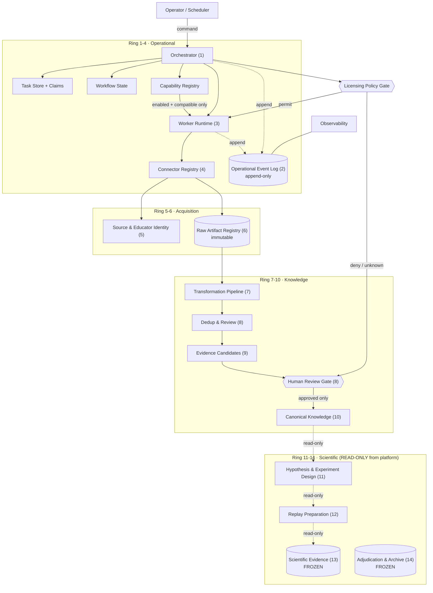
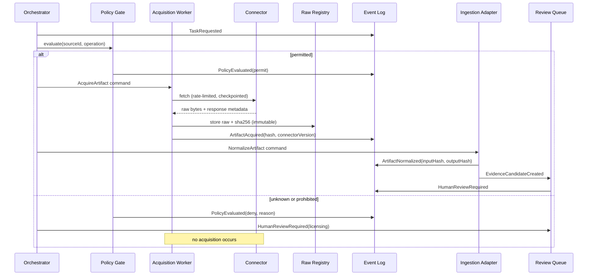
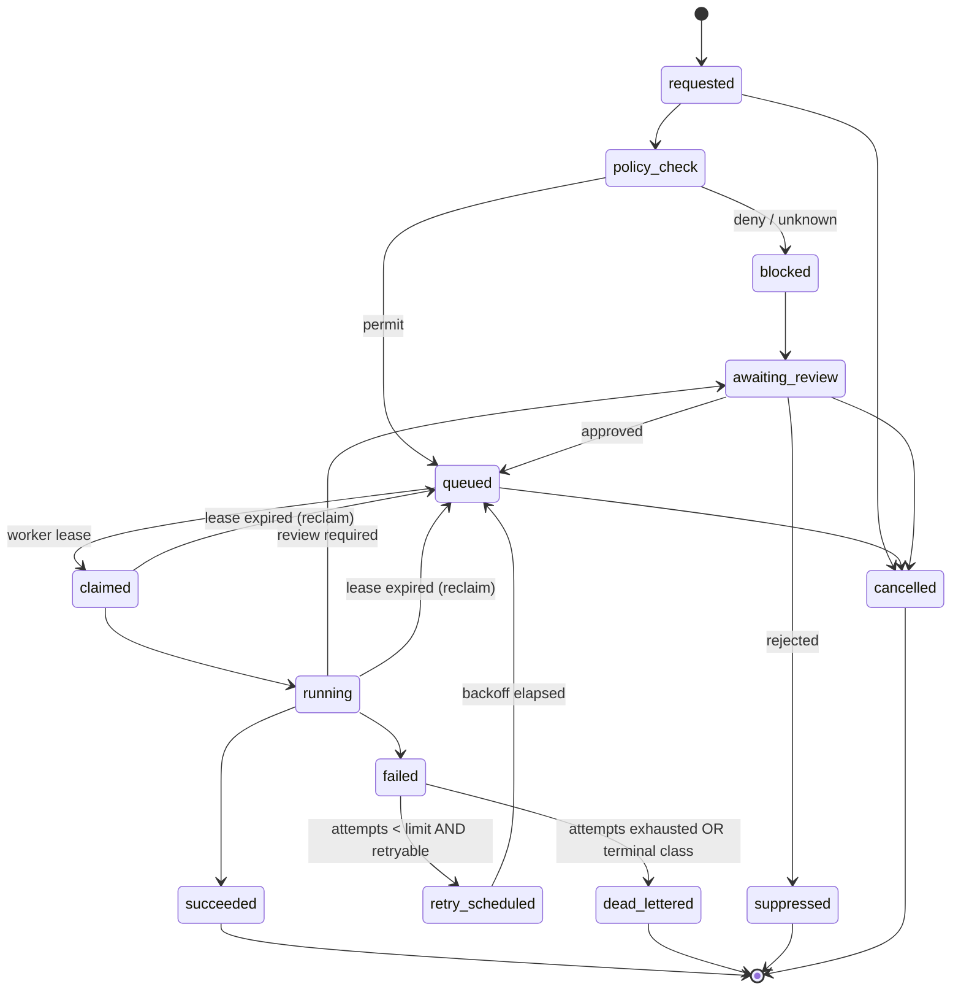
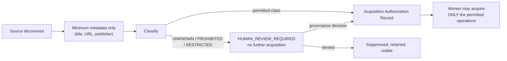

# MOGO-009 — Automation Platform Architecture

**Milestone:** MOGO-009 Phase II, Step 2 — formal architecture · **Status:** **APPROVED** (2026-08-07, Step 2A)
**Prepared:** 2026-08-07 · **Branch:** `main` · **HEAD:** `3f84489af1b376e240c30490e49fd932d6acf56c`
**Frozen tag at HEAD:** `campaign-c1-adjudication-complete`
**Governing document:** [`AUTOMATION_PLATFORM_CONSTITUTION.md`](../governance/AUTOMATION_PLATFORM_CONSTITUTION.md) v1.0 — **senior to this specification**
**Inputs:** MOGO-009 charter · [Step 1 inventory](../reports/MOGO-009-AUTOMATION-PLATFORM-ARCHITECTURE-INVENTORY.md) · [ADR-012](../adr/ADR-012-automation-platform-architecture.md) · [Contract Catalog](MOGO-009-CONTRACT-CATALOG.md)

> **Approval covers architecture only. No implementation is authorized by this document.** Where this
> specification and the Constitution conflict, the Constitution governs (Constitution §3).

**Nothing in this document is implemented.** No runtime, worker, connector, queue, event bus,
schema, manifest, or dependency was created. This is design only.

---

## 1. Executive summary

MOGO has a mature scientific core and a substantially complete knowledge-ingestion pipeline, but **no
operating platform**: Step 1 found zero occurrences of `worker`, `retry`, `backoff`, `checkpoint`,
`resume`, `concurren`, `correlation`, or `causation` across `scripts/`. This document designs that
missing layer.

The design rests on four commitments:

1. **A modular monolith** in a new top-level `platform/`, with enforced module boundaries. The
   repository has no package manifest, no CI and one operator; services would add operational cost
   with no evidence of need.
2. **A separate operational event namespace.** The existing decision-event bus is memory-only and
   browser-resident and cannot serve. Operational events never share a store, schema registry, or
   identifier space with trading evidence.
3. **A policy gate that no connector can bypass.** Acquisition is impossible unless a machine-readable
   licensing classification permits it. `UNKNOWN` behaves exactly like `PROHIBITED`.
4. **Structural, not procedural, isolation of science.** No automation component can write to
   `evidence/`, `docs/campaigns/`, the pre-registrations, adjudication records, or protected
   functions. This is a dependency rule, testable in CI.

The first proof is a vertical slice — one legally permitted artifact travelling discovery → policy →
acquisition → raw registration → existing ingestion → review queue — **stopping before canonical-rule
approval**.

## 2. Architectural goals

Modular · event-driven · durable across process death · observable with no silent failure ·
idempotent under retry · recoverable from interruption · testable without network · scientifically
traceable end to end · compatible with blocking human approval · independent of Campaign C1 · unable
to write scientific evidence.

## 3. Non-goals

Not in MOGO-009: replay automation; hypothesis promotion; adjudication automation; canonical-rule
approval; distributed execution; high availability; horizontal scale; a UI; a public API; real-time
streaming; multi-tenant operation; or replacing any Phase I component.

**Explicitly deferred** (ADR-012): external workflow engine · external message broker · microservices ·
cloud deployment · **Knowledge Graph** · YouTube connector · automatic rule generation · automatic
hypothesis promotion · replay execution automation · autonomous statistical conclusions.

**On the Knowledge Graph.** Recorded only as a **deferred extension of the Canonical Rule Library
(context 10)**, not a MOGO-009 requirement. One clarification prevents a misreading: a graph
capability *already exists* in Phase I — `scripts/trader_intelligence/graph_common.py`,
`build_graph.py`, `validate_graph.py` and 16 graph JSON records. **That existing graph is not the
deferred item and is not extended by MOGO-009.** The deferred item is a future graph over *approved
canonical rules*.

## 4. Current-state constraints

| Constraint | Consequence for design |
|---|---|
| No package manifest, lock file, CI, or build system | The platform introduces the project's first managed runtime — deliberately, minimally (**D-01**) |
| Two disjoint runtimes: browser `index.html` and CLI Python | The platform lives with the CLI side; the browser is reference-only |
| Decision-event bus is memory-only, in-browser | Cannot be reused as an operational event store (**D-04**) |
| 63 protected functions + 4 constants, SHA-1 gated | Platform must never touch them; the gate stays authoritative |
| Campaign C1 frozen, hash-verified, tagged | Read-only from automation, always |
| Ingestion exists as CLI scripts, not callable operations | Wrap via adapters; do not rewrite (Step 1 §3) |
| `intake/` is a working four-state directory machine | Generalize it; preserve filesystem inspectability |
| Canonical runner excludes 8 Python suites | Test architecture must close this without weakening the drift gate |
| `ingest.py --resume` documented but absent | Recovery must be designed properly, not patched (§24) |
| 8,055 tracked JSON files | Retention policy required before unbounded raw growth (**D-10**) |

## 5. Proposed bounded contexts

Fourteen contexts in four rings. Ring numbers govern dependency direction (§6).

| Ring | # | Context | Owns |
|---|---|---|---|
| **Operational** | 1 | Orchestration | tasks, workflows, schedules, claims, retries |
| | 2 | Operational event history | append-only execution facts |
| | 3 | Worker runtime | worker registry, invocation, sandboxing, health |
| | 4 | Connector framework | connector registry, manifests, rate limits |
| **Acquisition** | 5 | Source & educator identity | sources, educators, aliases, candidates |
| | 6 | Raw artifact registry | immutable raw bytes + hashes + policy record |
| **Knowledge** | 7 | Transformation pipeline | normalize, clean, segment, extract |
| | 8 | Deduplication & review | duplicate groups, review requests, decisions |
| | 9 | Evidence candidates | extracted claims awaiting governance |
| | 10 | Canonical knowledge | approved rules, concepts, terminology |
| **Scientific** | 11 | Hypothesis & experiment design | hypotheses, pre-flight checks |
| | 12 | Replay preparation | replay input packages |
| | 13 | Scientific evidence | campaigns, packages, pre-registrations |
| | 14 | Adjudication & archival | adjudications, audits, frozen archives |

## 6. Dependency rules

1. **Lower rings may not depend on higher rings.** Orchestration knows nothing of evidence.
2. **Rings 1–4 never import rings 5–14 domain logic.** They move work; they do not interpret it.
3. **Every cross-context interaction is a command, an event, or a read-model query** — never a direct
   write into another context's store.
4. **Workers never call workers.** Coordination is the orchestrator's job and is recorded as events.
5. **Contexts 13 and 14 are read-only from every automation component**, without exception.
6. **Context 10 is writable only through the review gate in context 8.**
7. **Adapters are the only permitted path into `scripts/trader_intelligence/`.**
8. **Adapters are libraries, not workers.** An adapter is invoked *by* a worker within that worker's
   task. It may not issue commands, claim tasks, emit events on its own behalf, or invoke another
   worker — otherwise it becomes an untraceable worker-to-worker channel, which rule 4 forbids. All
   events arising from adapter work are emitted by the calling worker, under that worker's identity.
9. **The orchestrator may dispatch only to an enabled capability** in the Capability Registry (§15b)
   whose declared compatibility admits the requested command version.

## 7. Prohibited cross-context writes

**Absolutely prohibited — enforced by dependency test (§25):**

```
platform/**  ──✗──>  evidence/
platform/**  ──✗──>  docs/campaigns/
platform/**  ──✗──>  docs/trader-intelligence/governance/PREREG-*.md
platform/**  ──✗──>  docs/MOGO-003-VERIFIED-REPLAY-RECORD.md
platform/**  ──✗──>  index.html
platform/**  ──✗──>  hypothesis-registry.json      (read-only; updates stay operator-driven)
```

**Prohibited by design:** any write from 1–9 into 10 except via the review gate; any write from 1–4
into 5–14; any worker→worker call; any write into 2 that is not an append.

## 8. Logical component diagram



Dotted = read-only. **No arrow terminates in 13 or 14.**

## 9. Data-flow diagram



## 10. Command model

Commands are **imperative and rejectable**. Fields, lifecycle and validation are specified in the
[Contract Catalog §A](MOGO-009-CONTRACT-CATALOG.md#a-command-contract).

Lifecycle: `issued → validated → {accepted | rejected}`; accepted commands create exactly one task.
Validation checks schema version, identifier well-formedness, idempotency key presence, policy
context, and that the target capability exists in the worker registry. **A command carrying a
payload hash that does not match its payload is rejected** and the rejection is an event.

## 11. Event model

Events are **immutable facts**, append-only, never updated or deleted. Fields in
[Catalog §B](MOGO-009-CONTRACT-CATALOG.md#b-event-contract).

**Schema evolution rules:** additive-only within a major version; new optional fields permitted;
never repurpose or remove a field; `eventVersion` bumps on any change; consumers must ignore unknown
fields; a breaking change is a **new event type**, not a new version of an old one. This mirrors the
additive discipline that let `mogo.evidence-package.v1` survive ten releases unbroken.

## 12–15. Task, workflow, worker and connector models

Specified in Catalog [§C](MOGO-009-CONTRACT-CATALOG.md#c-task-contract),
[§D](MOGO-009-CONTRACT-CATALOG.md#d-workflow-contract),
[§E](MOGO-009-CONTRACT-CATALOG.md#e-worker-contract),
[§F](MOGO-009-CONTRACT-CATALOG.md#f-connector-contract). Key rules:

- A **task** is the unit of retry, claim, and idempotency. It has exactly one worker capability.
- A **workflow** owns dependency order and approval gates; it issues commands and consumes events.
  It holds no domain logic.
- A **worker** declares capability, accepted commands, emitted events, resource limits, secret scope,
  and connector scope. It may not exceed any declared scope.
- A **connector** declares supported source types and operations, auth requirements, rate limits,
  pagination, checkpointing, and **must** preserve raw responses. It integrates the policy gate but
  can never override it.

## 15b. Capability Registry

**Approved as a required platform component (ADR-012 D-16). Not implemented.**

The registry is the orchestrator's only source of truth for what may run. Every worker or platform
capability is described by a self-describing, auditable record — fields in
[Catalog §O](MOGO-009-CONTRACT-CATALOG.md#o-capability-registry).

**Lifecycle:** `proposed` → `experimental` → `approved` → `production` → `deprecated` → `disabled` →
`retired`.

**Binding rules:**

- The orchestrator **may dispatch work only to an enabled capability** whose declared `compatibility`
  admits the requested `commandVersion`. An unregistered, disabled, retired or incompatible capability
  receives no work — the dispatch attempt fails and is recorded.
- A capability declaring a secret, connector or permission it does not need is a defect; using one it
  did not declare is a violation (Constitution §7).
- The registry is **auditable**: every lifecycle transition and enable/disable action is an event.
- **Registration confers no scientific authority.** A registered, enabled, production capability still
  cannot approve a rule, promote a hypothesis, or write scientific evidence — that boundary comes from
  the dependency rules (§6–7) and the Constitution, never from registry state.

## 16. Artifact and lineage model

Nine distinct states, each with its own identity and an unbroken parent chain
([Catalog §G](MOGO-009-CONTRACT-CATALOG.md#g-artifact-contract)):

```
DiscoveredSource → RegisteredSource → RawArtifact → NormalizedArtifact
   → CleanedArtifact → Segment → MetadataRecord → DuplicateCandidate → EvidenceCandidate
```

**Every derived object records:** `parentId`, `transformationId`, `transformationVersion`,
`inputHash`, `outputHash`, `workerId`, `workflowId`, `producedAt`. A transformation whose recorded
`inputHash` does not match its parent's `outputHash` is a **lineage break** — detectable, and a
hard error rather than a warning.

Raw artifacts are **immutable and append-only**. A re-acquisition producing a different hash is
`SourceMutationDetected` and creates a *new* raw artifact version; it never overwrites.

## 17. Identifier model

Full table in [Catalog §H](MOGO-009-CONTRACT-CATALOG.md#h-identifier-model). Design rules:

| Class | Identifiers | Rationale |
|---|---|---|
| **Content-derived (SHA-256)** | `artifactId`, `rawArtifactHash`, `segmentId`, `idempotencyKey`, `payloadHash` | Deduplication and reproducibility come free; matches existing MOGO practice |
| **Composite, human-readable** | `sourceId`, `educatorId`, `connectorId`, `workerId`, `canonicalRuleId` | Operators read these in queues and logs; existing corpus already uses `HYP\|AXR-001` style |
| **Opaque random (UUIDv4)** | `commandId`, `eventId`, `taskId`, `workflowId`, `correlationId`, `reviewId` | No meaning should be inferred from an execution identifier |
| **Derived reference** | `causationId` | Always the id of the event or command that caused this one |
| **Existing, referenced only** | `hypothesisId`, `evidencePackageId`, `replayPackageId` | Owned by governance; the platform cites, never mints |

**Collision handling.** Content-derived collisions are treated as identity — same bytes, same object.
A collision with *different* bytes is a corruption alarm, not a rename. Opaque identifiers are
generated with a uniqueness check against the event log; a duplicate is a hard failure. Composite
identifiers collide only on genuine identity conflict, which routes to human review (§22).

**Reuse verdict.** MOGO's SHA-256 canonicalization discipline is **adapted** (same algorithm, new
namespace). Browser-only and trading-specific mechanisms — `alexGStableHash`, decision-event ids,
`sourceTradeId` — are **not reused**; importing them would create exactly the cross-domain coupling
the charter prohibits.

## 18. State machines

### 18.1 Task state machine



**Diagram scope.** The diagram shows `cancelled` reached from three representative states for
legibility. The normative rule is broader and is in
[Catalog §L](MOGO-009-CONTRACT-CATALOG.md#l-task-state-transitions): **any non-terminal state may be
cancelled** by an explicit, audited operator action. The catalog table is authoritative where the two
differ in detail.

**`policy_check` applies to every task, but evaluates only acquisition-class operations.** For
non-acquisition tasks — normalize, segment, extract, dedup, review — the gate is a recorded no-op that
emits `PolicyEvaluated(not_applicable)` and permits immediately. Routing every task through the same
state keeps the machine uniform and makes "was this checked?" answerable from the log for *all* tasks,
rather than only for the ones someone remembered to route. **A task whose operation class cannot be
determined is treated as acquisition-class and therefore blocked** — the same fail-closed default the
licensing model uses.

**Transition authority:** the orchestrator alone writes task state. Workers *report*; they never
transition. Reviewers act through the review gate, which issues a command. **Every transition is
persisted as an event before the state is considered changed** — the log is the source of truth, the
state table a derived read model.

**Retry:** bounded attempts (default 3, per-task overridable), exponential backoff with jitter, only
for retryable error classes (§19). **Claim leases:** a claim carries an expiry; an expired lease
returns the task to `queued` and emits `TaskReclaimed`, which is how abandoned work recovers.
**Duplicate claim prevention:** claims are compare-and-set on `(taskId, leaseGeneration)`.
**Terminal states** (`succeeded`, `dead_lettered`, `suppressed`, `cancelled`) accept no further
transitions; anything arriving later is logged as a late-event anomaly, never applied.

### 18.2 Generalizing the intake directory pattern

The existing `pending → processing → completed → rejected` model has one property worth preserving
above all: **state is visible from the filesystem alone, with no database to drift out of sync.**

| Intake state | Platform state | Added |
|---|---|---|
| `pending/` | `queued` | durable task record, priority, dependencies |
| `processing/` | `claimed` + `running` | **lease with expiry** — fixes the stranded-file problem |
| `completed/` | `succeeded` | output hashes, provenance chain |
| `rejected/` + `.rejected.txt` | `suppressed` / `dead_lettered` | structured error class, retained and queryable |
| — | `blocked`, `awaiting_review`, `retry_scheduled` | policy and review made first-class |

The platform keeps a human-readable projection of task state on disk so an operator can still see the
queue without tooling. That projection is *derived*; the event log remains authoritative.

## 19. Retry and idempotency model

**Idempotency key composition** — per operation, in
[Catalog §I](MOGO-009-CONTRACT-CATALOG.md#i-idempotency-matrix). Principle: the key is a hash of the
*semantic inputs*, never of a timestamp or attempt number, so a retry computes the same key.

| Operation | Key composition | Duplicate-request behaviour |
|---|---|---|
| Source discovery | `(connectorId, query, discoveryWindow)` | return prior result, emit no new source |
| Source registration | `(normalizedUrl, educatorId)` | return existing `sourceId` |
| Metadata acquisition | `(sourceId, connectorVersion)` | return cached record |
| Artifact / transcript acquisition | `(sourceId, locator, connectorVersion)` | **no second raw artifact**; hash mismatch → `SourceMutationDetected` |
| Raw storage | `(sha256)` | content-addressed; write is naturally idempotent |
| Normalize / clean / segment / extract | `(inputHash, transformationId, transformationVersion)` | deterministic — same input, same output, verified by `outputHash` |
| Duplicate analysis | `(candidateSetHash, algorithmVersion)` | recompute allowed; decision records are never overwritten |
| Evidence-candidate creation | `(segmentId, extractorVersion)` | one candidate per key |
| Review request | `(subjectId, reviewType)` | dedupe into the open request |

**Partial completion:** a task interrupted mid-stage resumes from the last verified `outputHash`, not
from the beginning (§24). **Stale results:** a result whose `inputHash` no longer matches the current
parent is discarded and re-run. **Conflict:** two workers producing different outputs for the same
idempotency key is a determinism violation — dead-letter and alert, never pick a winner.

**Error classes** (drive retry policy): `transient` · `rate_limited` · `authentication` ·
`policy_blocked` · `not_found` · `source_mutated` · `validation` · `deterministic_processing` ·
`corrupted_input` · `dependency_unavailable` · `human_review_required` · `permanent`.
Retryable: `transient`, `rate_limited`, `dependency_unavailable`. All others are terminal or route to
review. **`policy_blocked` is never retried** — retrying a policy denial is an attempt to launder it.

## 20. Licensing-policy architecture — **D-08, highest priority**

The current `--licensing` free-text flag is unenforceable. The architecture replaces it with a gate
that acquisition cannot proceed without.

### 20.1 Classification

Machine-readable, closed vocabulary, no free text:

| Status | Permitted operations |
|---|---|
| `PERMITTED_PUBLIC_METADATA` | title, author, dates, duration, public identifiers |
| `PERMITTED_PUBLIC_TRANSCRIPT` | metadata + transcript text |
| `PERMITTED_PUBLIC_ARTIFACT` | metadata + full artifact bytes |
| `PERMITTED_EXPLICIT_LICENSE` | as stated in the recorded licence, which must be referenced |
| `PERMITTED_DOCUMENTED_POLICY` | as stated in a project-governance policy record **supplied by governance or legal review** |
| `METADATA_ONLY` | metadata only; artifact retrieval prohibited |
| `LINK_ONLY` | store the locator; retrieve nothing |
| `HUMAN_REVIEW_REQUIRED` | nothing until reviewed |
| `AUTHENTICATION_REQUIRED` | nothing until credentials and permission are both established |
| `RESTRICTED` | nothing; recorded reason required |
| `PROHIBITED` | nothing |
| `UNKNOWN` | **treated exactly as `PROHIBITED`** |

**This architecture makes no legal claim.** It carries decisions supplied by project governance or
legal review, records who made them and when, and enforces them mechanically.

### 20.2 The gate



**Pre-acquisition gate:** every acquisition command passes the gate; the gate's decision is an event.

**Post-discovery review, and the sequencing that closes the obvious loophole.** Discovery may collect
only the minimum metadata needed to *evaluate* permission — typically title, publisher, locator, date
— and never the artifact. That allowance exists **only in the window before a classification exists**,
and it expires the instant one is recorded.

This distinction matters because Catalog §M shows `HUMAN_REVIEW_REQUIRED` as permitting "minimum to
evaluate" while `UNKNOWN` permits nothing, which could be misread as a way to keep fetching under an
unresolved status. It is not:

- **Before classification** — minimum metadata may be collected, once, to enable classification.
- **After classification as `UNKNOWN`, `RESTRICTED` or `PROHIBITED`** — nothing further is acquired,
  including further metadata. `UNKNOWN` is not a holding state that permits drip-feed collection; it
  is `PROHIBITED` with a different reason string.
- **`HUMAN_REVIEW_REQUIRED`** permits no new acquisition either; its "minimum to evaluate" column
  refers to metadata *already* gathered during discovery and presented to the reviewer.

### 20.3 Acquisition Authorization Record

Fields: `authorizationId`, `sourceId`, `policyStatus`, `policyVersion`, `decisionAuthority`,
`decidedAt`, `permittedOperations[]`, `sourceTermsSnapshotRef` (or URL + retrieval hash),
`retentionRestrictions`, `deletionRequirements`, `redistributionRestrictions`,
`modelTrainingRestrictions`, `expiresAt`, `supersedesAuthorizationId`, `auditHistory[]`.

**Policy-change handling:** a policy version change does not retroactively legitimise past
acquisitions, and does not silently invalidate them. It creates a **re-evaluation task** for affected
sources; results are recorded, and any required deletion becomes an explicit, audited task.

**No connector may override the gate.** Connectors receive an authorization reference and a permitted
operation list; a connector attempting an operation outside that list fails as `policy_blocked` and
the attempt is recorded.

## 21. Security and secret boundary

Secrets are **never** in source artifacts, event payloads, logs, command payloads, evidence
candidates, documentation, repository files, or fixtures.

- **Secret references only.** Commands and configuration carry `secretRef` (a name), never a value.
- **Connector-scoped, least privilege.** A connector may resolve only the refs its manifest declares.
- **Resolution at point of use**, in memory, never persisted, never logged. Structured logging applies
  a redaction filter keyed on known secret names as defence in depth.
- **Local development:** OS keychain or environment; **CI:** injected environment, never in the repo;
  **rotation:** by reference, requiring no code change.
- **Access auditing:** every resolution emits `SecretAccessed(secretRef, workerId, taskId)` — the
  *reference*, never the value.
- **Unavailable secret** → `authentication` error class, task blocked, no retry storm.
- **Tests use substitutes exclusively.** A test that requires a real credential is a design defect.

This extends `docs/SECURITY.md`'s existing "never persist the OANDA token" posture to unattended
execution, where the browser model of "hold it in memory for the session" does not apply.

## 22. Human review and governance architecture

**No worker may approve its own governed output.** Review is a blocking workflow state, not a
notification.

Mandatory gates: unknown/restricted licensing · educator identity conflict · source identity
conflict · suspected duplicate · partial transcript · low-quality transcript · source mutation ·
contradictory metadata · **evidence-candidate promotion** · **rule-candidate creation** ·
**hypothesis proposal** · experiment pre-flight exception.

Every review decision records: `reviewId`, `subjectRef`, `reviewType`, `reviewerIdentity`,
`decision` (`approved` | `rejected` | `deferred` | `escalated`), `reason` (required — a bare approval
is invalid), `decidedAt`, `policyVersion`, `supportingReferences[]`, `auditHistory[]`.

**Rejected and suppressed items remain visible and queryable forever.** They are never deleted, and
never hidden from queue views — the existing `rejected/` + `.rejected.txt` convention is the
precedent, made structured.

## 23. Observability architecture

No external platform. Everything derives from the event log plus structured logs.

**Signals:** task and workflow history · worker heartbeat and last-seen · connector health and
consecutive-failure count · queue depth · **oldest queued task age** · retry counts · failure counts
by error class · dead-letter count · policy-block count · review backlog and oldest open review ·
acquisition success rate · duplicate rate · **provenance completeness** (share of artifacts with an
unbroken lineage chain) · artifact-hash verification results · transformation reproducibility
(re-run same input → same `outputHash`).

**Operator views (minimum):** *Queue* (depth, oldest, blocked), *Failures* (grouped by error class,
with the last event of each), *Reviews* (backlog by type and age), *Provenance* (lineage breaks and
hash-verification failures), *Policy* (blocks by status, pending authorizations).

**A failure always produces an event.** There is no code path in this design where a task can end
without a terminal event. The strongest lesson of MOGO-004 is that a silent export failure cost a day
and nearly the evidence; the platform treats silence as the defect.

## 24. Recovery architecture — and the `--resume` drift

Step 1 verified that `intake/README.md` prescribes `ingest.py --resume <file>` while `--resume`
appears **zero times** in `ingest.py`. The correct response is not to add a flag.

**Recovery model:**

| Element | Design |
|---|---|
| Persisted checkpoint | Each pipeline stage records a checkpoint event with `inputHash` and `outputHash` on completion |
| Task ownership | Lease with expiry; only the lease holder may write results |
| Completed-stage detection | Replay the event log for the workflow; the last verified checkpoint is the resume point |
| Output-hash verification | Before trusting a checkpoint, re-hash the stored output; mismatch invalidates it |
| Safe resumption point | The last stage whose `outputHash` verifies |
| Interrupted-write detection | Write to a temporary path, fsync, then atomically rename; an unrenamed temp file is a detected partial write |
| Partial-artifact cleanup | Unreferenced temp artifacts are quarantined, not deleted, and reported |
| Idempotent continuation | Resumption re-issues the same idempotency keys, so completed work is a no-op |
| Stale claim recovery | Lease expiry → `TaskReclaimed` → back to `queued` |
| Operator override | An explicit, audited command that force-releases a lease, recorded with actor and reason |
| Recovery audit events | `TaskReclaimed`, `CheckpointVerified`, `CheckpointInvalidated`, `PartialArtifactQuarantined`, `RecoveryOverrideIssued` |

**Recommendation on the README:** implement the capability first, then correct the documentation to
describe what exists. Correcting the text alone would remove the visible discrepancy while leaving
operators with no recovery path — the drift is a symptom; the missing capability is the defect. Until
then the README statement should be treated as known-inaccurate (Step 1 recorded it). **No edit to
`ingest.py` or the README is made in Step 2.**

## 25. Test architecture

| Layer | Scope |
|---|---|
| Unit | pure functions: hashing, identifier construction, state-transition legality |
| Contract | every command/event/task payload validates against its declared schema version |
| Schema | additive-evolution rules hold; no field removed or repurposed between versions |
| Worker | capability manifest matches behaviour; declared scopes not exceeded |
| Connector fixture | recorded responses only — **no network in any test** |
| Idempotency | same task twice → one artifact, two events, identical outputs |
| Retry | each error class retries or terminates exactly as specified |
| Crash recovery | kill mid-stage; resume produces byte-identical output |
| Provenance | unbroken lineage; `inputHash` of child equals `outputHash` of parent |
| Hash verification | stored artifact re-hashes to its recorded value |
| Policy gate | `UNKNOWN` and `PROHIBITED` cannot acquire; no connector path bypasses the gate |
| Event replay | replaying the log reconstructs identical workflow state |
| Workflow state | illegal transitions rejected; terminal states absorb late events |
| Human review | no self-approval; rejected items remain visible |
| Negative | malformed commands, hash mismatches, expired leases, duplicate claims |
| **Protected boundary** | **static test asserting `platform/**` contains no write path to the frozen paths in §7** |
| Existing browser regression | unchanged, still authoritative |

**Runner integration (not performed in Step 2).** `tests/run_all.sh` currently globs
`tests/run_*_tests.js` only and therefore excludes all 8 Python suites. The recommendation is to add
**separate, clearly-labelled sections** — JS fixtures, Python suites, platform suites — each reporting
its own counts, with the protected-function drift gate running last and remaining decisive. The drift
gate must never be weakened, reordered into irrelevance, or made conditional on platform tests
passing.

## 26. Research Acquisition Worker v1 — design

**Purpose.** Prove the platform end to end by acquiring one legally permitted artifact under full
governance. It is a worker inside the platform, never a standalone agent.

| | |
|---|---|
| **Capability** | `research.acquire.v1` |
| **Accepted commands** | `RequestSourceDiscovery`, `AcquireSourceMetadata`, `AcquireArtifact`, `AcquireTranscript` |
| **Authorized source types (v1)** | one connector only — see §26.1 |
| **Allowed metadata** | title, author/publisher, publication date, locator, duration, language, public identifiers |
| **Allowed artifacts** | only those the authorization record permits |
| **Licensing checks** | mandatory pre-acquisition gate; `UNKNOWN`/`PROHIBITED` → review, no fetch |
| **Dependencies** | orchestrator, connector registry, policy gate, raw registry, event log, secret provider |
| **Inputs** | `taskId`, `correlationId`, `sourceId` or candidate locator, `connectorId`+version, `authorizationId`, `idempotencyKey` |
| **Outputs** | immutable raw artifact + SHA-256; acquisition record; ingestion-queue submission |
| **Emitted events** | `ArtifactAcquisitionRequested`, `ArtifactAcquired`, `ArtifactAcquisitionFailed`, `TranscriptAcquired`, `SourceMutationDetected`, `DuplicateCandidateDetected`, `HumanReviewRequired`, `PolicyEvaluated` |
| **Idempotency** | `(sourceId, locator, connectorVersion)`; re-run creates no second artifact |
| **Retry** | `transient`/`rate_limited`/`dependency_unavailable` only; bounded, backoff with jitter |
| **Failure classes** | all twelve in §19 |
| **Review triggers** | licensing ambiguity, source mutation, duplicate ambiguity, educator identity ambiguity, partial/low-quality transcript |
| **Observability** | heartbeat, per-attempt events, success rate, per-connector health |
| **Test fixtures** | recorded connector responses; success, 404, 429, auth failure, mutated content, partial content |
| **Acceptance criteria** | one permitted artifact traverses discovery → policy → acquisition → raw registration → ingestion adapter → review queue; re-running the task creates no duplicate; killing it mid-run resumes cleanly; all events present and ordered; **it stops before canonical-rule approval** |

**Prohibited:** modifying canonical evidence or source material; rewriting transcripts without
preserving originals; creating canonical rules; approving claims or hypotheses; promoting anything;
interpreting profitability; ranking strategies; optimizing parameters; executing replays;
adjudicating; drawing statistical conclusions; trading; bypassing review; hiding failures; silently
discarding duplicates; treating acquired content as validated knowledge.

### 26.1 First-connector comparison — **APPROVED 2026-08-07 (D-15)**

**Operator decision: filesystem / operator-drop is the first connector. GitHub is the next external
candidate after the platform proof. YouTube is explicitly deferred** until licensing, access,
transcript and mutation concerns are governed and tested. The comparison that produced this decision
is retained below.

| Candidate | Legal clarity | Auth burden | API stability | Transcript | Rate limits | Fixture quality | Usefulness | Complexity | Reproducibility |
|---|---|---|---|---|---|---|---|---|---|
| **Local filesystem / operator drop** | ✅ highest — operator-supplied | none | ✅ total | n/a | none | ✅ perfect | medium | ✅ lowest | ✅ perfect |
| Documentation / static web page | ⚠️ per-site ToS | none | ⚠️ markup drift | n/a | ⚠️ politeness | good | medium | low | ⚠️ page mutates |
| GitHub (public repos, API) | ✅ clear, documented API + licences | low (token) | ✅ strong | n/a | ✅ documented | ✅ excellent | medium | low-medium | ✅ commit-pinned |
| Research papers (arXiv etc.) | ✅ mostly clear | none/low | ✅ stable | n/a | ✅ documented | good | medium | low | ✅ versioned |
| **YouTube transcripts** | ⚠️ **unresolved** | medium-high | ⚠️ volatile | ⚠️ **server-blocked in prior testing** | ⚠️ aggressive | ⚠️ brittle | ✅ highest | ✅ highest | ⚠️ videos mutate/vanish |

**Recommendation: the local filesystem / operator-drop connector first**, with **GitHub second**.

The reasoning is deliberately unglamorous. The first connector's job is to prove the *platform* —
policy gate, idempotency, lineage, recovery, events — not to obtain the most valuable content. A
filesystem connector has perfect legal clarity, no credentials, no rate limits, deterministic
fixtures, and reproducible bytes, so any failure during the vertical slice is unambiguously a
platform defect rather than a source problem. It also has a real user: the existing `intake/pending/`
drop directory already works this way, so the slice exercises a genuine workflow rather than a toy.

**YouTube is explicitly not recommended first**, despite being the most valuable source. Prior
project testing found captions server-blocked (HTTP 200, 0 bytes) while channel metadata remained
retrievable; its licensing status is unresolved (D-08); and its content mutates and disappears. It
should be attempted only after the platform is proven and D-08 has produced a governance decision for
it specifically.

## 27. Experiment Design Assistant — boundary only

**Inputs:** canonical rule references, hypothesis records, registry thresholds, replay-engine
capability declaration, dataset availability.
**Outputs:** an advisory pre-flight report — findings with severity `info` | `warning` | `blocking`,
each citing the contract it derives from.
**Checks (design-time list):** impossible or unpopulatable treatment arms · missing controls ·
inadequate sample vs the declared floor · unobservable variables · unavailable market data ·
unsupported instruments or timeframes · protocol contradictions · unsupported statistical tests ·
replay-engine limitations · unresolved-trade conflicts · suppression-accounting conflicts ·
multiplicity conflicts · confidence-interval method gaps · effect-size ambiguity · outcome-definition
ambiguity · dataset/config/params hash ambiguity · pre-registration inconsistencies · outcome leakage
· post-hoc rule change · treatment contamination.

**It must not** approve its own exceptions, modify a pre-registration, weaken sample requirements,
alter statistical methods after data observation, execute replay, or interpret outcomes. **It advises;
governance decides.** Had it existed before Campaign C1, the empty-arm-B finding was detectable from
the registry alone, before eleven runs — that is the capability's entire value.

## 28–29. Replay and Evidence Preparation boundaries

**Replay preparation** may assemble a candidate replay input package: rule and hypothesis references,
arms, instruments, ranges, parameters, sample requirements, outcome definitions. It **may not**
execute replay, mint `runId`/`datasetHash` (the engine owns those), freeze a campaign, or write to
context 13.

**Evidence preparation** may assemble package inputs and verify hashes of already-produced packages.
It **may not** create evidence packages, canonicalize, adjudicate, or update the registry.

**Phase I interfaces they reference — unchanged in Step 2:** `mogo.evidence-package.v1`,
`mogo.evidence-canon.v1`, `PREREG-001`/`PREREG-002`, `hypothesis-registry.json`,
`PRE_ADJUDICATION_PROTOCOL.md` v1.0, `CAMPAIGN_C1_EVIDENCE_MANIFEST.md`. All are **read-only**.

## 30. Deployment evolution path

**Now:** single-process modular monolith, operator-invoked, local filesystem persistence.
**Later, only on evidence of need:** long-running local daemon → scheduled execution → extract the
highest-load context (probably acquisition) behind the same contract → separate service.

Because every interaction is already a command or event, extraction changes transport, not design.
**No step is taken speculatively.**

## 31. Risks and mitigations

| Risk | Mitigation in this design |
|---|---|
| Disconnected agent | Worker exists only as an orchestrator capability; no standalone entry point |
| Coupled worker chains | Worker→worker calls prohibited; coordination via orchestrator, recorded as events |
| Provenance loss | Mandatory `inputHash`/`outputHash` chaining; lineage break is a hard error |
| Nondeterminism | Deterministic transformations; reproducibility test; seeds recorded |
| Duplicate execution | Idempotency keys + compare-and-set claims + duplicate-event detection |
| Duplicate evidence | Content addressing + duplicate groups + review |
| Mutable/deleted source | `SourceMutationDetected`; raw artifacts immutable and versioned |
| Licensing exposure | Enforced gate; `UNKNOWN` = `PROHIBITED`; authorization record required |
| Non-idempotent retry | Retry only for safe classes; keys stable across attempts |
| Silent failure | Every terminal path emits an event; no path ends silently |
| Schema drift | Additive-only evolution; contract tests |
| Premature canonicalization | Context 10 writable only through the review gate |
| Autonomous promotion | Structurally impossible via dependency rules, not merely forbidden |
| Governance bypass | Protected-boundary test in CI |
| Operational state contaminating evidence | Separate namespace, separate store, separate identifiers |
| Reusing trading event infrastructure | Explicitly rejected (§17, D-04) |
| Overengineering | Modular monolith; no broker; no service |
| Unbounded storage | Retention policy required (D-10) before scale acquisition |
| Secret leakage | References only; redaction; access auditing; no real credentials in tests |
| Source identity collision | Composite ids + alias resolution + review on conflict |

## 32. Implementation sequence — proposed for Step 3

1. **Contracts and identifiers** — non-executable schemas, then the identifier library.
2. **Durable event log** — append-only, correlation/causation, payload hashes, corruption detection.
3. **Task state machine** — persisted transitions, leases, backoff, dead-letter.
4. **Worker runtime** — registry, capability enforcement, idempotency, heartbeat.
5. **Policy gate** — classification, authorization records, enforcement tests. **Before any connector.**
6. **First connector** (filesystem, pending D-15) with fixtures, no network.
7. **Raw artifact registry** — immutable, content-addressed, mutation detection.
8. **Ingestion adapter** — wrap `scripts/trader_intelligence/*` with lineage capture.
9. **Recovery and retry** — checkpoints, resumption, stale-claim reclaim.
10. **Observability** — operator views and diagnostic reports.
11. **End-to-end vertical slice test.**
12. **Research Acquisition Worker v1.**

**Ordering rationale:** the policy gate precedes every connector, so no acquisition path can exist
before the control that governs it. Recovery precedes the real worker, so the first genuine
acquisition is already crash-safe.

## 33. Explicit approval gates

| Gate | Blocks |
|---|---|
| **D-08 licensing policy** | any real acquisition |
| **D-01 runtime + manifest** | all implementation |
| **D-02/03/04/05** | platform shape |
| **D-09 secret boundary** | any authenticated connector |
| **D-15 first connector** | connector work |
| **D-10 retention** | scale acquisition |
| Runner integration | any change to `tests/run_all.sh` |

## 34. Step 2 exit criteria

- [x] Bounded contexts, dependency rules and prohibited writes defined
- [x] Command, event, task, workflow, worker, connector, artifact contracts specified
- [x] Identifier model with collision handling and reuse verdicts
- [x] Task state machine with transitions, authority, leases, recovery
- [x] Durable operational event model, distinct from trading events
- [x] Idempotency and retry model per operation, with error classes
- [x] Enforceable licensing architecture (D-08)
- [x] Secret boundary, human-review architecture, observability model
- [x] Recovery architecture addressing the verified `--resume` drift
- [x] Test architecture preserving the protected-function gate
- [x] Research Acquisition Worker v1 design and first-connector comparison
- [x] Experiment Design, Replay and Evidence Preparation boundaries
- [x] Risks, sequence, approval gates
- [x] **Operator approval of the decisions in [ADR-012](../adr/ADR-012-automation-platform-architecture.md)** — recorded 2026-08-07
- [x] **[Automation Platform Constitution](../governance/AUTOMATION_PLATFORM_CONSTITUTION.md) v1.0** ratified and senior to this specification
- [x] **Capability Registry** specified (§15b, [Catalog §O](MOGO-009-CONTRACT-CATALOG.md#o-capability-registry))
- [x] **Consistency review** completed; corrections applied (Step 2A)

**Step 2 is complete. Step 3 has not begun and requires separate authorization.**
