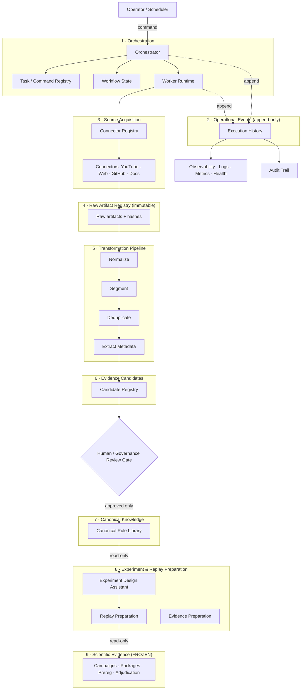

# MOGO-009 — Automation Platform Architecture Inventory

**Milestone:** MOGO-009 Phase II, Step 1 — inspection and architecture analysis only
**Prepared:** 2026-08-07 · **Branch:** `main` · **HEAD:** `3f84489af1b376e240c30490e49fd932d6acf56c`
**Repository state at inspection:** 0 tracked modifications

**Nothing was implemented, installed, migrated, or modified.** This report is the only file created.
Every claim below is backed by a repository observation, and capabilities documented but not found in
code are labelled as such.

---

# 1. Executive summary

**The repository can host Phase II, but not in the runtime where the science currently lives.**

The single most important finding is structural: **MOGO today is two disjoint runtimes with no shared
execution substrate.**

1. **A browser runtime** — `index.html`, 18,954 lines, 1.5 MB, one `<script>` block, one external
   dependency (Lightweight Charts via CDN). It holds the strategy engine, replay engine, evidence
   packages (IndexedDB `mogo_evidence`), the immutable trade ledger, and the decision-event bus.
2. **A filesystem/CLI runtime** — 36 Python modules (~470 KB) under `scripts/trader_intelligence/`
   plus 8,055 tracked JSON records, implementing acquisition, ingestion, normalization,
   deduplication, evidence registry, graph, and validation.

Neither runtime can invoke the other. There is **no scheduler, no queue runtime, no worker, no
daemon, no service, no API**. There is also **no package manifest, no lock file, no CI, no build
system, and no container configuration** anywhere in the repository.

**The strengths are unusually good and directly reusable.** The knowledge-ingestion domain is not
greenfield — acquisition, dedup, provenance, raw-artifact preservation, review queues and validation
are substantially implemented and schema-backed. Scientific governance is exceptionally mature:
pre-registration, protocol determinism, protected-function drift gating, and a completed mechanical
adjudication.

**The gaps are concentrated in exactly one layer: orchestration.** Repository-wide grep across
`scripts/` finds **0 files** containing `worker`, `retry`, `backoff`, `checkpoint`, `resume`,
`concurren`, `cron`, `correlation`, or `causation`. Phase II's work is to build the missing operating
platform *around* an ingestion domain that largely exists — not to rebuild ingestion.

**The three principal risks** are (a) reusing the trading decision-event bus for operational events —
it is explicitly **memory-only and browser-resident**, so it cannot serve; (b) contaminating frozen
scientific evidence with operational workflow state; and (c) building a standalone agent rather than
a platform, which the charter already forbids.

**Verdict: ready to proceed to Step 2**, subject to the eleven decisions in §14.

---

# 2. Verified current-state architecture

Status vocabulary: **implemented** · **partial** · **specified-only** · **experimental** ·
**deprecated** · **unused** · **missing** · **protected** · **frozen**.

## 2.1 Version control and release state

| Item | Observation | Status |
|---|---|---|
| Branch | `main` | implemented |
| HEAD | `3f84489` (MOGO-008 adjudication record) | implemented |
| Cleanliness | 0 tracked modifications; 4 untracked pre-existing documents | clean |
| Local branches | `main`, `claude/gracious-cohen-bd8041` (`4fb117e`), `mogo-003-phase-1-evidence-platform` (`c638629`) | 2 stale feature branches |
| Remotes | `mogo-main` `3f84489` (current) · `evidence-platform-v12.19` `b71f016` · `main` `abfc763` (**unrelated history** — web-upload line) | see §9 |
| Tags | 19 total, incl. `campaign-c1-adjudication-complete`, `campaign-c1-pre-adjudication-frozen`, `mogo-002-complete`, `mogo-003-complete`, `v12.0.0`–`v12.19.0` | frozen |

## 2.2 Build, dependency and runtime configuration — **absent**

| Artifact | Observation |
|---|---|
| `package.json`, lock files, `requirements.txt`, `pyproject.toml`, `setup.py`, `Makefile`, `Dockerfile`, `docker-compose.yml`, `.github/` | **all absent** |
| External runtime dependency | exactly one — `unpkg.com/lightweight-charts@4.1.3` via CDN in `index.html` |
| Python dependencies | standard library only (observed across `scripts/`) |
| CI | none |

**This is deliberate, not an oversight** — `.gitignore` states MOGO is "a static, single-file
application with no build step and no package manager." Phase II is the first workload that plausibly
needs a managed runtime, and that is a decision (**D-02**), not an assumption.

## 2.3 Application entry point

`index.html` — 18,954 lines, one `<script>`, no module system, no bundler. Contains the strategy
engines, replay engine, evidence platform, ledger, decision events, and all UI. **Protected** in part
(§8).

## 2.4 Persistence layers

| Layer | Location | Status |
|---|---|---|
| Browser IndexedDB | `mogo_evidence` DB; stores `packages`, `meta` (`index.html:12129-12132`) | implemented, browser-only |
| Browser localStorage | working buffer; 24 keys per `docs/STORAGE_KEYS.md` | implemented, browser-only |
| Filesystem JSON corpus | 8,055 tracked `.json` — 7,699 under `docs/trader-intelligence/evidence/`, 16 graph, plus schemas/registries | implemented |
| Campaign evidence | `evidence/` — 33 artifacts, **git-ignored by design** | frozen |
| Relational/document DB | **none** | missing |
| Migrations | **none** | missing |

## 2.5 Knowledge-ingestion domain — largely implemented

`scripts/trader_intelligence/`, 36 modules:

| Capability | Module(s) | Status |
|---|---|---|
| Source registration | `register_source.py`, `intake_registry.py` | implemented |
| Source discovery/candidates | `prioritize_sources.py`, `research-source-candidate.schema.json` (`discoveryMethod`, `discoveredAt`, `normalizedUrl`, `platform`) | partial — model implemented, no automated discovery |
| Transcript acquisition | `acquisition_common.py`, `transcript_adapters.py` | partial — see §9 licensing/access |
| Ingestion orchestration (single-run) | `ingest.py` (45 KB) — `--apply`, `--rollback`, `--status`, `--dry-run`, `--verify-provenance` | implemented |
| Normalization | `transcript_normalize.py` | implemented |
| Segmentation | `source-segment.schema.json`, `extraction_pipeline.py` | implemented |
| Deduplication | `detect_duplicates.py`, `evidence_dedup.py`, `duplicate-group.schema.json` (`canonicalCandidateId`, `ownerDecisionId`, `status`) | implemented, auditable, reversible |
| Metadata extraction | `extraction_pipeline.py`, `annotation_pipeline.py` | implemented |
| Evidence registry/validation | `evidence_registry.py`, `evidence_common.py`, `validate_evidence.py` (44 KB) | implemented |
| Confidence / explainability | `evidence_confidence.py`, `evidence_explain.py` | implemented |
| Knowledge graph | `graph_common.py` (39 KB), `build_graph.py`, `validate_graph.py` | implemented |
| Rule / hypothesis proposals | `rule_candidate_proposals.py`, `hypothesis_proposals.py` | implemented |
| Review queues | `review_queues.py`, `build_research_queue.py`, `docs/trader-intelligence/queues/{replay,validation}` | implemented (file-based) |
| Raw artifact preservation | `docs/trader-intelligence/imports/{alex-g,rayner-teo,tjr}/{raw,normalized}` | implemented |

**Intake state machine** — `docs/trader-intelligence/intake/{pending,processing,completed,rejected,manifests}`,
filesystem-as-state so "queue position is visible from the filesystem alone." Currently 1 pending,
1 processing, 12 completed, 3 rejected, 12 manifests.

⚠️ **Documentation drift, verified:** `intake/README.md` prescribes `ingest.py --resume <file>` to
recover an interrupted run. **`--resume` occurs 0 times in `ingest.py`.** The documented recovery
path does not exist. A file stranded in `processing/` must be moved by hand. This is precisely the
class of claim the charter required be tested rather than trusted.

## 2.6 Orchestration primitives — **effectively absent**

Repository-wide grep across `scripts/` (`--include=*.py`):

| Primitive | Files | Status |
|---|---:|---|
| `worker` | **0** | missing |
| `retry` | **0** | missing |
| `backoff` | **0** | missing |
| `checkpoint` | **0** | missing |
| `resume` | **0** | missing (and documented — §2.5) |
| `concurren` | **0** | missing |
| `cron` | **0** | missing |
| `correlation` | **0** | missing |
| `causation` | **0** | missing |
| `schedul` | 1 | specified-only |
| `async` | 1 | negligible |
| `idempot` | 4 | partial (content-hash identity, not execution idempotency) |
| `queue` | 22 | **review queues, not execution queues** |
| `lock` | 24 | mostly domain vocabulary ("locked"/"frozen"), not concurrency control |

## 2.7 Event and audit infrastructure

| Component | Location | Status |
|---|---|---|
| Decision-event schema | `createDecisionEvent()` `index.html:11429`; `emitDecisionEvent()` `:11502`; `DECISION_EVENT_ARCHITECTURE.md` | implemented — **memory-only, in-browser** |
| Decision-event durability | self-described "memory-only, append-only in-memory event bus" | **not durable** |
| Immutable trade ledger | `ledgerNormalizeEvent` `:11640`, `ledgerBuildEvents` `:11670`, `ledgerDeriveAccountState` `:11686`, `ledgerReconcileBalance` `:11760` | implemented, browser-only, trading-scoped |
| Evidence packages | `mogo.evidence-package.v1`; SHA-256 `contentHash` over `mogo.evidence-canon.v1` | implemented, frozen for C1 |
| Reason-code registry | `REASON_CODE_REGISTRY`, 14 categories | implemented |
| Operational execution history | — | **missing** |

## 2.8 Observability, security, testing

| Area | Observation | Status |
|---|---|---|
| Diagnostics | `runDiagnostics()`; engine-error channel; `evidenceRecordWriteFailure` (29 refs) | implemented, browser-only |
| Metrics / health endpoints | no service exists to expose them | missing |
| Secrets | OANDA token in-memory only, never persisted (`docs/SECURITY.md`); no secret store | implemented-for-browser; **missing for automation** |
| JS fixture suites | 17 suites, 947 fixtures, JXA via `osascript` | implemented |
| Python suites | 8 files under `tests/{trader_intelligence,knowledge_engineering,strategy_fidelity}` | implemented |
| Canonical runner | `tests/run_all.sh` globs `tests/run_*_tests.js` **only** | ⚠️ Python suites **not** in the canonical gate |
| Protected-function gate | `regression-baseline-tools.py` — 63 functions, 4 constants, SHA-1 | implemented, **protected** |
| Regression baseline snapshot | `regression-baseline.json` stale (disclosed in `KNOWN_ISSUES.md`) | partial |

## 2.9 Governance corpus

11 ADRs (`docs/adr/ADR-001`–`ADR-011`); `MOGO-003-*` architecture/specification set;
`PREREG-001`, `PREREG-002`, `STATISTICAL-GOVERNANCE.md`, `hypothesis-registry.json` (41 hypotheses);
`docs/campaigns/C1/` (7 documents incl. protocol v1.0, adjudication report, audit). **Frozen** — §8.

---

# 3. Phase I assets reusable in Phase II

| Asset | Location | Why reusable | Direct or adapter | Must remain untouched |
|---|---|---|---|---|
| Ingestion pipeline | `scripts/trader_intelligence/*.py` | Implements Acquire→Normalize→Segment→Dedup→Extract→Candidate already | **Adapter** — CLI entry points must be wrapped as callable worker operations | Behaviour; refactor only behind tests |
| Provenance/hashing | `hashlib`/SHA-256 in `ingest.py`, `transcript_normalize.py`, `evidence_common.py`, `graph_common.py`, `register_source.py` | Content-addressing already the identity basis | Direct | Hash semantics |
| Raw artifact preservation | `imports/*/raw` vs `imports/*/normalized` | Raw-vs-derived separation already correct | Direct | Raw tree is append-only |
| Dedup with reversible decisions | `duplicate-group.schema.json` + `detect_duplicates.py` | `canonicalCandidateId` + `ownerDecisionId` + `status` = auditable, reversible | Direct | Decision records |
| Schema corpus | `docs/trader-intelligence/schema/*.json` (12 schemas) | Machine-readable domain contracts exist | **Extend** (additively) | Existing required fields |
| Intake state machine | `intake/{pending,processing,completed,rejected}` | Proven visible-state pattern; a natural first workflow model | **Adapter** — needs durable task records | Semantics of the four states |
| Review queues | `review_queues.py`, `queues/{replay,validation}` | Human-review gate already exists conceptually | **Adapter** | Review outcomes |
| Evidence canonicalization | `mogo.evidence-canon.v1` + SHA-256 (`index.html`) | Deterministic hashing proven across 221+24 packages | **Reference only** — do not import into automation | Everything |
| Protected-function gate | `regression-baseline-tools.py` | Existing enforcement Phase II must not weaken | Direct (as a CI gate) | The tool and its baseline |
| Determinism doctrine | `PRE_ADJUDICATION_PROTOCOL.md` v1.0 P1/P2 | Determinism + conservative-boundary principles generalize to workers | Reference | The document |

---

# 4. Extension candidates

| Component | Proposed extension boundary |
|---|---|
| `docs/trader-intelligence/schema/` | **Add** connector-manifest, task, event, and workflow schemas as *new* files. Do not alter the 12 existing schemas' required fields. |
| `research-source-candidate.schema.json` | Additive fields only: `connectorId`, `connectorVersion`, `rawArtifactHash`, `licensingStatus`, `accessConstraints`. |
| Intake state machine | Generalize four directory states into a durable task record with the same four visible states — preserving the "state is inspectable without a database" property that makes it trustworthy. |
| `scripts/trader_intelligence/*.py` | Wrap, don't rewrite: expose each CLI as a callable operation with typed inputs/outputs so a worker can invoke it and capture provenance. |
| `tests/run_all.sh` | Extend to include Python suites, closing the gap in §2.8 — a governance improvement independent of Phase II. |
| `regression-baseline-tools.py` | Extend `FIXTURE_COUNTS` when Phase II adds suites. Do **not** run `--update` reflexively. |

---

# 5. Missing platform capabilities by domain

| Domain | Missing |
|---|---|
| **A. Orchestration** | Task/command definitions, workflow definitions and state, execution queues, dependencies, scheduling, retries, retry limits, backoff, cancellation, timeouts, concurrency and rate control, dead-letter handling, worker health, task history, workflow replay, interruption recovery. **Only** a manual four-state intake directory exists. |
| **B. Event/execution history** | A durable operational event store; causation/correlation/workflow/task/worker identifiers; event schema versions; payload hashes; producer versions; duplicate-event detection; idempotent consumers; retry/failure/suppression events. Nothing durable exists — the only event bus is in-browser and memory-only. |
| **C. Connector framework** | Connector interface, manifest, capability declaration, versioning, registry, auth/secrets, rate limiting, pagination, checkpointing, resumable acquisition, robots/licensing enforcement, source-mutation detection, test doubles, connector health. Acquisition logic exists but is not a pluggable connector boundary. |
| **D. Ingestion pipeline** | Mostly present. Missing: per-transformation input/output hash chaining, transformation identity/version records, worker and workflow identity on artifacts, durable failure state, reproducibility metadata. |
| **E. Dedup/identity** | Strong for exact and normalized duplication. Missing: mirrored/reposted/clipped video detection, partial-overlap, educator alias resolution, source-mutation and content-versioning detection. |
| **F. Canonical rule library** | Schemas exist for rule/assertion/evidence/contradiction/version. Missing: explicit, enforced separation of the six knowledge tiers (§F below) and machine-checked promotion transitions between them. |
| **G. Experiment design assistant** | Entirely missing as software. Every input it needs exists as documents; none is a machine-readable pre-flight contract. |
| **H. Replay preparation** | No programmatic interface. Replay is a browser button; campaign preparation was operator-driven. |
| **I. Evidence preparation** | The C1 lifecycle was executed by ad-hoc scripts, not reusable interfaces. |
| **J. Acquisition worker** | No worker runtime of any kind. |

---

# 6. Event-driven readiness

**Can the repository support the model? Yes — but nothing existing can serve as the substrate.**

| Requirement | Readiness |
|---|---|
| Commands/tasks | **Missing.** No task abstraction; CLI invocations are the closest analogue. |
| Workers | **Missing.** Zero occurrences repository-wide. |
| Workflows | **Partial-by-convention.** The intake four-state directory is a real, working single-workflow state machine. |
| Immutable events | **Conceptually proven, operationally missing.** The decision-event schema is mature (13 event types, 35+ fields, reason-code registry) — a good *design* template, an unusable *runtime*. |
| Lineage | **Partial.** Artifact parent/child and evidence lineage exist; causation/correlation IDs do not. |
| Idempotency | **Partial.** Content-hash identity gives natural dedup; there is no execution-level idempotency key. |
| Replay-safe processing | **Missing.** |
| Retries | **Missing.** |
| Failure visibility | **Partial.** `rejected/` + `.rejected.txt` reasons are genuinely good; no failure events, no dead-letter. |
| Human-review gates | **Implemented (manual).** Review queues and owner decisions exist as files. |

## Verdict on existing event/ledger infrastructure

| Infrastructure | Recommendation | Reason |
|---|---|---|
| Decision-event bus (`createDecisionEvent`) | **Reference only — do not reuse as runtime** | Memory-only, in-browser, dies on reload; scoped to trading decisions |
| Its *schema design* | **Adapt** | Field set, reason-code registry and completeness model are directly instructive for an operational event schema |
| Immutable trade ledger | **Isolate** | Trading-domain semantics; reusing it for operational events is a named charter risk |
| Evidence packages / canonicalization | **Reference only** | Frozen scientific records; automation must never write into this namespace |
| Operational event store | **New, supplemented** | A separate bounded context with its own namespace is required |

**A new event namespace is required.** Operational events (`ArtifactAcquired`, `WorkflowFailed`) and
trading evidence events (`TRADE_CLOSED`, `CANDIDATE_REJECTED`) must not share a store, a schema
registry, or an identifier space. Conflating them would let workflow state contaminate scientific
evidence — the exact failure the charter names.

---

# 7. Proposed bounded contexts

Nine contexts. **A modular monolith is recommended** (see D-01); these are module boundaries, not
necessarily deployment boundaries.

| # | Context | Owns | May write to |
|---|---|---|---|
| 1 | **Orchestration** | Tasks, workflows, schedules, retries, worker registry | itself + emits events |
| 2 | **Operational events** | Append-only execution history | itself only (append) |
| 3 | **Source acquisition** | Connectors, candidates, acquisition records | raw registry + events |
| 4 | **Raw artifact registry** | Immutable raw artifacts + hashes | itself (append-only) |
| 5 | **Transformation pipeline** | Normalize, segment, dedup, extract | derived artifacts + events |
| 6 | **Evidence candidates** | Extracted claims awaiting review | itself + review gate |
| 7 | **Canonical knowledge** | Approved rules, concepts, aliases | itself, **only via review gate** |
| 8 | **Experiment & replay preparation** | Hypotheses, pre-flight, replay inputs | itself; **read-only** on 7 |
| 9 | **Scientific evidence & adjudication** | Campaigns, packages, pre-registrations, adjudications, archives | **itself only** |

## Prohibited cross-domain writes

- **Nothing may write into context 9.** It is frozen. Automation reads; it never writes.
- **3, 4, 5 may never write into 7.** Promotion into canonical knowledge passes the review gate only.
- **6 may never write into 7 automatically.** Human or governance approval is mandatory.
- **1 and 2 may never write into 4–9.** Orchestration records execution, not knowledge.
- **8 may never write into 7 or 9.** It prepares inputs; it does not create knowledge or evidence.
- **No context may write into 2 except by appending** an event.
- **Workers may not call workers.** Coordination happens through 1, recorded in 2.

---

# 8. Protected and frozen boundaries

**Frozen — never modified by Phase II:**

- `evidence/` — all 33 Campaign C1 artifacts, and their manifest hashes
- `docs/campaigns/C1/` — identity, manifest, integrity certificate, readiness, lock report,
  `PRE_ADJUDICATION_PROTOCOL.md` v1.0, adjudication report, adjudication audit
- `PREREG-001-alex-multipair-2026-08-04.md` and `PREREG-002-alex-c1-execution-2026-08-05.md` —
  immutable by their own §10; successors only
- Tags `campaign-c1-pre-adjudication-frozen`, `campaign-c1-adjudication-complete`, `v12.*`,
  `mogo-002-complete`, `mogo-003-complete`
- `docs/MOGO-003-VERIFIED-REPLAY-RECORD.md` — append-only register
- The twelve adjudicated hypothesis records' `currentStatus`, arms, thresholds, ceilings

**Protected — changes gated by drift detection:**

- 63 protected functions and 4 protected constants (`WEIGHTS`, `ALERT_THRESHOLD`, `RULES`,
  `RULES_ALEXG`) in `index.html`, enforced by `regression-baseline-tools.py`
- The replay engine, evidence-capture seam, canonicalization (`mogo.evidence-canon.v1`), and
  `mogo.evidence-package.v1` schema version

**Governed — extend additively only:**

- The 12 existing schemas under `docs/trader-intelligence/schema/`
- `hypothesis-registry.json` schema and its five `allowedStatuses`
- `STATISTICAL-GOVERNANCE.md` thresholds

---

# 9. Architecture risks

| # | Risk | Repository-grounded assessment |
|---|---|---|
| R-01 | **Disconnected agent** | Highest-likelihood failure. Charter explicitly forbids it; mitigated only by building orchestration before the worker. |
| R-02 | **Tightly coupled worker chains** | No worker exists yet — the risk is entirely prospective and cheap to prevent now by prohibiting worker→worker calls. |
| R-03 | **Provenance loss** | Medium. Provenance is strong at rest but there is no transformation-level input/output hash chain. |
| R-04 | **Nondeterministic processing** | Medium. Protocol v1.0 P1 sets the standard; no worker runtime enforces it. |
| R-05 | **Duplicate task execution** | High. No idempotency keys, no execution history, no locking. |
| R-06 | **Duplicate evidence** | Low-medium. Content hashing and `duplicate-group` mitigate; mirrored/clipped video detection is missing. |
| R-07 | **Mutable/deleted source content** | High and unmitigated. No source-mutation detection; YouTube content can change or vanish. Raw preservation limits damage. |
| R-08 | **Licensing / access restrictions** | High. `ingest.py` has a `--licensing` flag, but there is **no enforced licensing gate**. A memory records that captions are server-blocked while channel metadata is retrievable — acquisition legality is source-specific and unresolved (**D-08**). |
| R-09 | **Retry duplication / non-idempotent workers** | High. Zero retry infrastructure means the first implementation defines the standard. |
| R-10 | **Silent worker failure** | High. `rejected/` is good for ingest; nothing equivalent for automation. |
| R-11 | **Schema / event-schema drift** | Medium. 12 schemas exist without a versioning policy (**D-11**). |
| R-12 | **Premature canonicalization** | Medium-high. `rule_candidate_proposals.py` and `hypothesis_proposals.py` already generate proposals; automating their acceptance would breach governance. |
| R-13 | **Autonomous hypothesis promotion** | Must be structurally impossible, not merely prohibited — enforce via context boundaries (§7). |
| R-14 | **Outcome leakage / governance bypass** | Medium. MOGO-007's R13 shows how easily an unstated interaction becomes analyst discretion. |
| R-15 | **Replay-platform coupling** | Medium. Replay runs in a browser and needs an OANDA credential; automating it would require weakening Rule 0 isolation. |
| R-16 | **Operational state contaminating evidence** | **The central architectural risk.** Mitigated only by contexts 1–2 being physically separate from 9. |
| R-17 | **Reusing trading event infrastructure** | Named and avoided in §6. |
| R-18 | **Overengineering / premature microservices** | Real: a repository with no package manifest does not need a broker. Recommendation is a modular monolith. |
| R-19 | **Unbounded storage growth** | Medium. 8,055 tracked JSON files already; raw artifact accumulation is unbounded and there is no retention policy (**D-10**). |
| R-20 | **Secret leakage** | Medium-high. The browser model (never persist) cannot work for an unattended worker needing API keys (**D-09**). |
| R-21 | **Source identity collision** | Low-medium. `normalizedUrl` exists; educator aliasing does not. |
| R-22 | **Testing gate gap** | The canonical runner excludes all 8 Python suites; Phase II code would inherit an untested-by-default posture. |

---

# 10. Recommended platform location

```
platform/                          ← NEW top-level; the automation platform
  orchestration/                   ← tasks, workflows, scheduling, retries
  events/                          ← operational event store (own namespace)
  workers/                         ← worker runtime + worker implementations
  connectors/                      ← connector registry + per-source connectors
  contracts/                       ← task/event/connector schemas (versioned)
  adapters/                        ← wrappers over scripts/trader_intelligence/*
tests/platform/                    ← mirrors platform/, added to run_all.sh
docs/platform/                     ← platform ADRs and specifications
```

**Why this location.** A new top-level sibling keeps the automation platform outside every existing
governed boundary. `scripts/` is a library of operator-invoked tools with no runtime; `docs/` is
governance and data; `index.html` is the protected trading engine. None can absorb a platform without
blurring a boundary the project has spent eight milestones establishing.

**Boundaries preserved.** `platform/` may **read** `docs/trader-intelligence/**` and **invoke**
`scripts/trader_intelligence/**` through `adapters/`. It **never** writes to `evidence/`,
`docs/campaigns/`, the pre-registrations, or `index.html`. Enforceable as a reviewable rule and, later,
as a test.

**How workers plug in.** A worker declares a manifest (id, version, inputs, outputs, emitted events,
idempotency key, retry policy), registers with `orchestration/`, and is invoked only by it. Connectors
follow the same pattern under `connectors/`, so adding a source touches only its own directory.

**How evidence stays isolated.** Scientific evidence remains in `evidence/` and `docs/campaigns/`,
written only by the existing operator-driven flow. Operational events live in `platform/events/` under
a distinct namespace and identifier space.

**Tests.** `tests/platform/` mirroring the source tree, and `run_all.sh` extended to run Python and
platform suites — closing R-22.

---

# 11. Initial logical component map — *not final architecture*



Dotted = read-only or append-only. **No arrow enters context 9.**

---

# 12. Initial event and command model — *conceptual only*

**Commands** (imperative, may be rejected): `RequestSourceDiscovery`, `RegisterSource`,
`AcquireArtifact`, `NormalizeArtifact`, `RequestHumanReview`, `RetryTask`, `CancelWorkflow`,
`SuppressWorkflow`.

**Events** (immutable facts): `SourceDiscovered`, `SourceRegistered`, `ArtifactAcquired`,
`ArtifactAcquisitionFailed`, `ArtifactNormalized`, `DuplicateCandidateDetected`,
`EvidenceCandidateCreated`, `HumanReviewRequired`, `HumanReviewCompleted`, `WorkflowFailed`,
`WorkflowRetried`, `WorkflowSuppressed`.

**Identifiers:** `workflowId`, `taskId`, `commandId`, `eventId`, `correlationId` (whole workflow),
`causationId` (direct parent), `workerId`, `workerVersion`, `sourceId`, `artifactId`, `evidenceId`,
`idempotencyKey`.

**State transitions:** `PENDING → CLAIMED → RUNNING → {SUCCEEDED | FAILED | SUPPRESSED}`, with
`FAILED → RETRY_SCHEDULED → CLAIMED` bounded by a retry limit, and terminal `DEAD_LETTERED`. The
existing intake directories map onto this and are the natural first proof.

**Retry:** bounded attempts, exponential backoff, retry recorded as an event, idempotency key
preventing duplicate effect. **Failure:** always an event — never a silent drop; `rejected/`'s reason
files are the precedent. **Human review:** a first-class blocking state, not a side channel; the
workflow parks and resumes on `HumanReviewCompleted`.

**Not finalized.** Names, payloads and schema versions are Step 2 work.

---

# 13. Research Acquisition Worker v1 — boundary

| | |
|---|---|
| **Authorized inputs** | An approved acquisition task from the orchestrator, carrying `taskId`, `correlationId`, `sourceId` or candidate URL, connector id/version, and an idempotency key |
| **Authorized outputs** | Raw artifact written to the raw registry; acquisition record with SHA-256, timestamps, source locator, connector version; emitted outcome events; an ingestion-queue submission |
| **Emitted events** | `ArtifactAcquisitionRequested`, `ArtifactAcquired`, `ArtifactAcquisitionFailed`, `TranscriptAcquired`, `DuplicateCandidateDetected`, `HumanReviewRequired` |
| **Dependencies** | Orchestrator (invocation), connector registry, raw artifact registry, event store, secret provider |
| **Failure states** | Source unavailable · access denied · licensing prohibited · rate-limited · content changed since discovery · malformed response · hash mismatch · storage failure. **Every one emits an event.** |
| **Retry** | Bounded attempts with exponential backoff; only transport/rate failures retry. Access-denied and licensing-prohibited are terminal and route to human review. |
| **Idempotency** | Keyed on (`sourceId`, normalized locator, connector version). Re-execution must not create a second raw artifact; a repeat acquisition yielding a different hash is `SourceMutationDetected`, not an overwrite. |
| **Human-review triggers** | Licensing ambiguity · robots/ToS ambiguity · duplicate-candidate ambiguity · source mutation · educator identity ambiguity · anything terminal-but-recoverable |
| **Legal/licensing checks** | Must run **before** acquisition and be recorded with the artifact. Currently only a free-text `--licensing` flag exists — see **D-08** |
| **Test requirements** | Connector test doubles and recorded fixtures; no network in tests; idempotency proof (same task twice → one artifact, two events); failure-path coverage for every state above; a proof it cannot write to contexts 7 or 9 |

**Prohibited, restated:** it may not modify canonical evidence or source material, rewrite transcripts
without preserving originals, create canonical rules, approve claims or hypotheses, promote anything,
interpret profitability, rank strategies, optimize parameters, execute replays, adjudicate, perform
statistical conclusions, execute trades, bypass review, hide failures, silently discard duplicates, or
treat acquired content as validated knowledge.

---

# 14. Decision register

| ID | Issue | Repository evidence | Options | Recommendation | Risk / reversibility | Approval |
|---|---|---|---|---|---|---|
| **D-01** | Modular monolith vs services | No manifest, no CI, no container; single-operator | monolith · services · hybrid | **Modular monolith** with strict boundaries | Low; reversible if boundaries hold | **Required** |
| **D-02** | Introduce a managed runtime + manifest | Zero dependency infrastructure today | none (stdlib only) · Python manifest · Node manifest · both | **Python-first, stdlib-biased**, matching the existing pipeline | Medium; adds the project's first supply chain | **Required** |
| **D-03** | Orchestration: build vs adopt engine | Nothing exists; intake dirs are the only precedent | internal orchestrator · Temporal/Prefect/Airflow · cron+scripts | **Internal, minimal orchestrator** first | Low-medium; adopting later is easier than removing | **Required** |
| **D-04** | Queue technology | No queue runtime | filesystem · SQLite · Redis · broker | **Filesystem or SQLite**, preserving inspectable state | Low; reversible | **Required** |
| **D-05** | Event storage | Only in-memory browser bus | append-only JSONL · SQLite · event-store product | **Append-only JSONL + index**, mirroring existing file-first conventions | Low; migratable | **Required** |
| **D-06** | Artifact storage | `imports/*/raw` in git; 8,055 tracked JSON | keep in git · git-ignored local · object storage | **Git-ignored local store + committed manifests**, following `evidence/`'s proven pattern | Medium — see D-10 | **Required** |
| **D-07** | Relational vs document | All JSON today | JSON files · SQLite · document DB | **JSON + SQLite index** | Low | **Required** |
| **D-08** | Source licensing policy | `--licensing` free-text flag; no enforcement; captions server-blocked per prior finding | permissive · explicit allowlist · per-source legal record | **Explicit allowlist + recorded per-source basis; refuse when ambiguous** | **High if wrong; hard to reverse** — acquired material cannot be un-acquired | **Required — highest priority** |
| **D-09** | Secret management | Browser model is "never persist"; unattended workers need credentials | OS keychain · env vars · encrypted file · none | **OS keychain or env with explicit non-logging guarantees**; never in repo | High if wrong; reversible | **Required** |
| **D-10** | Retention policy | 8,055 tracked JSON; unbounded raw growth | retain all · tiered · prune derived | **Retain raw + manifests; prune regenerable derived artifacts** | Medium; deletion irreversible | **Required** |
| **D-11** | Schema versioning | 12 schemas, no version policy | none · semver in filename · `schemaVersion` field | **`schemaVersion` field + additive-only rule** | Low | Recommended |
| **D-12** | Extend `run_all.sh` to Python suites | Canonical runner globs `run_*_tests.js` only; 8 Python suites excluded | leave · extend | **Extend** — closes R-22 | Low; touches test tooling only | Recommended |
| **D-13** | Worker sandboxing | Workers will execute network I/O | none · subprocess isolation · container | **Subprocess isolation** initially | Medium | Recommended |
| **D-14** | Observability platform | Browser diagnostics only | logs only · structured logs + metrics · external | **Structured logs + event-derived metrics**; no new service | Low | Recommended |

No technology is selected by this report.

---

# 15. Proposed MOGO-009 delivery sequence

1. **Contracts first (documentation).** Task, event, workflow and connector schemas; identifier
   model; state machine. No code. Proves the model before anything depends on it.
2. **Event store + audit reader.** The smallest durable append-only log with correlation/causation
   IDs. Independently testable; every later step emits into it.
3. **Minimal orchestrator.** Task registry, state machine, bounded retry with backoff, idempotency
   keys, dead-letter, human-review park state. Proof: drive the *existing* intake pipeline through it
   end to end — which also fixes the missing `--resume` recovery path (§2.5).
4. **Connector framework + one test-double connector.** No network. Proves the boundary: adding a
   connector touches only its own directory.
5. **Research Acquisition Worker v1** against the test-double connector, then one real source **only
   after D-08 is decided**. It is a worker inside the platform, never a standalone agent.
6. **Ingestion adapters.** Wrap `scripts/trader_intelligence/*` so transformations record input/output
   hashes, worker identity and workflow identity.
7. **Human-review gate as a first-class workflow state**, backed by the existing review queues.
8. **Read-only experiment pre-flight (advisory).** Reports conflicts; approves nothing.

**Deliberately excluded from MOGO-009:** replay automation, hypothesis promotion automation,
adjudication automation, and any write path into contexts 7 or 9.

---

# 16. Step 1 exit assessment

**Ready for Step 2: Formal Automation Platform Architecture.**

The repository is well-suited to host Phase II. Ingestion is substantially implemented and
schema-backed; governance is mature and enforceable; the missing layer is cleanly separable and does
not require touching protected or frozen material.

**Uncertainties that must be resolved before or during Step 2:**

1. **D-08 licensing policy** — blocks any real acquisition; must precede step 5 of the sequence.
2. **D-02 runtime and manifest** — determines everything downstream.
3. **D-01 / D-03 / D-04 / D-05** — the platform's shape.
4. **D-09 secret management** — blocks any authenticated connector.
5. **Whether replay preparation may ever be automated**, given replay requires a browser and an OANDA
   credential under Rule 0 isolation. Unresolved and not urgent, but it bounds domain H.
6. **Disposition of the two stale local branches** (`claude/gracious-cohen-bd8041`,
   `mogo-003-phase-1-evidence-platform`) and the unrelated `origin/main` history.

---

**Nothing was implemented. No dependency installed. No manifest, lock file, schema, migration,
protected function, replay, evidence, or Campaign C1 artifact touched. This report is the only file
created.**
